# Action Tree — Code Review & Collaboration Platform

## Mermaid Code

```mermaid
graph TD
    Root["Code Review & Collaboration Platform"]

    Root --> M1["Pull Request & Code Diff Viewer"]
    Root --> M2["Inline Commenting & Discussion Engine"]
    Root --> M3["Reviewer Assignment & CODEOWNERS Automation"]
    Root --> M4["Branch Protection & Approval Enforcement"]
    Root --> M5["CI Linter & SAST Integration"]
    Root --> M6["Review Velocity & Team Productivity Metrics"]

    M1 --> A11["Configure Pull Request & Code Diff Viewer Policies"]
    M1 --> A12["Execute Pull Request & Code Diff Viewer Tasks"]
    M1 --> A13["Monitor Pull Request & Code Diff Viewer Telemetry"]
    M1 --> A14["Export Pull Request & Code Diff Viewer Audit Logs"]

    M2 --> A21["Configure Inline Commenting & Discussion Engine Policies"]
    M2 --> A22["Execute Inline Commenting & Discussion Engine Tasks"]
    M2 --> A23["Monitor Inline Commenting & Discussion Engine Telemetry"]
    M2 --> A24["Export Inline Commenting & Discussion Engine Audit Logs"]

    M3 --> A31["Configure Reviewer Assignment & CODEOWNERS Automation Policies"]
    M3 --> A32["Execute Reviewer Assignment & CODEOWNERS Automation Tasks"]
    M3 --> A33["Monitor Reviewer Assignment & CODEOWNERS Automation Telemetry"]
    M3 --> A34["Export Reviewer Assignment & CODEOWNERS Automation Audit Logs"]

    M4 --> A41["Configure Branch Protection & Approval Enforcement Policies"]
    M4 --> A42["Execute Branch Protection & Approval Enforcement Tasks"]
    M4 --> A43["Monitor Branch Protection & Approval Enforcement Telemetry"]
    M4 --> A44["Export Branch Protection & Approval Enforcement Audit Logs"]

    M5 --> A51["Configure CI Linter & SAST Integration Policies"]
    M5 --> A52["Execute CI Linter & SAST Integration Tasks"]
    M5 --> A53["Monitor CI Linter & SAST Integration Telemetry"]
    M5 --> A54["Export CI Linter & SAST Integration Audit Logs"]

    M6 --> A61["Configure Review Velocity & Team Productivity Metrics Policies"]
    M6 --> A62["Execute Review Velocity & Team Productivity Metrics Tasks"]
    M6 --> A63["Monitor Review Velocity & Team Productivity Metrics Telemetry"]
    M6 --> A64["Export Review Velocity & Team Productivity Metrics Audit Logs"]
```

## Module Description | Mô tả Module

| # | Module | Description | Actions |
|---|--------|-------------|---------|
| 1 | Pull Request & Code Diff Viewer | Quản lý các chức năng cốt lõi thuộc phân hệ pull request & code diff viewer. | Configure Pull Request & Code Diff Viewer Policies, Execute Pull Request & Code Diff Viewer Tasks, Monitor Pull Request & Code Diff Viewer Telemetry, Export Pull Request & Code Diff Viewer Audit Logs |
| 2 | Inline Commenting & Discussion Engine | Quản lý các chức năng cốt lõi thuộc phân hệ inline commenting & discussion engine. | Configure Inline Commenting & Discussion Engine Policies, Execute Inline Commenting & Discussion Engine Tasks, Monitor Inline Commenting & Discussion Engine Telemetry, Export Inline Commenting & Discussion Engine Audit Logs |
| 3 | Reviewer Assignment & CODEOWNERS Automation | Quản lý các chức năng cốt lõi thuộc phân hệ reviewer assignment & codeowners automation. | Configure Reviewer Assignment & CODEOWNERS Automation Policies, Execute Reviewer Assignment & CODEOWNERS Automation Tasks, Monitor Reviewer Assignment & CODEOWNERS Automation Telemetry, Export Reviewer Assignment & CODEOWNERS Automation Audit Logs |
| 4 | Branch Protection & Approval Enforcement | Quản lý các chức năng cốt lõi thuộc phân hệ branch protection & approval enforcement. | Configure Branch Protection & Approval Enforcement Policies, Execute Branch Protection & Approval Enforcement Tasks, Monitor Branch Protection & Approval Enforcement Telemetry, Export Branch Protection & Approval Enforcement Audit Logs |
| 5 | CI Linter & SAST Integration | Quản lý các chức năng cốt lõi thuộc phân hệ ci linter & sast integration. | Configure CI Linter & SAST Integration Policies, Execute CI Linter & SAST Integration Tasks, Monitor CI Linter & SAST Integration Telemetry, Export CI Linter & SAST Integration Audit Logs |
| 6 | Review Velocity & Team Productivity Metrics | Quản lý các chức năng cốt lõi thuộc phân hệ review velocity & team productivity metrics. | Configure Review Velocity & Team Productivity Metrics Policies, Execute Review Velocity & Team Productivity Metrics Tasks, Monitor Review Velocity & Team Productivity Metrics Telemetry, Export Review Velocity & Team Productivity Metrics Audit Logs |
