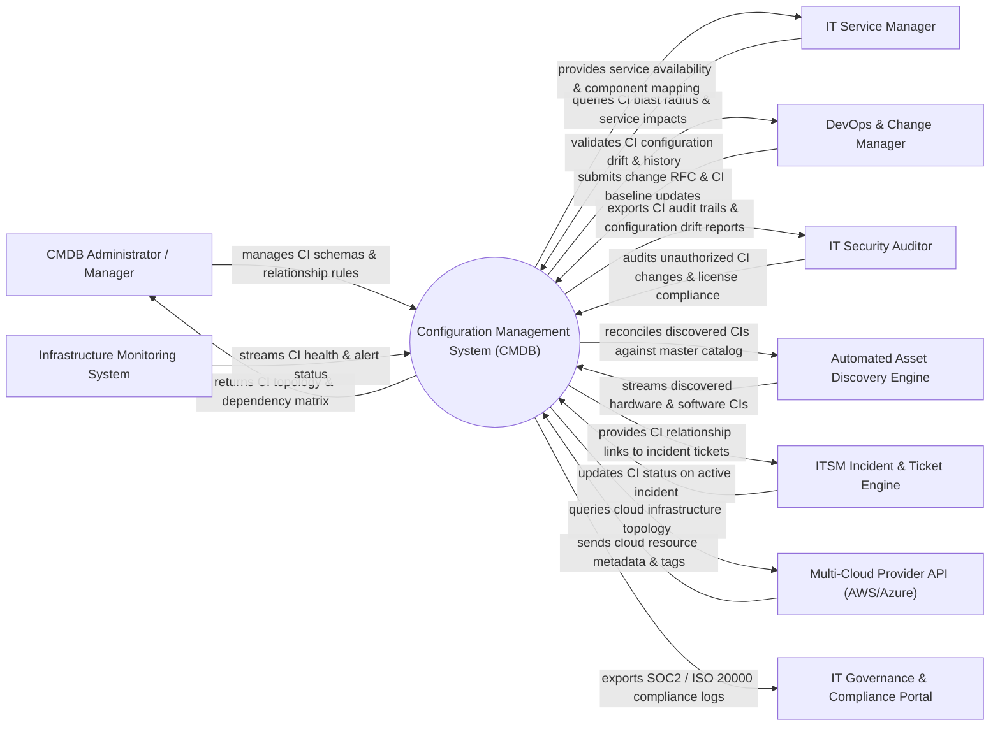

# Context Diagram — Configuration Management System (CMDB)

## Mermaid Code

## Actor & Interaction Table | Bảng Actor & Tương tác

| # | Actor | Actor Type | Data Sent TO System | Data Received FROM System | Notes |
|---|-------|------------|---------------------|---------------------------|-------|
| 1 | CMDB Administrator | Primary | CI class schemas, reconciliation rules, relationship definitions | CI topology maps, orphan CIs, configuration drift alerts | Governs CMDB data model and data quality |
| 2 | IT Service Manager | Primary | Service mapping queries, dependency lookup requests | Service impact analysis, CI blast radius, component health | Manages IT services built on underlying CIs |
| 3 | DevOps & Change Manager | Primary | Change RFC requests, CI baseline updates, deployment manifests | CI change history, configuration drift reports | Ensures changes are tracked against CI baselines |
| 4 | IT Security Auditor | Primary | Compliance audit mandates, security baseline rules | Unauthorized CI modification logs, CI audit trails | Audits IT configuration integrity and compliance |
| 5 | Automated Discovery Engine | Supporting | Discovered MACs, IPs, OS versions, installed software CIs | Reconciled CI records, identification rule matches | Automated discovery agents (ServiceNow Discovery) |
| 6 | ITSM Incident Engine | Supporting | Incident ticket IDs, affected CI references | CI details, upstream/downstream dependency links | ITSM ticketing systems |
| 7 | Multi-Cloud Provider API | Supporting | Cloud EC2, VM, S3, RDS metadata, resource tags | Cloud CI sync queries, topology mapping requests | AWS, Azure, GCP APIs |
| 8 | Infrastructure Monitoring | Supporting | Real-time CI health metrics, alert state changes | CI relationship links, service impact targets | Monitoring platforms |
| 9 | Compliance & Governance Portal | Supporting | ISO 20000 / ITIL v4 compliance mandates | CI audit logs, configuration drift reports | Governance audit systems |

## System Boundary Description | Mô tả Scope Hệ thống

Hệ thống **Configuration Management System (CMDB)** lưu trữ và quản lý tập trung toàn bộ các Mục cấu hình (Configuration Items - CIs) và mối quan hệ phụ thuộc lẫn nhau trong hạ tầng CNTT doanh nghiệp.

- **Phạm vi bên trong hệ thống (In-Scope)**:
  - Định nghĩa danh mục phân lớp CI (Hardware, Software, Service, Network, Cloud Resource, Database).
  - Tự động hòa giải (Reconciliation) và chống trùng lặp dữ liệu CI từ nhiều nguồn phát hiện khác nhau.
  - Quản lý ma trận quan hệ phụ thuộc (Relationships: Depends On, Hosted On, Runs On, Connects To).
  - Phân tích ảnh hưởng (Impact/Blast Radius Analysis) khi có sự cố hoặc yêu cầu thay đổi (Change Request).

- **Bên ngoài phạm vi hệ thống (Out-of-Scope)**:
  - Trực tiếp quét mạng thu thập dữ liệu thô (nhiệm vụ của Discovery Engine).
  - Trực tiếp xử lý vé sự cố (do ITSM Platform đảm nhận).
  - Trực tiếp lưu trữ tệp cài đặt phần mềm.
