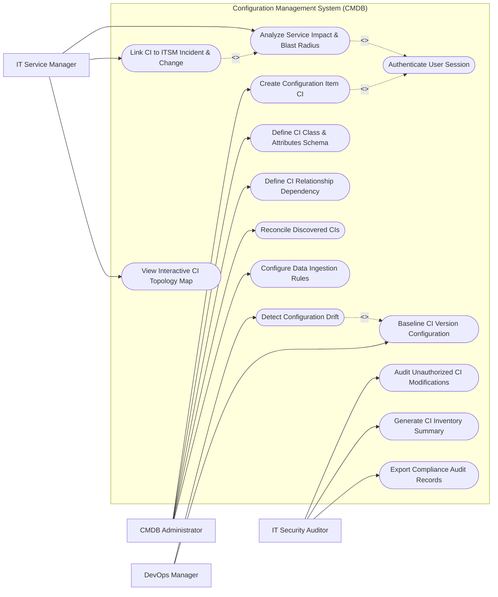

# Use Case Diagram — Configuration Management System (CMDB)

## Mermaid Code

## Actor Table | Bảng Actor

| # | Actor | Actor Type | Role Description | Related Use Cases |
|---|-------|------------|------------------|-------------------|
| 1 | CMDB Administrator | Primary | Configures CI schema classes, defines identification/reconciliation rules, establishes relationships | UC01, UC02, UC03, UC05, UC12 |
| 2 | IT Service Manager | Primary | Analyzes service dependency maps, evaluates change blast radius, links CIs to incident tickets | UC06, UC08, UC09 |
| 3 | DevOps Manager | Primary | Baselines CI configurations, detects configuration drift between environments | UC07, UC10 |
| 4 | IT Security Auditor | Primary | Audits unauthorized CI modifications, reviews drift reports, exports compliance evidence | UC11, UC13, UC14 |

## Use Case Table | Bảng Use Case

| # | UC ID | Use Case Name | Primary Actor | Secondary Actor | Description | Priority |
|---|-------|---------------|---------------|-----------------|-------------|----------|
| 1 | UC01 | Create Configuration Item CI | CMDB Admin | Barcode / Discovery | Registers a new Configuration Item (CI) with attributes, status, and owner | High |
| 2 | UC02 | Define CI Class & Attributes Schema | CMDB Admin | None | Configures custom CI classes (Server, Database, Web Service) and metadata fields | High |
| 3 | UC03 | Define CI Relationship Dependency | CMDB Admin | None | Connects CIs with relationships (Depends On, Runs On, Hosted On, Connects To) | High |
| 4 | UC04 | Authenticate User Session | System | Directory Service | Validates CMDB user credentials and role-based permissions | High |
| 5 | UC05 | Reconcile Discovered CIs | CMDB Admin | Discovery Engine | Reconciles duplicate CIs from multiple discovery feeds using identification rules | High |
| 6 | UC06 | Analyze Service Impact & Blast Radius | IT Service Manager | ITSM Engine | Simulates upstream/downstream impact if a specific CI fails or is modified | High |
| 7 | UC07 | Detect Configuration Drift | DevOps Manager | None | Identifies unauthorized changes between live CI state and approved baseline | High |
| 8 | UC08 | Link CI to ITSM Incident & Change | IT Service Manager | ITSM Engine | Associates CIs with active Incident, Problem, and Change Management tickets | High |
| 9 | UC09 | View Interactive CI Topology Map | IT Service Manager | None | Renders visual graph topology showing node connections and health statuses | Medium |
| 10 | UC10 | Baseline CI Version Configuration | DevOps Manager | None | Captures an immutable snapshot of CI configuration attributes for a release | Medium |
| 11 | UC11 | Audit Unauthorized CI Modifications | Security Auditor | SIEM Logger | Flags CIs modified outside approved Change Requests (RFCs) | High |
| 12 | UC12 | Configure Data Ingestion Rules | CMDB Admin | Multi-Cloud API | Configures field precedence and data refresh frequency for incoming data sources | Medium |
| 13 | UC13 | Generate CI Inventory Summary | Security Auditor | None | Compiles CI count metrics categorized by class, environment, and operational status | Medium |
| 14 | UC14 | Export Compliance Audit Records | Security Auditor | Audit System | Exports audit evidence showing ITIL configuration management compliance | Low |

## Use Case Specification | Đặc tả Use Case

---

### UC01 — Create Configuration Item CI

| Field | Detail |
|-------|--------|
| **UC ID** | UC01 |
| **Use Case Name** | Create Configuration Item CI |
| **Actor(s)** | Primary: CMDB Administrator   Secondary: Discovery Engine |
| **Description** | Manually or automatically registers a Configuration Item (CI) with class type, operational status, attributes, and owner. |
| **Precondition** | 1. CMDB Admin must have CI Creation privileges.   2. Target CI Class must be defined in schema. |
| **Main Flow** | 1. Administrator accesses "CMDB Inventory" and clicks "Create New CI".   2. Administrator selects CI Class (e.g., `Hardware -> Linux Server`).   3. Administrator inputs Name (`srv-db-prod-01`), IP (`10.0.4.15`), Serial Number (`SN-901-X`), Environment (`Production`), and Owner (`Database Team`).   4. Administrator selects Operational Status (`Operational / Live`).   5. Administrator clicks "Save CI".   6. System validates attribute completeness, generates unique CI Sys ID, stores record, and updates search index. |
| **Alternative Flow** | **AF1** — Automated Discovery Creation: Discovery Engine pushes payload; System auto-creates CI record after reconciliation.   **AF2** — Import from Cloud Provider: System imports EC2 instance directly as a CI from AWS API. |
| **Exception Flow** | **EX1** — Serial Number Reconciliation Conflict: If CI with identical serial number exists, System triggers Reconciliation (UC05) instead of creating duplicate.   **EX2** — Mandatory Attribute Missing: System highlights required field `Environment`. |
| **Postcondition** | Configuration Item is created and active in CMDB catalog, ready for relationship mapping. |
| **Business Rule** | **BR1**: All Production CIs must be assigned a valid Business Service owner. |

---

### UC03 — Define CI Relationship Dependency

| Field | Detail |
|-------|--------|
| **UC ID** | UC03 |
| **Use Case Name** | Define CI Relationship Dependency |
| **Actor(s)** | Primary: CMDB Administrator |
| **Description** | Establishes directional dependency links between CIs (e.g., Application `Runs On` Server, Database `Hosted On` Cluster). |
| **Precondition** | 1. Parent and Child CIs must exist in CMDB.   2. Standard relationship types must be defined in schema. |
| **Main Flow** | 1. Administrator opens detail view for parent CI `App-OrderProcessing`.   2. Administrator clicks "Add Relationship".   3. Administrator selects Relationship Type (`Runs On / Hosted On`).   4. Administrator selects Target Child CI `srv-web-prod-02`.   5. Administrator clicks "Save Relationship".   6. System validates directional logic, inserts relationship record, and updates interactive topology graph. |
| **Alternative Flow** | **AF1** — Automated Dependency Mapping: System automatically infers relationships from NetFlow traffic or APM trace data.   **AF2** — Bulk Relationship Mapping: System links 10 VMs to 1 ESXi Host cluster simultaneously. |
| **Exception Flow** | **EX1** — Circular Relationship Loop: If adding relationship creates a loop (A depends on B, B depends on A), System alerts "Circular dependency detected".   **EX2** — Invalid Class Relationship Type: System blocks invalid links (e.g., Database `Installed On` Printer). |
| **Postcondition** | Directional relationship link is established, enabling automated blast radius impact analysis. |
| **Business Rule** | **BR1**: Dependencies must specify strict parent-child directionality. |

---

### UC05 — Reconcile Discovered CIs

| Field | Detail |
|-------|--------|
| **UC ID** | UC05 |
| **Use Case Name** | Reconcile Discovered CIs |
| **Actor(s)** | Primary: CMDB Administrator   Secondary: Automated Discovery Engine |
| **Description** | Reconciles incoming CI data feeds from multiple sources (AWS, ServiceNow Discovery, SCCM) to prevent duplicate CI records. |
| **Precondition** | 1. Identification and Reconciliation Rules must be active.   2. Data sources must be registered. |
| **Main Flow** | 1. Discovery Engine feeds new CI payload (`IP: 10.0.4.15, MAC: 00:1A:2B:3C:4D:5E`).   2. System runs Identification Rules: Checks Serial Number -> Checks MAC Address -> Checks Hostname.   3. System matches payload to existing CI `srv-db-prod-01`.   4. System evaluates Reconciliation Precedence Rules (e.g., AWS API overrides IP, SCCM overrides Installed Software).   5. System updates existing CI record attributes without creating a duplicate.   6. System logs reconciliation transaction in audit history. |
| **Alternative Flow** | **AF1** — Create New CI on No Match: If zero identification rules match, System creates a new CI record.   **AF2** — Manual Reconciliation Queue: System flags ambiguous matches (e.g., matching IP but different Serial Number) for admin review. |
| **Exception Flow** | **EX1** — Identification Rule Collision: If payload matches 2 distinct CIs, System places payload in "Reconciliation Exception Queue".   **EX2** — Low Confidence Score: System ignores update if data confidence < 70%. |
| **Postcondition** | CI attributes are updated accurately from authoritative data sources without duplicate records. |
| **Business Rule** | **BR1**: Serial Number takes highest priority in CI identification rule processing. |

---

### UC06 — Analyze Service Impact & Blast Radius

| Field | Detail |
|-------|--------|
| **UC ID** | UC06 |
| **Use Case Name** | Analyze Service Impact & Blast Radius |
| **Actor(s)** | Primary: IT Service Manager   Secondary: ITSM Engine |
| **Description** | Traverses CI relationship trees to simulate and visualize the upstream business services impacted if a specific CI fails. |
| **Precondition** | 1. CI relationships must be mapped in CMDB.   2. Service Manager must have Service Management role. |
| **Main Flow** | 1. Service Manager opens "Impact Analyzer" or selects a CI (e.g., Core DB Server `srv-db-prod-01`).   2. Manager clicks "Simulate Outage / Analyze Blast Radius".   3. System recursively traverses upstream `Runs On` and `Depends On` relationship graph up to 5 levels deep.   4. System identifies impacted components: 3 Web Applications (`OrderApp`, `BillingApp`, `CRM`), 2 Business Services (`Online Checkout`, `Customer Portal`), and 12,000 active users.   5. System renders color-coded Impact Tree (Red = Failed Target, Orange = Directly Impacted, Yellow = Degraded).   6. Manager exports Impact Assessment Report for Change Advisory Board (CAB) review. |
| **Alternative Flow** | **AF1** — Change Request Impact Check: System automatically attaches blast radius report to a Change Request RFC.   **AF2** — Redundant Path Detection: System notes if secondary standby server mitigates outage impact. |
| **Exception Flow** | **EX1** — Unmapped CI Dependencies: System flags warning "Target CI has 0 mapped upstream relationships".   **EX2** — Max Traversal Depth Reached: System truncates graph display at level 10 and alerts user. |
| **Postcondition** | Upstream business impact is calculated, providing exact blast radius data for change approval decisions. |
| **Business Rule** | **BR1**: Changes affecting Critical Business Services (Tier 1) require mandatory CAB approval based on blast radius analysis. |

---

### UC07 — Detect Configuration Drift

| Field | Detail |
|-------|--------|
| **UC ID** | UC07 |
| **Use Case Name** | Detect Configuration Drift |
| **Actor(s)** | Primary: DevOps Manager   Secondary: IT Security Auditor |
| **Description** | Compares live discovered CI configuration against approved baseline to detect unauthorized changes. |
| **Precondition** | 1. Baseline configuration must be locked for the CI (UC10).   2. Live discovery scan must be current. |
| **Main Flow** | 1. DevOps Manager opens "Configuration Drift Dashboard".   2. System compares live attribute state against locked baseline state for target CI `srv-web-prod-02`.   3. System identifies attribute drifts: (a) Installed Package: `Apache 2.4.52` -> `Apache 2.4.58` (Unauthorized Upgrade), (b) Firewall Port 8080 opened.   4. System cross-references CMDB Change History to check if an approved RFC exists for this modification.   5. If no approved RFC exists, System flags "Unauthorized Configuration Drift".   6. System generates Drift Alert, highlights modified fields in side-by-side diff view, and dispatches notification to Security Auditor. |
| **Alternative Flow** | **AF1** — Auto-Remediation Trigger: System triggers Ansible playbook to revert drifted configuration back to baseline.   **AF2** — Update Baseline: Manager approves drift and updates baseline to match new live state. |
| **Exception Flow** | **EX1** — Missing Baseline: If CI has no baseline established, System prompts "Create baseline before drift detection".   **EX2** — Ignores Dynamic Attributes: System excludes volatile attributes (e.g., CPU load %, Uptime seconds) from drift checks. |
| **Postcondition** | Configuration drift is detected, audited against RFC history, and flagged for security review. |
| **Business Rule** | **BR1**: Unauthorized configuration drifts on Production CIs must generate High-severity security events. |
