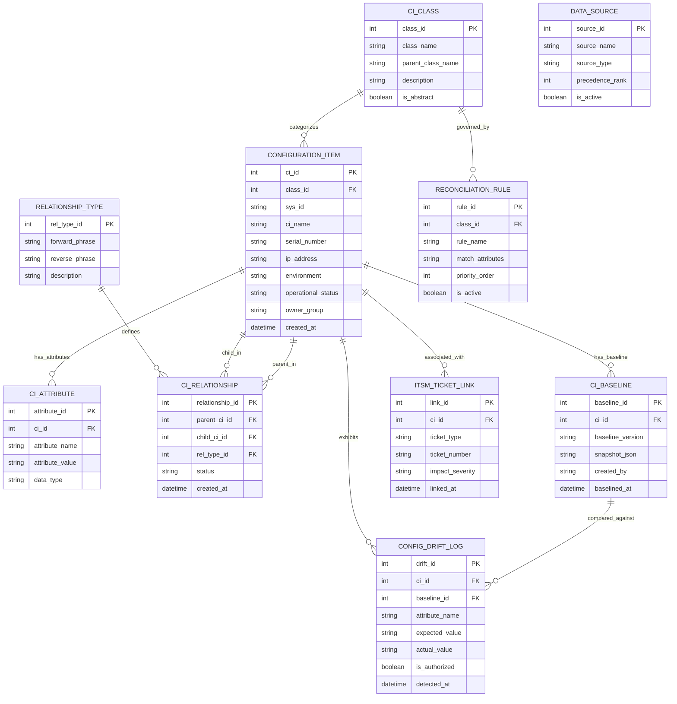

# Conceptual ERD — Configuration Management System (CMDB)

## Mermaid Code

## Entity Description Table | Bảng mô tả Entity

| # | Entity Name | Vietnamese Name | Description | Key Attributes | Main Relationships |
|---|-------------|-----------------|-------------|----------------|-------------------|
| 1 | CI_CLASS | Lớp Mục Cấu hình | Định nghĩa sơ đồ cấu trúc cấp bậc phân loại cho các CI (Server, DB, Service) | class_id (PK), class_name, parent_class_name, is_abstract | Categorizes CONFIGURATION_ITEM |
| 2 | CONFIGURATION_ITEM | Mục Cấu hình (CI) | Thực thể trung tâm lưu trữ thông tin về một thành phần cấu hình CNTT | ci_id (PK), class_id (FK), sys_id, ci_name, serial_number, operational_status | Categorized by CLASS, has ATTRIBUTE, parent/child in RELATIONSHIP |
| 3 | CI_ATTRIBUTE | Thuộc tính CI | Lưu trữ các thuộc tính tùy chỉnh mở rộng dưới dạng cặp Name-Value cho từng CI | attribute_id (PK), ci_id (FK), attribute_name, attribute_value, data_type | Belongs to CONFIGURATION_ITEM |
| 4 | RELATIONSHIP_TYPE | Loại Quan hệ CI | Định nghĩa ngữ nghĩa của mối quan hệ hai chiều (Runs On / Hosts, Depends On / Depended By) | rel_type_id (PK), forward_phrase, reverse_phrase | Defines CI_RELATIONSHIP |
| 5 | CI_RELATIONSHIP | Mối Quan hệ CI | Ghi nhận liên kết phụ thuộc có hướng giữa hai CI (Parent CI và Child CI) | relationship_id (PK), parent_ci_id (FK), child_ci_id (FK), rel_type_id (FK) | Connects parent & child CONFIGURATION_ITEM |
| 6 | CI_BASELINE | Bản Mẫu Chuẩn CI | Lưu ảnh chụp cấu hình chuẩn đã được phê duyệt tại một mốc thời gian release | baseline_id (PK), ci_id (FK), baseline_version, snapshot_json | Belongs to CONFIGURATION_ITEM, compared in DRIFT_LOG |
| 7 | CONFIG_DRIFT_LOG | Nhật ký Sai lệch Cấu hình | Ghi nhận các điểm sai lệch giữa trạng thái thực tế và bản mẫu chuẩn đã đóng vết | drift_id (PK), ci_id (FK), baseline_id (FK), attribute_name, actual_value | Exhibits for CONFIGURATION_ITEM |
| 8 | RECONCILIATION_RULE | Quy tắc Hòa giải CI | Quy định các thuộc tính dùng để nhận diện và hợp nhất dữ liệu CI trùng lặp | rule_id (PK), class_id (FK), rule_name, match_attributes, priority_order | Governs CI_CLASS |
| 9 | DATA_SOURCE | Nguồn Dữ liệu Nguồn | Quản lý thứ tự ưu tiên của các nguồn dữ liệu đẩy vào CMDB (Discovery, AWS, SCCM) | source_id (PK), source_name, source_type, precedence_rank | Feeds CMDB |
| 10 | ITSM_TICKET_LINK | Liên kết Vé ITSM | Ghi nhận liên kết giữa CI với các vé sự cố (Incident, Problem, Change Request) | link_id (PK), ci_id (FK), ticket_type, ticket_number, impact_severity | Associated with CONFIGURATION_ITEM |

## Relationship Description | Mô tả Quan hệ

| # | From Entity | Cardinality | To Entity | Relationship Label | Business Explanation |
|---|-------------|-------------|-----------|-------------------|----------------------|
| 1 | CI_CLASS | 1 to Many | CONFIGURATION_ITEM | categorizes | Một lớp CI định nghĩa phân loại cấu trúc cho nhiều mục CI. |
| 2 | CONFIGURATION_ITEM | 1 to Many | CI_ATTRIBUTE | has_attributes | Một mục CI sở hữu nhiều thuộc tính mở rộng. |
| 3 | CONFIGURATION_ITEM | 1 to Many | CI_RELATIONSHIP | parent_in | Một CI có thể đóng vai trò là CI cha (Parent) trong nhiều mối quan hệ. |
| 4 | CONFIGURATION_ITEM | 1 to Many | CI_RELATIONSHIP | child_in | Một CI có thể đóng vai trò là CI con (Child) trong nhiều mối quan hệ. |
| 5 | RELATIONSHIP_TYPE | 1 to Many | CI_RELATIONSHIP | defines | Loại quan hệ quy định ngữ nghĩa hiển thị cho các liên kết quan hệ CI. |
| 6 | CONFIGURATION_ITEM | 1 to Many | CI_BASELINE | has_baseline | Một CI có thể được lưu trữ nhiều bản mẫu snapshot cấu hình chuẩn. |
| 7 | CI_BASELINE | 1 to Many | CONFIG_DRIFT_LOG | compared_against | Bản mẫu chuẩn được dùng để so sánh phát hiện các điểm sai lệch cấu hình. |
| 8 | CONFIGURATION_ITEM | 1 to Many | CONFIG_DRIFT_LOG | exhibits | Một CI có thể ghi nhận các sự kiện sai lệch cấu hình thực tế. |
| 9 | CI_CLASS | 1 to Many | RECONCILIATION_RULE | governed_by | Một lớp CI được áp dụng các quy tắc nhận diện và hòa giải dữ liệu trùng lặp. |
| 10 | CONFIGURATION_ITEM | 1 to Many | ITSM_TICKET_LINK | associated_with | Mot CI có thể được liên kết với nhiều vé sự cố hoặc yêu cầu thay đổi ITSM. |
