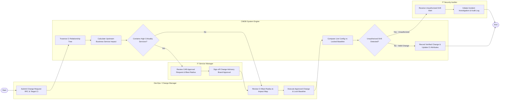

# Swimlane Diagram — Configuration Management System (CMDB)

## Mermaid Code

## Flow Description | Mô tả luồng xử lý

| Lane | Actor | Role in Flow |
|------|-------|-------------|
| 1 | DevOps / Change Manager | Khởi tạo yêu cầu thay đổi (RFC), xem xét báo cáo ma trận ảnh hưởng (Blast Radius), thực hiện thay đổi và yêu cầu đóng vết bản mẫu (Baseline). |
| 2 | CMDB System Engine | Tự động duyệt cây quan hệ CI, tính toán các dịch vụ bị ảnh hưởng, so sánh trạng thái thực tế với baseline và phát hiện các biến đổi trái phép (Drift). |
| 3 | IT Service Manager | Xem xét báo cáo mức độ ảnh hưởng của thay đổi, chủ trì Hội đồng Phê duyệt Thay đổi (CAB) và xác nhận đồng ý triển khai. |
| 4 | IT Security Auditor | Tiếp nhận cảnh báo khi hệ thống phát hiện thay đổi cấu hình CI trái phép (không có RFC phê duyệt) và tiến hành kiểm toán bảo mật. |
