# Action Tree — Configuration Management System (CMDB)

## Mermaid Code

```mermaid
graph TD
    Root["Configuration Management System CMDB"]

    Root --> M1["CI Catalog & Schema Management"]
    Root --> M2["CI Relationship & Topology Mapping"]
    Root --> M3["Automated Data Ingestion & Reconciliation"]
    Root --> M4["Impact Analysis & ITSM Integration"]
    Root --> M5["Configuration Baseline & Drift Detection"]
    Root --> M6["CMDB Audit & Compliance Reporting"]

    M1 --> A11["Define CI Class Hierarchy Schemas"]
    M1 --> A12["Register Configuration Item Records"]
    M1 --> A13["Manage Custom CI Attribute Name Values"]
    M1 --> A14["Update Operational Status Life Cycle"]

    M2 --> A21["Define Directional Relationship Types"]
    M2 --> A22["Link Parent and Child CI Dependencies"]
    M2 --> A23["Render Interactive Graph Topology Map"]
    M2 --> A24["Detect Orphan & Unlinked CIs"]

    M3 --> A31["Configure Automated Discovery Feeds"]
    M3 --> A32["Set CI Identification Priority Rules"]
    M3 --> A33["Reconcile Multi-Source Duplicate CIs"]
    M3 --> A34["Manage Data Source Precedence Ranks"]

    M4 --> A41["Simulate Outage Blast Radius Impact"]
    M4 --> A42["Identify Affected Upstream Services"]
    M4 --> A43["Link CIs to ITSM Incident Tickets"]
    M4 --> A44["Attach Impact Assessment to Change RFCs"]

    M5 --> A51["Capture Immutable CI Version Baseline"]
    M5 --> A52["Compare Live Config against Baseline"]
    M5 --> A53["Detect Unauthorized Configuration Drift"]
    M5 --> A54["Trigger Automated Drift Remediation"]

    M6 --> A61["Audit Unauthorized CI Modifications"]
    M6 --> A62["Generate CI Health & Quality Metrics"]
    M6 --> A63["View CI Inventory Class Distribution"]
    M6 --> A64["Export ISO 20000 Compliance Reports"]
```

## Module Description | Mô tả Module

| # | Module | Description | Actions |
|---|--------|-------------|---------|
| 1 | CI Catalog & Schema Management | Định nghĩa cấu trúc danh mục lớp CI, quản lý thông tin các mục cấu hình, các thuộc tính tùy chỉnh và vòng đời trạng thái. | Define CI Class Hierarchy Schemas, Register Configuration Item Records, Manage Custom CI Attribute Name Values, Update Operational Status Life Cycle |
| 2 | CI Relationship & Topology Mapping | Quản lý loại quan hệ có hướng, liên kết các phụ thuộc giữa CI cha-con, hiển thị sơ đồ ma trận mạng và phát hiện các CI bị cô lập. | Define Directional Relationship Types, Link Parent and Child CI Dependencies, Render Interactive Graph Topology Map, Detect Orphan & Unlinked CIs |
| 3 | Automated Data Ingestion & Reconciliation | Cấu hình nguồn dữ liệu đầu vào tự động, thiết lập quy tắc nhận diện và hòa giải để chống trùng lặp dữ liệu CI từ nhiều nguồn. | Configure Automated Discovery Feeds, Set CI Identification Priority Rules, Reconcile Multi-Source Duplicate CIs, Manage Data Source Precedence Ranks |
| 4 | Impact Analysis & ITSM Integration | Giả lập mức độ ảnh hưởng của sự cố/thay đổi (Blast Radius), xác định các dịch vụ bị ảnh hưởng và đổi nối liên kết vé ITSM. | Simulate Outage Blast Radius Impact, Identify Affected Upstream Services, Link CIs to ITSM Incident Tickets, Attach Impact Assessment to Change RFCs |
| 5 | Configuration Baseline & Drift Detection | Lưu vết snapshot cấu hình chuẩn đã phê duyệt, so sánh với trạng thái thực tế để phát hiện các thay đổi trái phép (Drift). | Capture Immutable CI Version Baseline, Compare Live Config against Baseline, Detect Unauthorized Configuration Drift, Trigger Automated Drift Remediation |
| 6 | CMDB Audit & Compliance Reporting | Kiểm toán các thao tác thay đổi cấu hình CI, đánh giá chất lượng dữ liệu CMDB và xuất báo cáo tuân thủ tiêu chuẩn ISO 20000 / ITIL. | Audit Unauthorized CI Modifications, Generate CI Health & Quality Metrics, View CI Inventory Class Distribution, Export ISO 20000 Compliance Reports |
