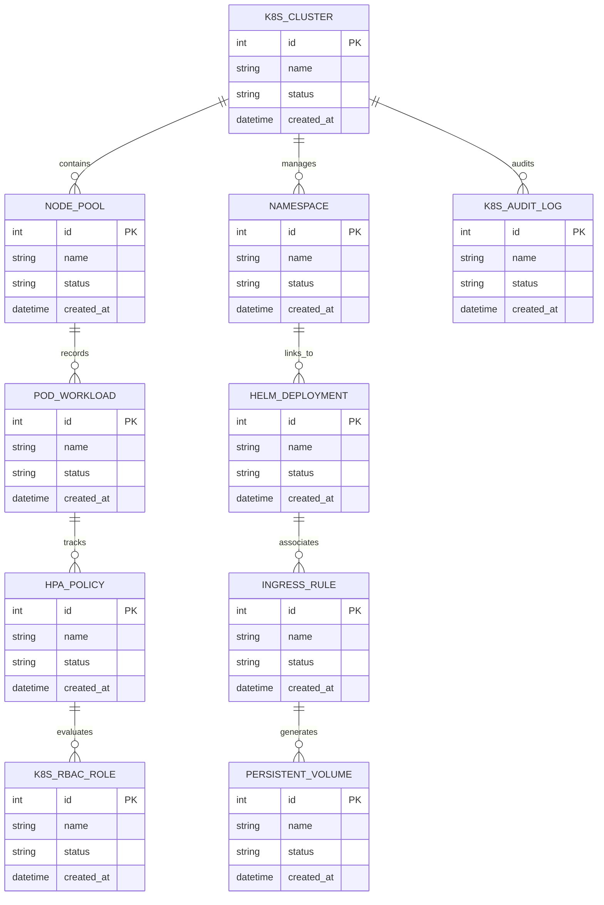

# Conceptual ERD — Container & Kubernetes Management System

## Mermaid Code

## Entity Description Table | Bảng mô tả Entity

| # | Entity Name | Vietnamese Name | Description | Key Attributes | Main Relationships |
|---|-------------|-----------------|-------------|----------------|-------------------|
| 1 | K8S_CLUSTER | Thực thể K8S_CLUSTER | Quản lý thông tin chi tiết cho k8s_cluster | id (PK), name, status, created_at | Links with related entities |
| 2 | NODE_POOL | Thực thể NODE_POOL | Quản lý thông tin chi tiết cho node_pool | id (PK), name, status, created_at | Links with related entities |
| 3 | NAMESPACE | Thực thể NAMESPACE | Quản lý thông tin chi tiết cho namespace | id (PK), name, status, created_at | Links with related entities |
| 4 | POD_WORKLOAD | Thực thể POD_WORKLOAD | Quản lý thông tin chi tiết cho pod_workload | id (PK), name, status, created_at | Links with related entities |
| 5 | HELM_DEPLOYMENT | Thực thể HELM_DEPLOYMENT | Quản lý thông tin chi tiết cho helm_deployment | id (PK), name, status, created_at | Links with related entities |
| 6 | HPA_POLICY | Thực thể HPA_POLICY | Quản lý thông tin chi tiết cho hpa_policy | id (PK), name, status, created_at | Links with related entities |
| 7 | INGRESS_RULE | Thực thể INGRESS_RULE | Quản lý thông tin chi tiết cho ingress_rule | id (PK), name, status, created_at | Links with related entities |
| 8 | K8S_RBAC_ROLE | Thực thể K8S_RBAC_ROLE | Quản lý thông tin chi tiết cho k8s_rbac_role | id (PK), name, status, created_at | Links with related entities |
| 9 | PERSISTENT_VOLUME | Thực thể PERSISTENT_VOLUME | Quản lý thông tin chi tiết cho persistent_volume | id (PK), name, status, created_at | Links with related entities |
| 10 | K8S_AUDIT_LOG | Thực thể K8S_AUDIT_LOG | Quản lý thông tin chi tiết cho k8s_audit_log | id (PK), name, status, created_at | Links with related entities |

## Relationship Description | Mô tả Quan hệ

| # | From Entity | Cardinality | To Entity | Relationship Label | Business Explanation |
|---|-------------|-------------|-----------|-------------------|----------------------|
| 1 | K8S_CLUSTER | 1 to Many | NODE_POOL | relates_to | Quản lý mối quan hệ giữa K8S_CLUSTER và NODE_POOL |
| 2 | NODE_POOL | 1 to Many | NAMESPACE | relates_to | Quản lý mối quan hệ giữa NODE_POOL và NAMESPACE |
| 3 | NAMESPACE | 1 to Many | POD_WORKLOAD | relates_to | Quản lý mối quan hệ giữa NAMESPACE và POD_WORKLOAD |
| 4 | POD_WORKLOAD | 1 to Many | HELM_DEPLOYMENT | relates_to | Quản lý mối quan hệ giữa POD_WORKLOAD và HELM_DEPLOYMENT |
| 5 | HELM_DEPLOYMENT | 1 to Many | HPA_POLICY | relates_to | Quản lý mối quan hệ giữa HELM_DEPLOYMENT và HPA_POLICY |
| 6 | HPA_POLICY | 1 to Many | INGRESS_RULE | relates_to | Quản lý mối quan hệ giữa HPA_POLICY và INGRESS_RULE |
| 7 | INGRESS_RULE | 1 to Many | K8S_RBAC_ROLE | relates_to | Quản lý mối quan hệ giữa INGRESS_RULE và K8S_RBAC_ROLE |
| 8 | K8S_RBAC_ROLE | 1 to Many | PERSISTENT_VOLUME | relates_to | Quản lý mối quan hệ giữa K8S_RBAC_ROLE và PERSISTENT_VOLUME |
| 9 | PERSISTENT_VOLUME | 1 to Many | K8S_AUDIT_LOG | relates_to | Quản lý mối quan hệ giữa PERSISTENT_VOLUME và K8S_AUDIT_LOG |
