# Action Tree — Container & Kubernetes Management System

## Mermaid Code

```mermaid
graph TD
    Root["Container & Kubernetes Management System"]

    Root --> M1["Cluster Provisioning & Node Management"]
    Root --> M2["Workload Deployment & Helm Management"]
    Root --> M3["Pod Autoscaling & Resource Quotas"]
    Root --> M4["Ingress & Network Policy Control"]
    Root --> M5["RBAC & Pod Security Governance"]
    Root --> M6["Cluster Telemetry & Log Troubleshooting"]

    M1 --> A11["Configure Cluster Provisioning & Node Management Policies"]
    M1 --> A12["Execute Cluster Provisioning & Node Management Tasks"]
    M1 --> A13["Monitor Cluster Provisioning & Node Management Telemetry"]
    M1 --> A14["Export Cluster Provisioning & Node Management Audit Logs"]

    M2 --> A21["Configure Workload Deployment & Helm Management Policies"]
    M2 --> A22["Execute Workload Deployment & Helm Management Tasks"]
    M2 --> A23["Monitor Workload Deployment & Helm Management Telemetry"]
    M2 --> A24["Export Workload Deployment & Helm Management Audit Logs"]

    M3 --> A31["Configure Pod Autoscaling & Resource Quotas Policies"]
    M3 --> A32["Execute Pod Autoscaling & Resource Quotas Tasks"]
    M3 --> A33["Monitor Pod Autoscaling & Resource Quotas Telemetry"]
    M3 --> A34["Export Pod Autoscaling & Resource Quotas Audit Logs"]

    M4 --> A41["Configure Ingress & Network Policy Control Policies"]
    M4 --> A42["Execute Ingress & Network Policy Control Tasks"]
    M4 --> A43["Monitor Ingress & Network Policy Control Telemetry"]
    M4 --> A44["Export Ingress & Network Policy Control Audit Logs"]

    M5 --> A51["Configure RBAC & Pod Security Governance Policies"]
    M5 --> A52["Execute RBAC & Pod Security Governance Tasks"]
    M5 --> A53["Monitor RBAC & Pod Security Governance Telemetry"]
    M5 --> A54["Export RBAC & Pod Security Governance Audit Logs"]

    M6 --> A61["Configure Cluster Telemetry & Log Troubleshooting Policies"]
    M6 --> A62["Execute Cluster Telemetry & Log Troubleshooting Tasks"]
    M6 --> A63["Monitor Cluster Telemetry & Log Troubleshooting Telemetry"]
    M6 --> A64["Export Cluster Telemetry & Log Troubleshooting Audit Logs"]
```

## Module Description | Mô tả Module

| # | Module | Description | Actions |
|---|--------|-------------|---------|
| 1 | Cluster Provisioning & Node Management | Quản lý các chức năng cốt lõi thuộc phân hệ cluster provisioning & node management. | Configure Cluster Provisioning & Node Management Policies, Execute Cluster Provisioning & Node Management Tasks, Monitor Cluster Provisioning & Node Management Telemetry, Export Cluster Provisioning & Node Management Audit Logs |
| 2 | Workload Deployment & Helm Management | Quản lý các chức năng cốt lõi thuộc phân hệ workload deployment & helm management. | Configure Workload Deployment & Helm Management Policies, Execute Workload Deployment & Helm Management Tasks, Monitor Workload Deployment & Helm Management Telemetry, Export Workload Deployment & Helm Management Audit Logs |
| 3 | Pod Autoscaling & Resource Quotas | Quản lý các chức năng cốt lõi thuộc phân hệ pod autoscaling & resource quotas. | Configure Pod Autoscaling & Resource Quotas Policies, Execute Pod Autoscaling & Resource Quotas Tasks, Monitor Pod Autoscaling & Resource Quotas Telemetry, Export Pod Autoscaling & Resource Quotas Audit Logs |
| 4 | Ingress & Network Policy Control | Quản lý các chức năng cốt lõi thuộc phân hệ ingress & network policy control. | Configure Ingress & Network Policy Control Policies, Execute Ingress & Network Policy Control Tasks, Monitor Ingress & Network Policy Control Telemetry, Export Ingress & Network Policy Control Audit Logs |
| 5 | RBAC & Pod Security Governance | Quản lý các chức năng cốt lõi thuộc phân hệ rbac & pod security governance. | Configure RBAC & Pod Security Governance Policies, Execute RBAC & Pod Security Governance Tasks, Monitor RBAC & Pod Security Governance Telemetry, Export RBAC & Pod Security Governance Audit Logs |
| 6 | Cluster Telemetry & Log Troubleshooting | Quản lý các chức năng cốt lõi thuộc phân hệ cluster telemetry & log troubleshooting. | Configure Cluster Telemetry & Log Troubleshooting Policies, Execute Cluster Telemetry & Log Troubleshooting Tasks, Monitor Cluster Telemetry & Log Troubleshooting Telemetry, Export Cluster Telemetry & Log Troubleshooting Audit Logs |
