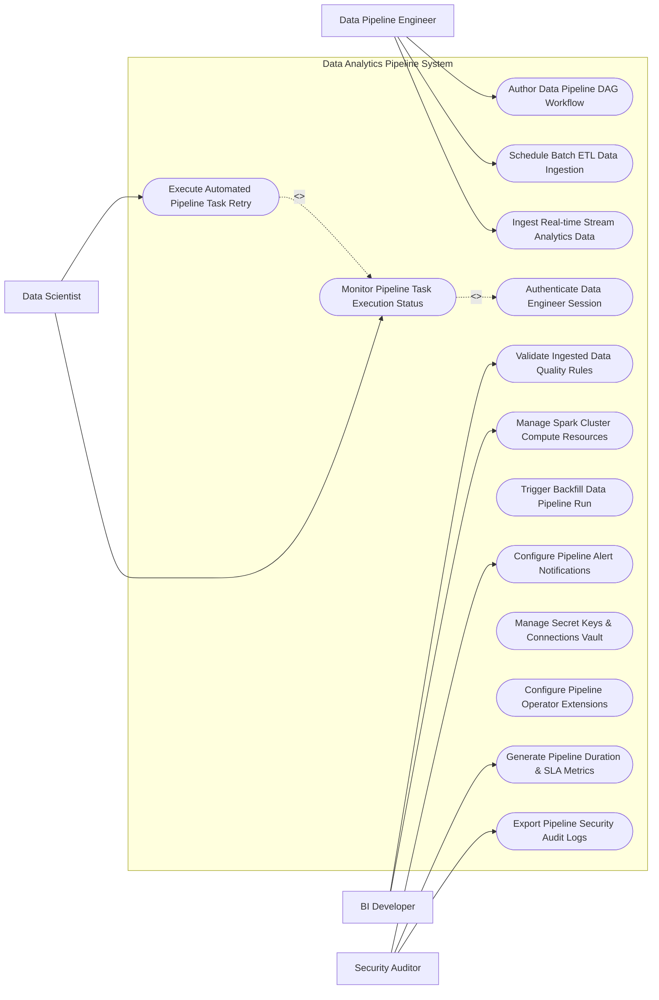

# Use Case Diagram — Data Analytics Pipeline System

## Mermaid Code

## Actor Table | Bảng Actor

| # | Actor | Actor Type | Role Description | Related Use Cases |
|---|-------|------------|------------------|-------------------|
| 1 | Data Pipeline Engineer | Primary | Main actor responsible for system operations and oversight | UC01, UC02, UC05, UC10 |
| 2 | Data Scientist | Primary | Main actor responsible for system operations and oversight | UC01, UC02, UC05, UC10 |
| 3 | BI Developer | Primary | Main actor responsible for system operations and oversight | UC01, UC02, UC05, UC10 |
| 4 | Security Auditor | Primary | Main actor responsible for system operations and oversight | UC01, UC02, UC05, UC10 |

## Use Case Table | Bảng Use Case

| # | UC ID | Use Case Name | Primary Actor | Secondary Actor | Description | Priority |
|---|-------|---------------|---------------|-----------------|-------------|----------|
| 1 | UC01 | Author Data Pipeline DAG Workflow | Data Pipeline Engineer | Supporting System | Handles author data pipeline dag workflow operations within system boundary | High |
| 2 | UC02 | Schedule Batch ETL Data Ingestion | Data Scientist | Supporting System | Handles schedule batch etl data ingestion operations within system boundary | High |
| 3 | UC03 | Ingest Real-time Stream Analytics Data | BI Developer | Supporting System | Handles ingest real-time stream analytics data operations within system boundary | High |
| 4 | UC04 | Authenticate Data Engineer Session | Security Auditor | Supporting System | Handles authenticate data engineer session operations within system boundary | High |
| 5 | UC05 | Monitor Pipeline Task Execution Status | Data Pipeline Engineer | Supporting System | Handles monitor pipeline task execution status operations within system boundary | High |
| 6 | UC06 | Execute Automated Pipeline Task Retry | Data Scientist | Supporting System | Handles execute automated pipeline task retry operations within system boundary | High |
| 7 | UC07 | Validate Ingested Data Quality Rules | BI Developer | Supporting System | Handles validate ingested data quality rules operations within system boundary | High |
| 8 | UC08 | Manage Spark Cluster Compute Resources | Security Auditor | Supporting System | Handles manage spark cluster compute resources operations within system boundary | Medium |
| 9 | UC09 | Trigger Backfill Data Pipeline Run | Data Pipeline Engineer | Supporting System | Handles trigger backfill data pipeline run operations within system boundary | Medium |
| 10 | UC10 | Configure Pipeline Alert Notifications | Data Scientist | Supporting System | Handles configure pipeline alert notifications operations within system boundary | High |
| 11 | UC11 | Manage Secret Keys & Connections Vault | BI Developer | Supporting System | Handles manage secret keys & connections vault operations within system boundary | High |
| 12 | UC12 | Configure Pipeline Operator Extensions | Security Auditor | Supporting System | Handles configure pipeline operator extensions operations within system boundary | Low |
| 13 | UC13 | Generate Pipeline Duration & SLA Metrics | Data Pipeline Engineer | Supporting System | Handles generate pipeline duration & sla metrics operations within system boundary | Medium |
| 14 | UC14 | Export Pipeline Security Audit Logs | Data Scientist | Supporting System | Handles export pipeline security audit logs operations within system boundary | Low |

## Use Case Specification | Đặc tả Use Case

---

### UC01 — Author Data Pipeline DAG Workflow

| Field | Detail |
|-------|--------|
| **UC ID** | UC01 |
| **Use Case Name** | Author Data Pipeline DAG Workflow |
| **Actor(s)** | Primary: Data Pipeline Engineer |
| **Description** | Allows primary actors to configure and execute author data pipeline dag workflow within the system. |
| **Precondition** | 1. Actor must be authenticated.   2. System must be in operational status. |
| **Main Flow** | 1. Actor accesses system module.   2. System displays input form.   3. Actor inputs required details.   4. System validates parameters.   5. Actor submits request.   6. System saves record and updates status. |
| **Alternative Flow** | **AF1** — Bulk Operation: System processes input items in batch mode.   **AF2** — Template Loading: System auto-populates fields using preset template. |
| **Exception Flow** | **EX1** — Validation Error: System highlights missing mandatory fields.   **EX2** — System Timeout: System logs transaction and prompts retry. |
| **Postcondition** | Record is saved and audit trail entry is generated. |
| **Business Rule** | **BR1**: Operation requires valid administrative privileges. |

---

### UC05 — Monitor Pipeline Task Execution Status

| Field | Detail |
|-------|--------|
| **UC ID** | UC05 |
| **Use Case Name** | Monitor Pipeline Task Execution Status |
| **Actor(s)** | Primary: Data Scientist |
| **Description** | Executes monitor pipeline task execution status with real-time feedback and validation. |
| **Precondition** | 1. User must have operational role.   2. Target items must exist. |
| **Main Flow** | 1. User initiates operation.   2. System retrieves target data.   3. User verifies details.   4. User confirms execution.   5. System processes transaction.   6. System returns success confirmation. |
| **Alternative Flow** | **AF1** — Automated Trigger: System executes operation automatically based on policy. |
| **Exception Flow** | **EX1** — Resource Locked: System alerts user if item is locked by another session. |
| **Postcondition** | Execution status is updated to completed. |
| **Business Rule** | **BR1**: All state changes must record timestamp and operator ID. |

---

### UC06 — Execute Automated Pipeline Task Retry

| Field | Detail |
|-------|--------|
| **UC ID** | UC06 |
| **Use Case Name** | Execute Automated Pipeline Task Retry |
| **Actor(s)** | Primary: BI Developer |
| **Description** | Performs execute automated pipeline task retry to ensure operational compliance and quality. |
| **Precondition** | 1. System policies must be active. |
| **Main Flow** | 1. User opens audit/monitoring view.   2. System performs automated scan.   3. System presents findings.   4. User applies corrective action.   5. System updates compliance status.   6. System dispatches notification. |
| **Alternative Flow** | **AF1** — Auto-Remediation: System auto-corrects non-compliant items. |
| **Exception Flow** | **EX1** — Access Denied: System blocks unauthorized role access. |
| **Postcondition** | Compliance logs are updated. |
| **Business Rule** | **BR1**: Non-compliant items must generate high-priority alerts. |

---

### UC07 — Validate Ingested Data Quality Rules

| Field | Detail |
|-------|--------|
| **UC ID** | UC07 |
| **Use Case Name** | Validate Ingested Data Quality Rules |
| **Actor(s)** | Primary: BI Developer |
| **Description** | Manages validate ingested data quality rules to maintain system efficiency. |
| **Precondition** | 1. Threshold rules must be defined. |
| **Main Flow** | 1. System detects threshold event.   2. System alerts user.   3. User reviews event parameters.   4. User confirms action.   5. System executes update.   6. System logs outcome. |
| **Alternative Flow** | **AF1** — Scheduled Task: System executes task at off-peak hours. |
| **Exception Flow** | **EX1** — Integration Fail: System retries external API connection. |
| **Postcondition** | Metric trends are updated. |
| **Business Rule** | **BR1**: Critical metrics require immediate notification. |

---

### UC10 — Configure Pipeline Alert Notifications

| Field | Detail |
|-------|--------|
| **UC ID** | UC10 |
| **Use Case Name** | Configure Pipeline Alert Notifications |
| **Actor(s)** | Primary: Security Auditor |
| **Description** | Conducts configure pipeline alert notifications for governance and security audits. |
| **Precondition** | 1. Audit rules must be pre-configured. |
| **Main Flow** | 1. Auditor opens governance portal.   2. System compiles audit report.   3. Auditor reviews compliance score.   4. Auditor exports documentation.   5. System logs audit event.   6. System updates compliance status. |
| **Alternative Flow** | **AF1** — Automated Export: System dispatches weekly audit summary email. |
| **Exception Flow** | **EX1** — Data Gap Warning: System flags unverified data points. |
| **Postcondition** | Audit compliance record is finalized. |
| **Business Rule** | **BR1**: Audit records are immutable after publication. |
