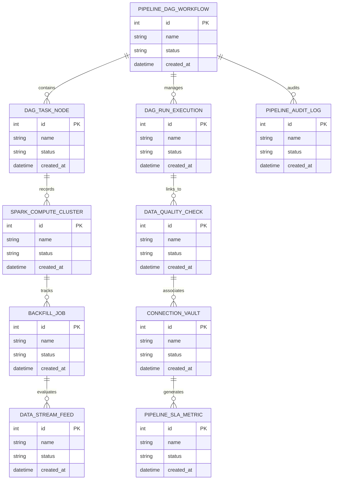

# Conceptual ERD — Data Analytics Pipeline System

## Mermaid Code

## Entity Description Table | Bảng mô tả Entity

| # | Entity Name | Vietnamese Name | Description | Key Attributes | Main Relationships |
|---|-------------|-----------------|-------------|----------------|-------------------|
| 1 | PIPELINE_DAG_WORKFLOW | Thực thể PIPELINE_DAG_WORKFLOW | Quản lý thông tin chi tiết cho pipeline_dag_workflow | id (PK), name, status, created_at | Links with related entities |
| 2 | DAG_TASK_NODE | Thực thể DAG_TASK_NODE | Quản lý thông tin chi tiết cho dag_task_node | id (PK), name, status, created_at | Links with related entities |
| 3 | DAG_RUN_EXECUTION | Thực thể DAG_RUN_EXECUTION | Quản lý thông tin chi tiết cho dag_run_execution | id (PK), name, status, created_at | Links with related entities |
| 4 | SPARK_COMPUTE_CLUSTER | Thực thể SPARK_COMPUTE_CLUSTER | Quản lý thông tin chi tiết cho spark_compute_cluster | id (PK), name, status, created_at | Links with related entities |
| 5 | DATA_QUALITY_CHECK | Thực thể DATA_QUALITY_CHECK | Quản lý thông tin chi tiết cho data_quality_check | id (PK), name, status, created_at | Links with related entities |
| 6 | BACKFILL_JOB | Thực thể BACKFILL_JOB | Quản lý thông tin chi tiết cho backfill_job | id (PK), name, status, created_at | Links with related entities |
| 7 | CONNECTION_VAULT | Thực thể CONNECTION_VAULT | Quản lý thông tin chi tiết cho connection_vault | id (PK), name, status, created_at | Links with related entities |
| 8 | DATA_STREAM_FEED | Thực thể DATA_STREAM_FEED | Quản lý thông tin chi tiết cho data_stream_feed | id (PK), name, status, created_at | Links with related entities |
| 9 | PIPELINE_SLA_METRIC | Thực thể PIPELINE_SLA_METRIC | Quản lý thông tin chi tiết cho pipeline_sla_metric | id (PK), name, status, created_at | Links with related entities |
| 10 | PIPELINE_AUDIT_LOG | Thực thể PIPELINE_AUDIT_LOG | Quản lý thông tin chi tiết cho pipeline_audit_log | id (PK), name, status, created_at | Links with related entities |

## Relationship Description | Mô tả Quan hệ

| # | From Entity | Cardinality | To Entity | Relationship Label | Business Explanation |
|---|-------------|-------------|-----------|-------------------|----------------------|
| 1 | PIPELINE_DAG_WORKFLOW | 1 to Many | DAG_TASK_NODE | relates_to | Quản lý mối quan hệ giữa PIPELINE_DAG_WORKFLOW và DAG_TASK_NODE |
| 2 | DAG_TASK_NODE | 1 to Many | DAG_RUN_EXECUTION | relates_to | Quản lý mối quan hệ giữa DAG_TASK_NODE và DAG_RUN_EXECUTION |
| 3 | DAG_RUN_EXECUTION | 1 to Many | SPARK_COMPUTE_CLUSTER | relates_to | Quản lý mối quan hệ giữa DAG_RUN_EXECUTION và SPARK_COMPUTE_CLUSTER |
| 4 | SPARK_COMPUTE_CLUSTER | 1 to Many | DATA_QUALITY_CHECK | relates_to | Quản lý mối quan hệ giữa SPARK_COMPUTE_CLUSTER và DATA_QUALITY_CHECK |
| 5 | DATA_QUALITY_CHECK | 1 to Many | BACKFILL_JOB | relates_to | Quản lý mối quan hệ giữa DATA_QUALITY_CHECK và BACKFILL_JOB |
| 6 | BACKFILL_JOB | 1 to Many | CONNECTION_VAULT | relates_to | Quản lý mối quan hệ giữa BACKFILL_JOB và CONNECTION_VAULT |
| 7 | CONNECTION_VAULT | 1 to Many | DATA_STREAM_FEED | relates_to | Quản lý mối quan hệ giữa CONNECTION_VAULT và DATA_STREAM_FEED |
| 8 | DATA_STREAM_FEED | 1 to Many | PIPELINE_SLA_METRIC | relates_to | Quản lý mối quan hệ giữa DATA_STREAM_FEED và PIPELINE_SLA_METRIC |
| 9 | PIPELINE_SLA_METRIC | 1 to Many | PIPELINE_AUDIT_LOG | relates_to | Quản lý mối quan hệ giữa PIPELINE_SLA_METRIC và PIPELINE_AUDIT_LOG |
