# Action Tree — Data Analytics Pipeline System

## Mermaid Code

```mermaid
graph TD
    Root["Data Analytics Pipeline System"]

    Root --> M1["DAG Workflow Authoring & Scheduling"]
    Root --> M2["Batch ETL & Real-time Stream Ingestion"]
    Root --> M3["Spark Compute Cluster Management"]
    Root --> M4["Data Quality Validation & Backfill"]
    Root --> M5["Secret Connection & Vault Security"]
    Root --> M6["Pipeline SLAs & Execution Analytics"]

    M1 --> A11["Configure DAG Workflow Authoring & Scheduling Policies"]
    M1 --> A12["Execute DAG Workflow Authoring & Scheduling Tasks"]
    M1 --> A13["Monitor DAG Workflow Authoring & Scheduling Telemetry"]
    M1 --> A14["Export DAG Workflow Authoring & Scheduling Audit Logs"]

    M2 --> A21["Configure Batch ETL & Real-time Stream Ingestion Policies"]
    M2 --> A22["Execute Batch ETL & Real-time Stream Ingestion Tasks"]
    M2 --> A23["Monitor Batch ETL & Real-time Stream Ingestion Telemetry"]
    M2 --> A24["Export Batch ETL & Real-time Stream Ingestion Audit Logs"]

    M3 --> A31["Configure Spark Compute Cluster Management Policies"]
    M3 --> A32["Execute Spark Compute Cluster Management Tasks"]
    M3 --> A33["Monitor Spark Compute Cluster Management Telemetry"]
    M3 --> A34["Export Spark Compute Cluster Management Audit Logs"]

    M4 --> A41["Configure Data Quality Validation & Backfill Policies"]
    M4 --> A42["Execute Data Quality Validation & Backfill Tasks"]
    M4 --> A43["Monitor Data Quality Validation & Backfill Telemetry"]
    M4 --> A44["Export Data Quality Validation & Backfill Audit Logs"]

    M5 --> A51["Configure Secret Connection & Vault Security Policies"]
    M5 --> A52["Execute Secret Connection & Vault Security Tasks"]
    M5 --> A53["Monitor Secret Connection & Vault Security Telemetry"]
    M5 --> A54["Export Secret Connection & Vault Security Audit Logs"]

    M6 --> A61["Configure Pipeline SLAs & Execution Analytics Policies"]
    M6 --> A62["Execute Pipeline SLAs & Execution Analytics Tasks"]
    M6 --> A63["Monitor Pipeline SLAs & Execution Analytics Telemetry"]
    M6 --> A64["Export Pipeline SLAs & Execution Analytics Audit Logs"]
```

## Module Description | Mô tả Module

| # | Module | Description | Actions |
|---|--------|-------------|---------|
| 1 | DAG Workflow Authoring & Scheduling | Quản lý các chức năng cốt lõi thuộc phân hệ dag workflow authoring & scheduling. | Configure DAG Workflow Authoring & Scheduling Policies, Execute DAG Workflow Authoring & Scheduling Tasks, Monitor DAG Workflow Authoring & Scheduling Telemetry, Export DAG Workflow Authoring & Scheduling Audit Logs |
| 2 | Batch ETL & Real-time Stream Ingestion | Quản lý các chức năng cốt lõi thuộc phân hệ batch etl & real-time stream ingestion. | Configure Batch ETL & Real-time Stream Ingestion Policies, Execute Batch ETL & Real-time Stream Ingestion Tasks, Monitor Batch ETL & Real-time Stream Ingestion Telemetry, Export Batch ETL & Real-time Stream Ingestion Audit Logs |
| 3 | Spark Compute Cluster Management | Quản lý các chức năng cốt lõi thuộc phân hệ spark compute cluster management. | Configure Spark Compute Cluster Management Policies, Execute Spark Compute Cluster Management Tasks, Monitor Spark Compute Cluster Management Telemetry, Export Spark Compute Cluster Management Audit Logs |
| 4 | Data Quality Validation & Backfill | Quản lý các chức năng cốt lõi thuộc phân hệ data quality validation & backfill. | Configure Data Quality Validation & Backfill Policies, Execute Data Quality Validation & Backfill Tasks, Monitor Data Quality Validation & Backfill Telemetry, Export Data Quality Validation & Backfill Audit Logs |
| 5 | Secret Connection & Vault Security | Quản lý các chức năng cốt lõi thuộc phân hệ secret connection & vault security. | Configure Secret Connection & Vault Security Policies, Execute Secret Connection & Vault Security Tasks, Monitor Secret Connection & Vault Security Telemetry, Export Secret Connection & Vault Security Audit Logs |
| 6 | Pipeline SLAs & Execution Analytics | Quản lý các chức năng cốt lõi thuộc phân hệ pipeline slas & execution analytics. | Configure Pipeline SLAs & Execution Analytics Policies, Execute Pipeline SLAs & Execution Analytics Tasks, Monitor Pipeline SLAs & Execution Analytics Telemetry, Export Pipeline SLAs & Execution Analytics Audit Logs |
