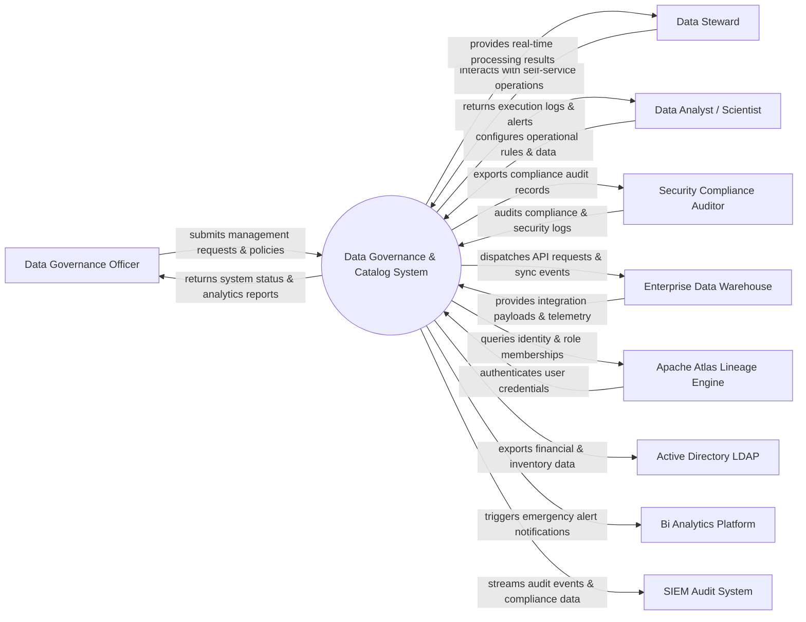

# Context Diagram — Data Governance & Catalog System

## Mermaid Code

## Actor & Interaction Table | Bảng Actor & Tương tác

| # | Actor | Actor Type | Data Sent TO System | Data Received FROM System | Notes |
|---|-------|------------|---------------------|---------------------------|-------|
| 1 | Data Governance Officer | Primary | Operational requests, policy configurations, audit queries | Status updates, performance reports, audit results | Data Governance Officer role |
| 2 | Data Steward | Primary | Operational requests, policy configurations, audit queries | Status updates, performance reports, audit results | Data Steward role |
| 3 | Data Analyst / Scientist | Primary | Operational requests, policy configurations, audit queries | Status updates, performance reports, audit results | Data Analyst / Scientist role |
| 4 | Security Compliance Auditor | Primary | Operational requests, policy configurations, audit queries | Status updates, performance reports, audit results | Security Compliance Auditor role |
| 5 | Enterprise Data Warehouse | Supporting | Integration payloads, auth claims, event logs | API sync responses, verification tokens | Enterprise Data Warehouse role |
| 6 | Apache Atlas Lineage Engine | Supporting | Integration payloads, auth claims, event logs | API sync responses, verification tokens | Apache Atlas Lineage Engine role |
| 7 | Active Directory LDAP | Supporting | Integration payloads, auth claims, event logs | API sync responses, verification tokens | Active Directory LDAP role |
| 8 | Bi Analytics Platform | Supporting | Integration payloads, auth claims, event logs | API sync responses, verification tokens | Bi Analytics Platform role |
| 9 | SIEM Audit System | Supporting | Integration payloads, auth claims, event logs | API sync responses, verification tokens | SIEM Audit System role |

## System Boundary Description | Mô tả Scope Hệ thống

Hệ thống **Data Governance & Catalog System** (Hệ thống Quản trị và Danh mục Dữ liệu) được thiết kế nhằm quản lý tập trung và tự động hóa các quy trình vận hành CNTT cốt lõi trong doanh nghiệp.

- **Phạm vi bên trong hệ thống (In-Scope)**:
  - Quản lý dữ liệu nghiệp vụ trung tâm, tự động hóa quy trình theo chính sách doanh nghiệp.
  - Phân quyền người dùng chi tiết, theo dõi lịch sử thao tác và xuất báo cáo tuân thủ (ISO/SOC2).
  - Tích hợp phát hiện sự cố, gửi cảnh báo tức thì và kết nối dữ liệu hai chiều.

- **Bên ngoài phạm vi hệ thống (Out-of-Scope)**:
  - Trực tiếp quản lý hạ tầng phần cứng máy chủ vật lý.
  - Trực tiếp xử lý xác thực mật khẩu người dùng gốc (do Identity Provider đảm nhận).
