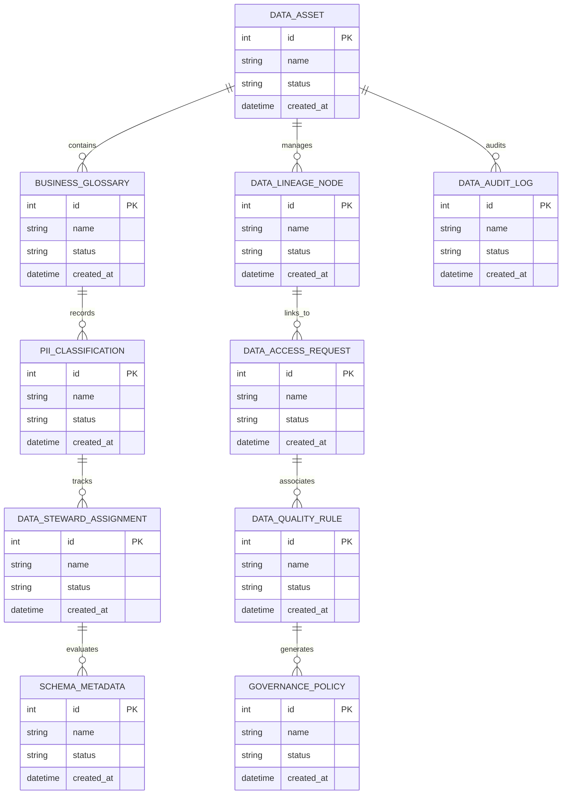

# Conceptual ERD — Data Governance & Catalog System

## Mermaid Code

## Entity Description Table | Bảng mô tả Entity

| # | Entity Name | Vietnamese Name | Description | Key Attributes | Main Relationships |
|---|-------------|-----------------|-------------|----------------|-------------------|
| 1 | DATA_ASSET | Thực thể DATA_ASSET | Quản lý thông tin chi tiết cho data_asset | id (PK), name, status, created_at | Links with related entities |
| 2 | BUSINESS_GLOSSARY | Thực thể BUSINESS_GLOSSARY | Quản lý thông tin chi tiết cho business_glossary | id (PK), name, status, created_at | Links with related entities |
| 3 | DATA_LINEAGE_NODE | Thực thể DATA_LINEAGE_NODE | Quản lý thông tin chi tiết cho data_lineage_node | id (PK), name, status, created_at | Links with related entities |
| 4 | PII_CLASSIFICATION | Thực thể PII_CLASSIFICATION | Quản lý thông tin chi tiết cho pii_classification | id (PK), name, status, created_at | Links with related entities |
| 5 | DATA_ACCESS_REQUEST | Thực thể DATA_ACCESS_REQUEST | Quản lý thông tin chi tiết cho data_access_request | id (PK), name, status, created_at | Links with related entities |
| 6 | DATA_STEWARD_ASSIGNMENT | Thực thể DATA_STEWARD_ASSIGNMENT | Quản lý thông tin chi tiết cho data_steward_assignment | id (PK), name, status, created_at | Links with related entities |
| 7 | DATA_QUALITY_RULE | Thực thể DATA_QUALITY_RULE | Quản lý thông tin chi tiết cho data_quality_rule | id (PK), name, status, created_at | Links with related entities |
| 8 | SCHEMA_METADATA | Thực thể SCHEMA_METADATA | Quản lý thông tin chi tiết cho schema_metadata | id (PK), name, status, created_at | Links with related entities |
| 9 | GOVERNANCE_POLICY | Thực thể GOVERNANCE_POLICY | Quản lý thông tin chi tiết cho governance_policy | id (PK), name, status, created_at | Links with related entities |
| 10 | DATA_AUDIT_LOG | Thực thể DATA_AUDIT_LOG | Quản lý thông tin chi tiết cho data_audit_log | id (PK), name, status, created_at | Links with related entities |

## Relationship Description | Mô tả Quan hệ

| # | From Entity | Cardinality | To Entity | Relationship Label | Business Explanation |
|---|-------------|-------------|-----------|-------------------|----------------------|
| 1 | DATA_ASSET | 1 to Many | BUSINESS_GLOSSARY | relates_to | Quản lý mối quan hệ giữa DATA_ASSET và BUSINESS_GLOSSARY |
| 2 | BUSINESS_GLOSSARY | 1 to Many | DATA_LINEAGE_NODE | relates_to | Quản lý mối quan hệ giữa BUSINESS_GLOSSARY và DATA_LINEAGE_NODE |
| 3 | DATA_LINEAGE_NODE | 1 to Many | PII_CLASSIFICATION | relates_to | Quản lý mối quan hệ giữa DATA_LINEAGE_NODE và PII_CLASSIFICATION |
| 4 | PII_CLASSIFICATION | 1 to Many | DATA_ACCESS_REQUEST | relates_to | Quản lý mối quan hệ giữa PII_CLASSIFICATION và DATA_ACCESS_REQUEST |
| 5 | DATA_ACCESS_REQUEST | 1 to Many | DATA_STEWARD_ASSIGNMENT | relates_to | Quản lý mối quan hệ giữa DATA_ACCESS_REQUEST và DATA_STEWARD_ASSIGNMENT |
| 6 | DATA_STEWARD_ASSIGNMENT | 1 to Many | DATA_QUALITY_RULE | relates_to | Quản lý mối quan hệ giữa DATA_STEWARD_ASSIGNMENT và DATA_QUALITY_RULE |
| 7 | DATA_QUALITY_RULE | 1 to Many | SCHEMA_METADATA | relates_to | Quản lý mối quan hệ giữa DATA_QUALITY_RULE và SCHEMA_METADATA |
| 8 | SCHEMA_METADATA | 1 to Many | GOVERNANCE_POLICY | relates_to | Quản lý mối quan hệ giữa SCHEMA_METADATA và GOVERNANCE_POLICY |
| 9 | GOVERNANCE_POLICY | 1 to Many | DATA_AUDIT_LOG | relates_to | Quản lý mối quan hệ giữa GOVERNANCE_POLICY và DATA_AUDIT_LOG |
