# Action Tree — Data Governance & Catalog System

## Mermaid Code

```mermaid
graph TD
    Root["Data Governance & Catalog System"]

    Root --> M1["Data Catalog & Metadata Management"]
    Root --> M2["Data Lineage & Impact Traversal"]
    Root --> M3["PII Security & Data Masking"]
    Root --> M4["Data Access Request & Approval Workflow"]
    Root --> M5["Business Glossary & Term Mapping"]
    Root --> M6["Data Governance Audit & Compliance"]

    M1 --> A11["Configure Data Catalog & Metadata Management Policies"]
    M1 --> A12["Execute Data Catalog & Metadata Management Tasks"]
    M1 --> A13["Monitor Data Catalog & Metadata Management Telemetry"]
    M1 --> A14["Export Data Catalog & Metadata Management Audit Logs"]

    M2 --> A21["Configure Data Lineage & Impact Traversal Policies"]
    M2 --> A22["Execute Data Lineage & Impact Traversal Tasks"]
    M2 --> A23["Monitor Data Lineage & Impact Traversal Telemetry"]
    M2 --> A24["Export Data Lineage & Impact Traversal Audit Logs"]

    M3 --> A31["Configure PII Security & Data Masking Policies"]
    M3 --> A32["Execute PII Security & Data Masking Tasks"]
    M3 --> A33["Monitor PII Security & Data Masking Telemetry"]
    M3 --> A34["Export PII Security & Data Masking Audit Logs"]

    M4 --> A41["Configure Data Access Request & Approval Workflow Policies"]
    M4 --> A42["Execute Data Access Request & Approval Workflow Tasks"]
    M4 --> A43["Monitor Data Access Request & Approval Workflow Telemetry"]
    M4 --> A44["Export Data Access Request & Approval Workflow Audit Logs"]

    M5 --> A51["Configure Business Glossary & Term Mapping Policies"]
    M5 --> A52["Execute Business Glossary & Term Mapping Tasks"]
    M5 --> A53["Monitor Business Glossary & Term Mapping Telemetry"]
    M5 --> A54["Export Business Glossary & Term Mapping Audit Logs"]

    M6 --> A61["Configure Data Governance Audit & Compliance Policies"]
    M6 --> A62["Execute Data Governance Audit & Compliance Tasks"]
    M6 --> A63["Monitor Data Governance Audit & Compliance Telemetry"]
    M6 --> A64["Export Data Governance Audit & Compliance Audit Logs"]
```

## Module Description | Mô tả Module

| # | Module | Description | Actions |
|---|--------|-------------|---------|
| 1 | Data Catalog & Metadata Management | Quản lý các chức năng cốt lõi thuộc phân hệ data catalog & metadata management. | Configure Data Catalog & Metadata Management Policies, Execute Data Catalog & Metadata Management Tasks, Monitor Data Catalog & Metadata Management Telemetry, Export Data Catalog & Metadata Management Audit Logs |
| 2 | Data Lineage & Impact Traversal | Quản lý các chức năng cốt lõi thuộc phân hệ data lineage & impact traversal. | Configure Data Lineage & Impact Traversal Policies, Execute Data Lineage & Impact Traversal Tasks, Monitor Data Lineage & Impact Traversal Telemetry, Export Data Lineage & Impact Traversal Audit Logs |
| 3 | PII Security & Data Masking | Quản lý các chức năng cốt lõi thuộc phân hệ pii security & data masking. | Configure PII Security & Data Masking Policies, Execute PII Security & Data Masking Tasks, Monitor PII Security & Data Masking Telemetry, Export PII Security & Data Masking Audit Logs |
| 4 | Data Access Request & Approval Workflow | Quản lý các chức năng cốt lõi thuộc phân hệ data access request & approval workflow. | Configure Data Access Request & Approval Workflow Policies, Execute Data Access Request & Approval Workflow Tasks, Monitor Data Access Request & Approval Workflow Telemetry, Export Data Access Request & Approval Workflow Audit Logs |
| 5 | Business Glossary & Term Mapping | Quản lý các chức năng cốt lõi thuộc phân hệ business glossary & term mapping. | Configure Business Glossary & Term Mapping Policies, Execute Business Glossary & Term Mapping Tasks, Monitor Business Glossary & Term Mapping Telemetry, Export Business Glossary & Term Mapping Audit Logs |
| 6 | Data Governance Audit & Compliance | Quản lý các chức năng cốt lõi thuộc phân hệ data governance audit & compliance. | Configure Data Governance Audit & Compliance Policies, Execute Data Governance Audit & Compliance Tasks, Monitor Data Governance Audit & Compliance Telemetry, Export Data Governance Audit & Compliance Audit Logs |
