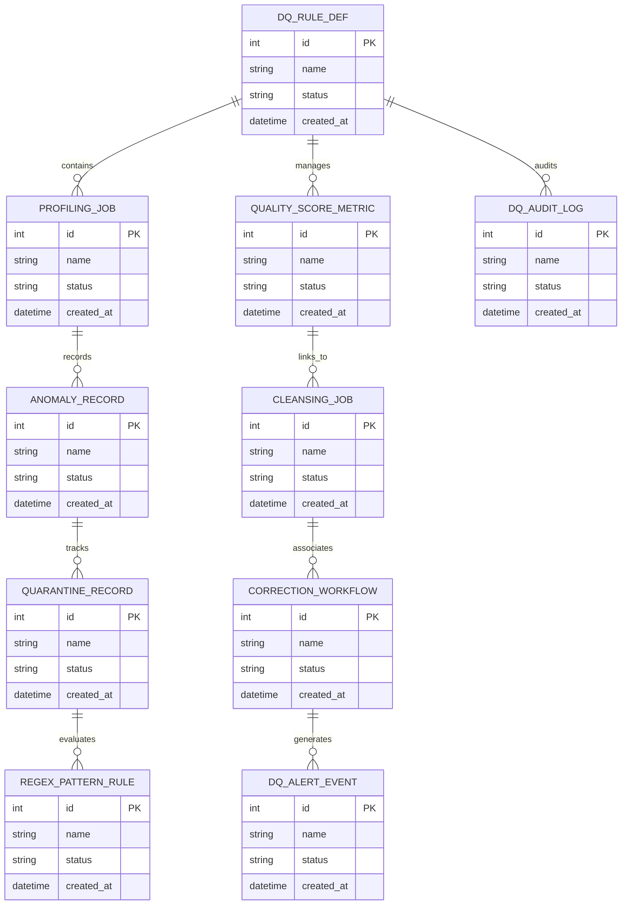

# Conceptual ERD — Data Quality Management System

## Mermaid Code

## Entity Description Table | Bảng mô tả Entity

| # | Entity Name | Vietnamese Name | Description | Key Attributes | Main Relationships |
|---|-------------|-----------------|-------------|----------------|-------------------|
| 1 | DQ_RULE_DEF | Thực thể DQ_RULE_DEF | Quản lý thông tin chi tiết cho dq_rule_def | id (PK), name, status, created_at | Links with related entities |
| 2 | PROFILING_JOB | Thực thể PROFILING_JOB | Quản lý thông tin chi tiết cho profiling_job | id (PK), name, status, created_at | Links with related entities |
| 3 | QUALITY_SCORE_METRIC | Thực thể QUALITY_SCORE_METRIC | Quản lý thông tin chi tiết cho quality_score_metric | id (PK), name, status, created_at | Links with related entities |
| 4 | ANOMALY_RECORD | Thực thể ANOMALY_RECORD | Quản lý thông tin chi tiết cho anomaly_record | id (PK), name, status, created_at | Links with related entities |
| 5 | CLEANSING_JOB | Thực thể CLEANSING_JOB | Quản lý thông tin chi tiết cho cleansing_job | id (PK), name, status, created_at | Links with related entities |
| 6 | QUARANTINE_RECORD | Thực thể QUARANTINE_RECORD | Quản lý thông tin chi tiết cho quarantine_record | id (PK), name, status, created_at | Links with related entities |
| 7 | CORRECTION_WORKFLOW | Thực thể CORRECTION_WORKFLOW | Quản lý thông tin chi tiết cho correction_workflow | id (PK), name, status, created_at | Links with related entities |
| 8 | REGEX_PATTERN_RULE | Thực thể REGEX_PATTERN_RULE | Quản lý thông tin chi tiết cho regex_pattern_rule | id (PK), name, status, created_at | Links with related entities |
| 9 | DQ_ALERT_EVENT | Thực thể DQ_ALERT_EVENT | Quản lý thông tin chi tiết cho dq_alert_event | id (PK), name, status, created_at | Links with related entities |
| 10 | DQ_AUDIT_LOG | Thực thể DQ_AUDIT_LOG | Quản lý thông tin chi tiết cho dq_audit_log | id (PK), name, status, created_at | Links with related entities |

## Relationship Description | Mô tả Quan hệ

| # | From Entity | Cardinality | To Entity | Relationship Label | Business Explanation |
|---|-------------|-------------|-----------|-------------------|----------------------|
| 1 | DQ_RULE_DEF | 1 to Many | PROFILING_JOB | relates_to | Quản lý mối quan hệ giữa DQ_RULE_DEF và PROFILING_JOB |
| 2 | PROFILING_JOB | 1 to Many | QUALITY_SCORE_METRIC | relates_to | Quản lý mối quan hệ giữa PROFILING_JOB và QUALITY_SCORE_METRIC |
| 3 | QUALITY_SCORE_METRIC | 1 to Many | ANOMALY_RECORD | relates_to | Quản lý mối quan hệ giữa QUALITY_SCORE_METRIC và ANOMALY_RECORD |
| 4 | ANOMALY_RECORD | 1 to Many | CLEANSING_JOB | relates_to | Quản lý mối quan hệ giữa ANOMALY_RECORD và CLEANSING_JOB |
| 5 | CLEANSING_JOB | 1 to Many | QUARANTINE_RECORD | relates_to | Quản lý mối quan hệ giữa CLEANSING_JOB và QUARANTINE_RECORD |
| 6 | QUARANTINE_RECORD | 1 to Many | CORRECTION_WORKFLOW | relates_to | Quản lý mối quan hệ giữa QUARANTINE_RECORD và CORRECTION_WORKFLOW |
| 7 | CORRECTION_WORKFLOW | 1 to Many | REGEX_PATTERN_RULE | relates_to | Quản lý mối quan hệ giữa CORRECTION_WORKFLOW và REGEX_PATTERN_RULE |
| 8 | REGEX_PATTERN_RULE | 1 to Many | DQ_ALERT_EVENT | relates_to | Quản lý mối quan hệ giữa REGEX_PATTERN_RULE và DQ_ALERT_EVENT |
| 9 | DQ_ALERT_EVENT | 1 to Many | DQ_AUDIT_LOG | relates_to | Quản lý mối quan hệ giữa DQ_ALERT_EVENT và DQ_AUDIT_LOG |
