# Action Tree — Data Quality Management System

## Mermaid Code

```mermaid
graph TD
    Root["Data Quality Management System"]

    Root --> M1["Data Profiling & Rule Configuration"]
    Root --> M2["Anomaly & Duplicate Detection"]
    Root --> M3["Automated Cleansing & Standardization"]
    Root --> M4["Quarantine & Manual Data Correction"]
    Root --> M5["Quality Score & Metric Dashboard"]
    Root --> M6["Data Quality Compliance Reporting"]

    M1 --> A11["Configure Data Profiling & Rule Configuration Policies"]
    M1 --> A12["Execute Data Profiling & Rule Configuration Tasks"]
    M1 --> A13["Monitor Data Profiling & Rule Configuration Telemetry"]
    M1 --> A14["Export Data Profiling & Rule Configuration Audit Logs"]

    M2 --> A21["Configure Anomaly & Duplicate Detection Policies"]
    M2 --> A22["Execute Anomaly & Duplicate Detection Tasks"]
    M2 --> A23["Monitor Anomaly & Duplicate Detection Telemetry"]
    M2 --> A24["Export Anomaly & Duplicate Detection Audit Logs"]

    M3 --> A31["Configure Automated Cleansing & Standardization Policies"]
    M3 --> A32["Execute Automated Cleansing & Standardization Tasks"]
    M3 --> A33["Monitor Automated Cleansing & Standardization Telemetry"]
    M3 --> A34["Export Automated Cleansing & Standardization Audit Logs"]

    M4 --> A41["Configure Quarantine & Manual Data Correction Policies"]
    M4 --> A42["Execute Quarantine & Manual Data Correction Tasks"]
    M4 --> A43["Monitor Quarantine & Manual Data Correction Telemetry"]
    M4 --> A44["Export Quarantine & Manual Data Correction Audit Logs"]

    M5 --> A51["Configure Quality Score & Metric Dashboard Policies"]
    M5 --> A52["Execute Quality Score & Metric Dashboard Tasks"]
    M5 --> A53["Monitor Quality Score & Metric Dashboard Telemetry"]
    M5 --> A54["Export Quality Score & Metric Dashboard Audit Logs"]

    M6 --> A61["Configure Data Quality Compliance Reporting Policies"]
    M6 --> A62["Execute Data Quality Compliance Reporting Tasks"]
    M6 --> A63["Monitor Data Quality Compliance Reporting Telemetry"]
    M6 --> A64["Export Data Quality Compliance Reporting Audit Logs"]
```

## Module Description | Mô tả Module

| # | Module | Description | Actions |
|---|--------|-------------|---------|
| 1 | Data Profiling & Rule Configuration | Quản lý các chức năng cốt lõi thuộc phân hệ data profiling & rule configuration. | Configure Data Profiling & Rule Configuration Policies, Execute Data Profiling & Rule Configuration Tasks, Monitor Data Profiling & Rule Configuration Telemetry, Export Data Profiling & Rule Configuration Audit Logs |
| 2 | Anomaly & Duplicate Detection | Quản lý các chức năng cốt lõi thuộc phân hệ anomaly & duplicate detection. | Configure Anomaly & Duplicate Detection Policies, Execute Anomaly & Duplicate Detection Tasks, Monitor Anomaly & Duplicate Detection Telemetry, Export Anomaly & Duplicate Detection Audit Logs |
| 3 | Automated Cleansing & Standardization | Quản lý các chức năng cốt lõi thuộc phân hệ automated cleansing & standardization. | Configure Automated Cleansing & Standardization Policies, Execute Automated Cleansing & Standardization Tasks, Monitor Automated Cleansing & Standardization Telemetry, Export Automated Cleansing & Standardization Audit Logs |
| 4 | Quarantine & Manual Data Correction | Quản lý các chức năng cốt lõi thuộc phân hệ quarantine & manual data correction. | Configure Quarantine & Manual Data Correction Policies, Execute Quarantine & Manual Data Correction Tasks, Monitor Quarantine & Manual Data Correction Telemetry, Export Quarantine & Manual Data Correction Audit Logs |
| 5 | Quality Score & Metric Dashboard | Quản lý các chức năng cốt lõi thuộc phân hệ quality score & metric dashboard. | Configure Quality Score & Metric Dashboard Policies, Execute Quality Score & Metric Dashboard Tasks, Monitor Quality Score & Metric Dashboard Telemetry, Export Quality Score & Metric Dashboard Audit Logs |
| 6 | Data Quality Compliance Reporting | Quản lý các chức năng cốt lõi thuộc phân hệ data quality compliance reporting. | Configure Data Quality Compliance Reporting Policies, Execute Data Quality Compliance Reporting Tasks, Monitor Data Quality Compliance Reporting Telemetry, Export Data Quality Compliance Reporting Audit Logs |
