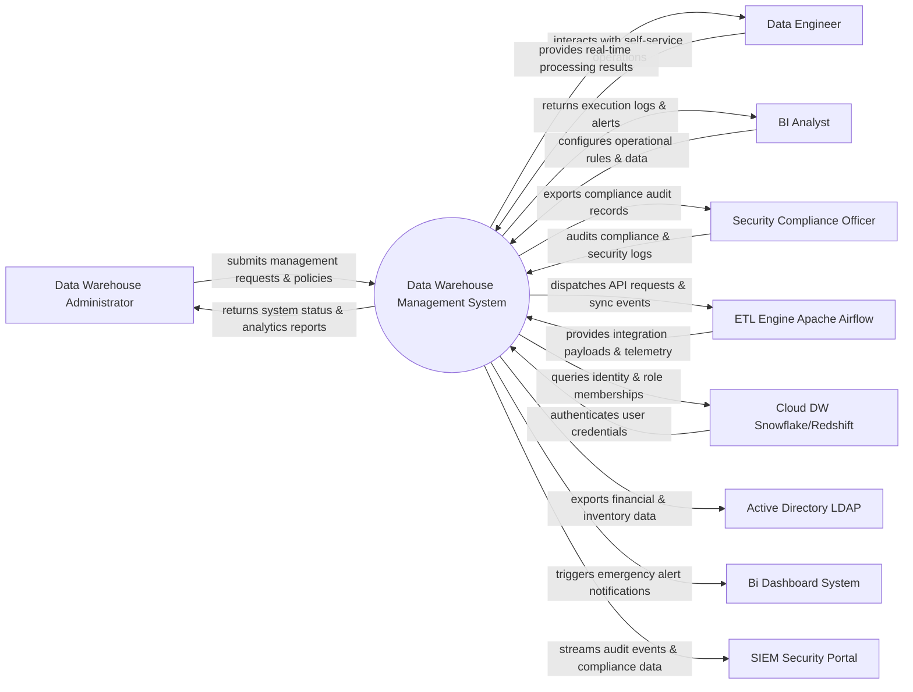

# Context Diagram — Data Warehouse Management System

## Mermaid Code

## Actor & Interaction Table | Bảng Actor & Tương tác

| # | Actor | Actor Type | Data Sent TO System | Data Received FROM System | Notes |
|---|-------|------------|---------------------|---------------------------|-------|
| 1 | Data Warehouse Administrator | Primary | Operational requests, policy configurations, audit queries | Status updates, performance reports, audit results | Data Warehouse Administrator role |
| 2 | Data Engineer | Primary | Operational requests, policy configurations, audit queries | Status updates, performance reports, audit results | Data Engineer role |
| 3 | BI Analyst | Primary | Operational requests, policy configurations, audit queries | Status updates, performance reports, audit results | BI Analyst role |
| 4 | Security Compliance Officer | Primary | Operational requests, policy configurations, audit queries | Status updates, performance reports, audit results | Security Compliance Officer role |
| 5 | ETL Engine Apache Airflow | Supporting | Integration payloads, auth claims, event logs | API sync responses, verification tokens | ETL Engine Apache Airflow role |
| 6 | Cloud DW Snowflake/Redshift | Supporting | Integration payloads, auth claims, event logs | API sync responses, verification tokens | Cloud DW Snowflake/Redshift role |
| 7 | Active Directory LDAP | Supporting | Integration payloads, auth claims, event logs | API sync responses, verification tokens | Active Directory LDAP role |
| 8 | Bi Dashboard System | Supporting | Integration payloads, auth claims, event logs | API sync responses, verification tokens | Bi Dashboard System role |
| 9 | SIEM Security Portal | Supporting | Integration payloads, auth claims, event logs | API sync responses, verification tokens | SIEM Security Portal role |

## System Boundary Description | Mô tả Scope Hệ thống

Hệ thống **Data Warehouse Management System** (Hệ thống Quản lý Kho Dữ liệu) được thiết kế nhằm quản lý tập trung và tự động hóa các quy trình vận hành CNTT cốt lõi trong doanh nghiệp.

- **Phạm vi bên trong hệ thống (In-Scope)**:
  - Quản lý dữ liệu nghiệp vụ trung tâm, tự động hóa quy trình theo chính sách doanh nghiệp.
  - Phân quyền người dùng chi tiết, theo dõi lịch sử thao tác và xuất báo cáo tuân thủ (ISO/SOC2).
  - Tích hợp phát hiện sự cố, gửi cảnh báo tức thì và kết nối dữ liệu hai chiều.

- **Bên ngoài phạm vi hệ thống (Out-of-Scope)**:
  - Trực tiếp quản lý hạ tầng phần cứng máy chủ vật lý.
  - Trực tiếp xử lý xác thực mật khẩu người dùng gốc (do Identity Provider đảm nhận).
