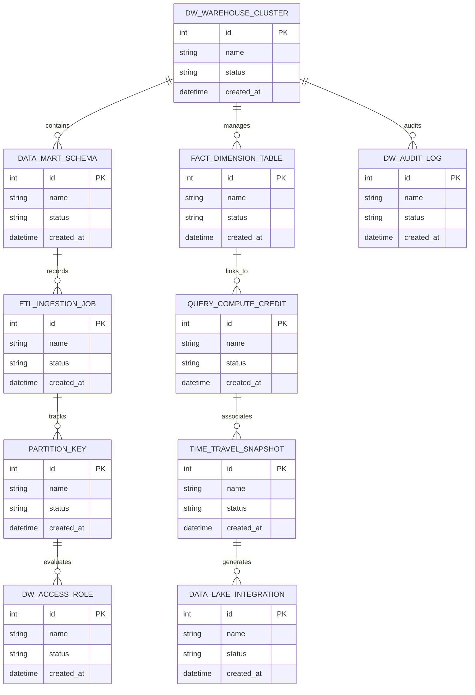

# Conceptual ERD — Data Warehouse Management System

## Mermaid Code

## Entity Description Table | Bảng mô tả Entity

| # | Entity Name | Vietnamese Name | Description | Key Attributes | Main Relationships |
|---|-------------|-----------------|-------------|----------------|-------------------|
| 1 | DW_WAREHOUSE_CLUSTER | Thực thể DW_WAREHOUSE_CLUSTER | Quản lý thông tin chi tiết cho dw_warehouse_cluster | id (PK), name, status, created_at | Links with related entities |
| 2 | DATA_MART_SCHEMA | Thực thể DATA_MART_SCHEMA | Quản lý thông tin chi tiết cho data_mart_schema | id (PK), name, status, created_at | Links with related entities |
| 3 | FACT_DIMENSION_TABLE | Thực thể FACT_DIMENSION_TABLE | Quản lý thông tin chi tiết cho fact_dimension_table | id (PK), name, status, created_at | Links with related entities |
| 4 | ETL_INGESTION_JOB | Thực thể ETL_INGESTION_JOB | Quản lý thông tin chi tiết cho etl_ingestion_job | id (PK), name, status, created_at | Links with related entities |
| 5 | QUERY_COMPUTE_CREDIT | Thực thể QUERY_COMPUTE_CREDIT | Quản lý thông tin chi tiết cho query_compute_credit | id (PK), name, status, created_at | Links with related entities |
| 6 | PARTITION_KEY | Thực thể PARTITION_KEY | Quản lý thông tin chi tiết cho partition_key | id (PK), name, status, created_at | Links with related entities |
| 7 | TIME_TRAVEL_SNAPSHOT | Thực thể TIME_TRAVEL_SNAPSHOT | Quản lý thông tin chi tiết cho time_travel_snapshot | id (PK), name, status, created_at | Links with related entities |
| 8 | DW_ACCESS_ROLE | Thực thể DW_ACCESS_ROLE | Quản lý thông tin chi tiết cho dw_access_role | id (PK), name, status, created_at | Links with related entities |
| 9 | DATA_LAKE_INTEGRATION | Thực thể DATA_LAKE_INTEGRATION | Quản lý thông tin chi tiết cho data_lake_integration | id (PK), name, status, created_at | Links with related entities |
| 10 | DW_AUDIT_LOG | Thực thể DW_AUDIT_LOG | Quản lý thông tin chi tiết cho dw_audit_log | id (PK), name, status, created_at | Links with related entities |

## Relationship Description | Mô tả Quan hệ

| # | From Entity | Cardinality | To Entity | Relationship Label | Business Explanation |
|---|-------------|-------------|-----------|-------------------|----------------------|
| 1 | DW_WAREHOUSE_CLUSTER | 1 to Many | DATA_MART_SCHEMA | relates_to | Quản lý mối quan hệ giữa DW_WAREHOUSE_CLUSTER và DATA_MART_SCHEMA |
| 2 | DATA_MART_SCHEMA | 1 to Many | FACT_DIMENSION_TABLE | relates_to | Quản lý mối quan hệ giữa DATA_MART_SCHEMA và FACT_DIMENSION_TABLE |
| 3 | FACT_DIMENSION_TABLE | 1 to Many | ETL_INGESTION_JOB | relates_to | Quản lý mối quan hệ giữa FACT_DIMENSION_TABLE và ETL_INGESTION_JOB |
| 4 | ETL_INGESTION_JOB | 1 to Many | QUERY_COMPUTE_CREDIT | relates_to | Quản lý mối quan hệ giữa ETL_INGESTION_JOB và QUERY_COMPUTE_CREDIT |
| 5 | QUERY_COMPUTE_CREDIT | 1 to Many | PARTITION_KEY | relates_to | Quản lý mối quan hệ giữa QUERY_COMPUTE_CREDIT và PARTITION_KEY |
| 6 | PARTITION_KEY | 1 to Many | TIME_TRAVEL_SNAPSHOT | relates_to | Quản lý mối quan hệ giữa PARTITION_KEY và TIME_TRAVEL_SNAPSHOT |
| 7 | TIME_TRAVEL_SNAPSHOT | 1 to Many | DW_ACCESS_ROLE | relates_to | Quản lý mối quan hệ giữa TIME_TRAVEL_SNAPSHOT và DW_ACCESS_ROLE |
| 8 | DW_ACCESS_ROLE | 1 to Many | DATA_LAKE_INTEGRATION | relates_to | Quản lý mối quan hệ giữa DW_ACCESS_ROLE và DATA_LAKE_INTEGRATION |
| 9 | DATA_LAKE_INTEGRATION | 1 to Many | DW_AUDIT_LOG | relates_to | Quản lý mối quan hệ giữa DATA_LAKE_INTEGRATION và DW_AUDIT_LOG |
