# Action Tree — Data Warehouse Management System

## Mermaid Code

```mermaid
graph TD
    Root["Data Warehouse Management System"]

    Root --> M1["Warehouse Provisioning & Compute Scaling"]
    Root --> M2["Star Schema & Data Mart Management"]
    Root --> M3["ETL Ingestion & Pipeline Orchestration"]
    Root --> M4["Query Performance & Credit Monitoring"]
    Root --> M5["Time-Travel & Data Resilience"]
    Root --> M6["DW Security & Compliance Audit"]

    M1 --> A11["Configure Warehouse Provisioning & Compute Scaling Policies"]
    M1 --> A12["Execute Warehouse Provisioning & Compute Scaling Tasks"]
    M1 --> A13["Monitor Warehouse Provisioning & Compute Scaling Telemetry"]
    M1 --> A14["Export Warehouse Provisioning & Compute Scaling Audit Logs"]

    M2 --> A21["Configure Star Schema & Data Mart Management Policies"]
    M2 --> A22["Execute Star Schema & Data Mart Management Tasks"]
    M2 --> A23["Monitor Star Schema & Data Mart Management Telemetry"]
    M2 --> A24["Export Star Schema & Data Mart Management Audit Logs"]

    M3 --> A31["Configure ETL Ingestion & Pipeline Orchestration Policies"]
    M3 --> A32["Execute ETL Ingestion & Pipeline Orchestration Tasks"]
    M3 --> A33["Monitor ETL Ingestion & Pipeline Orchestration Telemetry"]
    M3 --> A34["Export ETL Ingestion & Pipeline Orchestration Audit Logs"]

    M4 --> A41["Configure Query Performance & Credit Monitoring Policies"]
    M4 --> A42["Execute Query Performance & Credit Monitoring Tasks"]
    M4 --> A43["Monitor Query Performance & Credit Monitoring Telemetry"]
    M4 --> A44["Export Query Performance & Credit Monitoring Audit Logs"]

    M5 --> A51["Configure Time-Travel & Data Resilience Policies"]
    M5 --> A52["Execute Time-Travel & Data Resilience Tasks"]
    M5 --> A53["Monitor Time-Travel & Data Resilience Telemetry"]
    M5 --> A54["Export Time-Travel & Data Resilience Audit Logs"]

    M6 --> A61["Configure DW Security & Compliance Audit Policies"]
    M6 --> A62["Execute DW Security & Compliance Audit Tasks"]
    M6 --> A63["Monitor DW Security & Compliance Audit Telemetry"]
    M6 --> A64["Export DW Security & Compliance Audit Audit Logs"]
```

## Module Description | Mô tả Module

| # | Module | Description | Actions |
|---|--------|-------------|---------|
| 1 | Warehouse Provisioning & Compute Scaling | Quản lý các chức năng cốt lõi thuộc phân hệ warehouse provisioning & compute scaling. | Configure Warehouse Provisioning & Compute Scaling Policies, Execute Warehouse Provisioning & Compute Scaling Tasks, Monitor Warehouse Provisioning & Compute Scaling Telemetry, Export Warehouse Provisioning & Compute Scaling Audit Logs |
| 2 | Star Schema & Data Mart Management | Quản lý các chức năng cốt lõi thuộc phân hệ star schema & data mart management. | Configure Star Schema & Data Mart Management Policies, Execute Star Schema & Data Mart Management Tasks, Monitor Star Schema & Data Mart Management Telemetry, Export Star Schema & Data Mart Management Audit Logs |
| 3 | ETL Ingestion & Pipeline Orchestration | Quản lý các chức năng cốt lõi thuộc phân hệ etl ingestion & pipeline orchestration. | Configure ETL Ingestion & Pipeline Orchestration Policies, Execute ETL Ingestion & Pipeline Orchestration Tasks, Monitor ETL Ingestion & Pipeline Orchestration Telemetry, Export ETL Ingestion & Pipeline Orchestration Audit Logs |
| 4 | Query Performance & Credit Monitoring | Quản lý các chức năng cốt lõi thuộc phân hệ query performance & credit monitoring. | Configure Query Performance & Credit Monitoring Policies, Execute Query Performance & Credit Monitoring Tasks, Monitor Query Performance & Credit Monitoring Telemetry, Export Query Performance & Credit Monitoring Audit Logs |
| 5 | Time-Travel & Data Resilience | Quản lý các chức năng cốt lõi thuộc phân hệ time-travel & data resilience. | Configure Time-Travel & Data Resilience Policies, Execute Time-Travel & Data Resilience Tasks, Monitor Time-Travel & Data Resilience Telemetry, Export Time-Travel & Data Resilience Audit Logs |
| 6 | DW Security & Compliance Audit | Quản lý các chức năng cốt lõi thuộc phân hệ dw security & compliance audit. | Configure DW Security & Compliance Audit Policies, Execute DW Security & Compliance Audit Tasks, Monitor DW Security & Compliance Audit Telemetry, Export DW Security & Compliance Audit Audit Logs |
