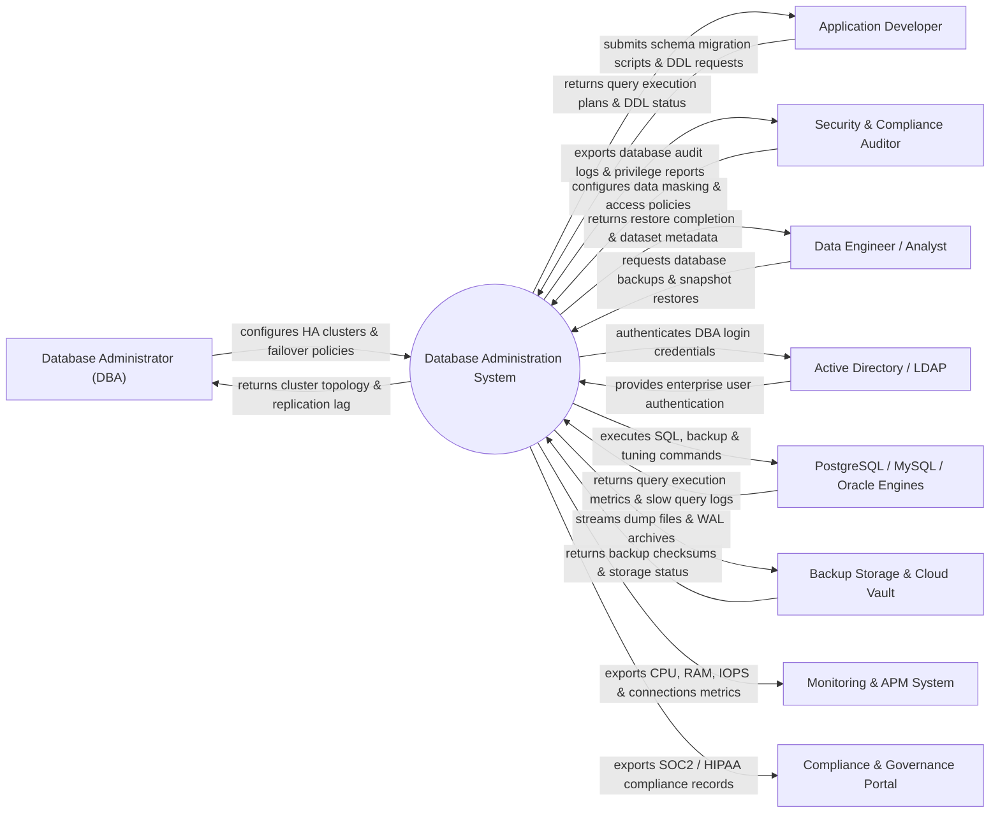

# Context Diagram — Database Administration System

## Mermaid Code

## Actor & Interaction Table | Bảng Actor & Tương tác

| # | Actor | Actor Type | Data Sent TO System | Data Received FROM System | Notes |
|---|-------|------------|---------------------|---------------------------|-------|
| 1 | Database Administrator (DBA) | Primary | HA cluster configurations, failover rules, memory tuning parameters | Replication lag, IOPS metrics, connection pool health | Manages database infrastructure and performance |
| 2 | Application Developer | Primary | Schema migration DDL scripts, SQL queries, index creation requests | Execution plans, query performance advice, DDL status | Consumes database for application development |
| 3 | Security & Compliance Auditor | Primary | Data masking policies, PII encryption rules, audit mandates | User privilege reports, data access audit logs, compliance status | Ensures database security and regulatory compliance |
| 4 | Data Engineer / Analyst | Primary | Backup restore requests, read-replica creation requests | Database snapshot URIs, restore execution status | Manages data pipelines and analytics datasets |
| 5 | Active Directory / LDAP | Supporting | User identity claims, group memberships, SSO credentials | Authentication requests, role mapping queries | Enterprise identity provider |
| 6 | DBMS Engines | Supporting | Query metrics, slow logs, replication status, error logs | SQL execution commands, backup triggers, configuration parameters | Target DBMS instances (PostgreSQL, MySQL, Oracle, MSSQL) |
| 7 | Backup Storage & Cloud Vault | Supporting | Backup verification checksums, storage availability status | Compressed dump files, WAL archive logs, snapshot data | Storage locations (AWS S3, NFS, SAN storage) |
| 8 | Monitoring & APM System | Supporting | Alert thresholds, metric ingestion rules | Real-time IOPS, connection counts, slow query metrics | Observability systems (Datadog, Prometheus, Zabbix) |
| 9 | Compliance & Governance Portal | Supporting | Audit compliance mandates, security standards | Database security audit logs, access review logs | Central enterprise governance system |

## System Boundary Description | Mô tả Scope Hệ thống

Hệ thống **Database Administration System (DBA System)** cung cấp nền tảng quản trị, giám sát và vận hành tập trung cho toàn bộ các hệ quản trị cơ sở dữ liệu (DBMS) trong doanh nghiệp.

- **Phạm vi bên trong hệ thống (In-Scope)**:
  - Quản lý khởi tạo (Provisioning), cấu hình cụm khả dụng cao (HA/Replication) và điều khiển Failover tự động.
  - Quản lý phân quyền người dùng (Role-Based Access Control), chính sách bảo mật và mã hóa dữ liệu nhạy cảm (Data Masking).
  - Tự động hóa lập lịch sao lưu (Backup & Recovery), lưu trữ bản ghi giao dịch (WAL/Binlog) và khôi phục sự cố Point-in-Time (PITR).
  - Giám sát hiệu năng chỉ số (CPU, Memory, IOPS, Connections), phát hiện câu lệnh SQL chậm (Slow Queries) và đề xuất đánh chỉ mục (Index Advisory).

- **Bên ngoài phạm vi hệ thống (Out-of-Scope)**:
  - Trực tiếp phát triển mã nguồn công cụ DBMS gốc (như engine của PostgreSQL hay MySQL).
  - Trực tiếp lưu trữ lâu dài tệp sao lưu dung lượng lớn (do SAN/NAS hoặc Cloud Vault đảm nhận).
  - Trực tiếp xác thực mật khẩu người dùng gốc (sử dụng Active Directory / LDAP).
