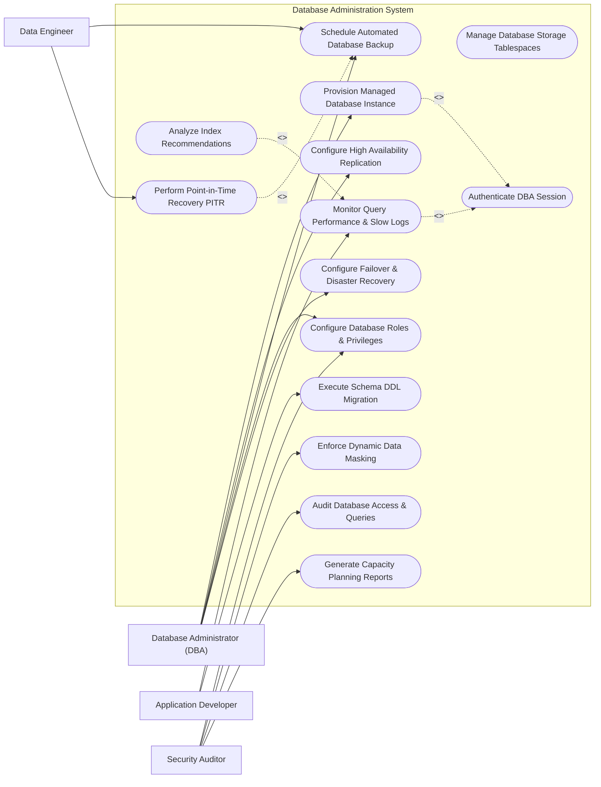

# Use Case Diagram — Database Administration System

## Mermaid Code

## Actor Table | Bảng Actor

| # | Actor | Actor Type | Role Description | Related Use Cases |
|---|-------|------------|------------------|-------------------|
| 1 | Database Administrator (DBA) | Primary | Provisions database instances, manages HA replication, configures user access, oversees cluster health | UC01, UC02, UC04, UC05, UC10, UC12 |
| 2 | Application Developer | Primary | Submits DDL schema migrations, analyzes query execution plans, tunes SQL queries | UC06, UC07 |
| 3 | Security Auditor | Primary | Audits database user privileges, configures data masking rules, reviews database access security logs | UC10, UC11, UC13, UC14 |
| 4 | Data Engineer | Primary | Manages database backup schedules, performs point-in-time snapshot restores for analytics | UC05, UC08 |

## Use Case Table | Bảng Use Case

| # | UC ID | Use Case Name | Primary Actor | Secondary Actor | Description | Priority |
|---|-------|---------------|---------------|-----------------|-------------|----------|
| 1 | UC01 | Provision Managed Database Instance | Database Administrator | DBMS Engine | Deploys a new standalone or clustered database instance (PostgreSQL/MySQL/Oracle) | High |
| 2 | UC02 | Configure High Availability Replication | Database Administrator | DBMS Engine | Sets up Primary-Replica streaming replication, sync modes, and read-replicas | High |
| 3 | UC03 | Manage Database Storage Tablespaces | Database Administrator | None | Monitors disk tablespace usage, resizes datafiles, and manages auto-extend rules | Medium |
| 4 | UC04 | Authenticate DBA Session | System | Directory Service | Validates DBA credentials and multi-factor authentication tokens | High |
| 5 | UC05 | Schedule Automated Database Backup | Database Administrator | Backup Storage | Configures full, incremental, and WAL archive backup schedules | High |
| 6 | UC06 | Monitor Query Performance & Slow Logs | Application Developer | DBMS Engine | Tracks long-running SQL queries, CPU consumption, and execution plan bottlenecks | High |
| 7 | UC07 | Execute Schema DDL Migration | Application Developer | Database Administrator | Safely applies DDL scripts (CREATE, ALTER TABLE) with automated rollback protection | High |
| 8 | UC08 | Perform Point-in-Time Recovery PITR | Data Engineer | Backup Storage | Restores a database instance to an exact target timestamp using WAL logs | High |
| 9 | UC09 | Analyze Index Recommendations | Application Developer | DBMS Engine | Identifies missing indexes on frequently scanned tables to optimize query speeds | Medium |
| 10 | UC10 | Configure Database Roles & Privileges | Database Administrator | Security Auditor | Assigns fine-grained SQL privileges (SELECT, INSERT, UPDATE) to user roles | High |
| 11 | UC11 | Enforce Dynamic Data Masking | Security Auditor | None | Obscures sensitive PII data (Credit Cards, SSN) for non-production environments | High |
| 12 | UC12 | Configure Failover & Disaster Recovery | Database Administrator | DBMS Engine | Configures automatic health probing and failover promotion from Primary to Standby | High |
| 13 | UC13 | Audit Database Access & Queries | Security Auditor | Governance Portal | Logs all DDL/DML statements, failed login attempts, and privilege escalations | High |
| 14 | UC14 | Generate Capacity Planning Reports | Security Auditor | None | Forecasts disk growth trends, connection pool scaling, and memory requirements | Low |

## Use Case Specification | Đặc tả Use Case

---

### UC01 — Provision Managed Database Instance

| Field | Detail |
|-------|--------|
| **UC ID** | UC01 |
| **Use Case Name** | Provision Managed Database Instance |
| **Actor(s)** | Primary: Database Administrator (DBA)   Secondary: DBMS Engine (PostgreSQL/MySQL/Oracle) |
| **Description** | Deploys a new database instance with configured memory buffers, connection limits, and storage tablespaces. |
| **Precondition** | 1. DBA must be authenticated with Infrastructure Admin permissions.   2. Target server host or container node must be online. |
| **Main Flow** | 1. DBA opens "Provision Database Instance" wizard.   2. System prompts for DBMS Engine selection (PostgreSQL 15 / MySQL 8 / Oracle 19c) and Target Server Node.   3. DBA inputs Database Name (e.g., `prod_orders_db`), Port (e.g., `5432`), Shared Buffers memory allocation, and Max Connections (e.g., `500`).   4. DBA sets Storage Data Path, Log Path, and Initial Master Admin Credentials.   5. DBA clicks "Start Provisioning".   6. System dispatches installation script, initializes database cluster, creates tablespaces, verifies health status, and returns connection string endpoint. |
| **Alternative Flow** | **AF1** — High Availability Cluster Provisioning: DBA selects "Deploy HA Pair"; System provisions Primary and Standby instances simultaneously with Patroni/Orchestrator replication.   **AF2** — Template-based Deployment: DBA selects pre-tuned OLTP database configuration template. |
| **Exception Flow** | **EX1** — Port Conflict: If target port 5432 is already bound on server, System alerts "Port 5432 already in use".   **EX2** — Insufficient Disk Space: If target storage partition has less than 50GB free, System flags error "Insufficient disk space for initial tablespace". |
| **Postcondition** | Database instance is running, listening on specified port, and registered in DBA System inventory. |
| **Business Rule** | **BR1**: Master admin password must be generated using strong entropy (at least 16 characters). |

---

### UC05 — Schedule Automated Database Backup

| Field | Detail |
|-------|--------|
| **UC ID** | UC05 |
| **Use Case Name** | Schedule Automated Database Backup |
| **Actor(s)** | Primary: Database Administrator / Data Engineer   Secondary: Backup Storage & Cloud Vault |
| **Description** | Configures automated full database backups, differential backups, and WAL/Binlog archiving for disaster recovery. |
| **Precondition** | 1. Database instance must be in status "Running".   2. Target backup storage location (S3 / NFS) must have valid write credentials. |
| **Main Flow** | 1. DBA opens "Backup & Recovery Manager" and selects target database instance.   2. System displays current backup policies.   3. DBA configures Full Backup schedule (e.g., Weekly on Sunday at 01:00 AM), Differential Backup schedule (Daily at 02:00 AM), and WAL Archive frequency (every 15 minutes).   4. DBA sets Retention Period (e.g., 30 days) and Compression Level (Gzip/Zstd).   5. DBA enables Encryption-at-Rest using AES-256 backup key.   6. DBA clicks "Save Backup Schedule". System validates storage target, registers cron job, and executes an immediate test backup verification. |
| **Alternative Flow** | **AF1** — Storage Snapshot Integration: System uses cloud block storage snapshots (EBS Snapshot) for near-instantaneous zero-impact backup.   **AF2** — Offsite Vault Copying: System automatically copies completed backup files to an offsite secondary region. |
| **Exception Flow** | **EX1** — Backup Target Storage Full: If storage destination has < 10% space remaining, System dispatches high-priority alert.   **EX2** — Backup Execution Timeout: If full backup job takes longer than 6 hours, System alerts DBA of potential disk I/O bottleneck. |
| **Postcondition** | Automated backup policy is active, continuously capturing database states and WAL logs. |
| **Business Rule** | **BR1**: Production database backups must be encrypted at rest and tested for restore integrity at least monthly. |

---

### UC06 — Monitor Query Performance & Slow Logs

| Field | Detail |
|-------|--------|
| **UC ID** | UC06 |
| **Use Case Name** | Monitor Query Performance & Slow Logs |
| **Actor(s)** | Primary: Application Developer / DBA   Secondary: DBMS Engine |
| **Description** | Captures and analyzes SQL queries exceeding execution time thresholds (e.g., > 1000ms), displaying query execution plans. |
| **Precondition** | 1. DBMS Slow Query Log feature (`pg_stat_statements` or `slow_query_log`) must be enabled.   2. User must have database view permissions. |
| **Main Flow** | 1. User opens "SQL Performance Tuning Dashboard".   2. System queries database performance views and displays top 10 most expensive SQL queries ranked by cumulative execution time.   3. User selects a slow query digest (e.g., `SELECT * FROM orders WHERE status = 'PENDING'`).   4. System presents execution statistics: Call count, Average execution time (e.g., 3,420ms), Rows scanned, and Lock wait time.   5. User clicks "Generate EXPLAIN Visualizer".   6. System executes `EXPLAIN (ANALYZE, BUFFERS)` on the query and renders an interactive execution plan tree highlighting Sequential Scans. |
| **Alternative Flow** | **AF1** — Automated Index Recommendation: System suggests index creation script (e.g., `CREATE INDEX idx_orders_status ON orders(status)`) to convert Sequential Scan to Index Scan.   **AF2** — Cancel Long-Running Query: DBA clicks "Kill Session" to terminate a query consuming 100% CPU. |
| **Exception Flow** | **EX1** — Slow Log Collection Disabled: If target database instance has slow logging disabled, System prompts "Click to enable pg_stat_statements".   **EX2** — EXPLAIN Execution Permission Denied: If user lacks permission to run EXPLAIN, System alerts "Insufficient privileges". |
| **Postcondition** | Query bottleneck is identified, execution plan analyzed, and tuning recommendations presented. |
| **Business Rule** | **BR1**: Queries executing for longer than 30 seconds on OLTP databases must trigger an automated DBA alert. |

---

### UC07 — Execute Schema DDL Migration

| Field | Detail |
|-------|--------|
| **UC ID** | UC07 |
| **Use Case Name** | Execute Schema DDL Migration |
| **Actor(s)** | Primary: Application Developer   Secondary: Database Administrator |
| **Description** | Safely applies database schema changes (CREATE TABLE, ADD COLUMN, CREATE INDEX) with lock timeout protection and rollback scripts. |
| **Precondition** | 1. Migration DDL script must be submitted and pass syntax validation.   2. Target database must not be undergoing backup or maintenance. |
| **Main Flow** | 1. Developer opens "Schema Migration Manager" and selects target database.   2. Developer pastes DDL SQL migration script (e.g., `ALTER TABLE users ADD COLUMN phone_number VARCHAR(20);`).   3. Developer inputs mandatory Rollback SQL script (e.g., `ALTER TABLE users DROP COLUMN phone_number;`).   4. System performs pre-execution checks: Syntax linting, Lock Timeout setting (`SET lock_timeout = '5s'`), and Table Size check.   5. Developer clicks "Execute Migration".   6. System creates transaction savepoint, applies DDL script, verifies schema changes, commits transaction, and logs schema version update. |
| **Alternative Flow** | **AF1** — Online Schema Change (gh-ost/pt-online-schema-change): For large tables (>10M rows), System uses non-blocking online schema migration tool.   **AF2** — Scheduled Maintenance Window Execution: Developer queues migration to execute automatically at 03:00 AM. |
| **Exception Flow** | **EX1** — Exclusive Lock Timeout: If table is locked by active transactions and migration times out (5s), System aborts migration and rolls back safely.   **EX2** — DDL Syntax Error: System detects syntax error on line 4, highlights error, and denies execution. |
| **Postcondition** | Database schema is updated to new version tag, schema history table updated, and rollback script stored. |
| **Business Rule** | **BR1**: Destructive DDL operations (`DROP TABLE`, `TRUNCATE`) require explicit secondary DBA approval. |

---

### UC10 — Configure Database Roles & Privileges

| Field | Detail |
|-------|--------|
| **UC ID** | UC10 |
| **Use Case Name** | Configure Database Roles & Privileges |
| **Actor(s)** | Primary: Database Administrator (DBA)   Secondary: Security Auditor |
| **Description** | Manages database user accounts, role hierarchies, and granular object privileges following Least Privilege principles. |
| **Precondition** | 1. DBA must have `SUPERUSER` or `CREATEROLE` privileges.   2. Database instance must be online. |
| **Main Flow** | 1. DBA opens "Database User & Role Manager".   2. System lists existing database roles (e.g., `app_read_only`, `app_read_write`, `reporting_user`).   3. DBA clicks "Create New Role" or edits an existing role.   4. DBA selects Target Database, Target Schema, and Table permissions (SELECT, INSERT, UPDATE, DELETE).   5. DBA assigns connection limits (e.g., `max_user_connections = 50`) and password expiration policy.   6. DBA clicks "Apply Role Privileges". System dispatches `GRANT` SQL commands, updates system catalogs, and logs privilege modification in audit log. |
| **Alternative Flow** | **AF1** — LDAP Group Sync: System automatically maps Active Directory group `AD_DBA_Group` to database superuser role.   **AF2** — Temporary Access Grant: DBA grants 8-hour temporary SELECT access for troubleshooting. |
| **Exception Flow** | **EX1** — Privilege Escalation Prevention: If non-admin attempts to grant `SUPERUSER` role, System blocks request with alert "Privilege escalation denied".   **EX2** — Weak Password Policy Violations: System rejects password failing complexity rules. |
| **Postcondition** | Database user role permissions are updated and active for subsequent database sessions. |
| **Business Rule** | **BR1**: Application service accounts must never be granted `SUPERUSER` or `DROP DATABASE` privileges. |
