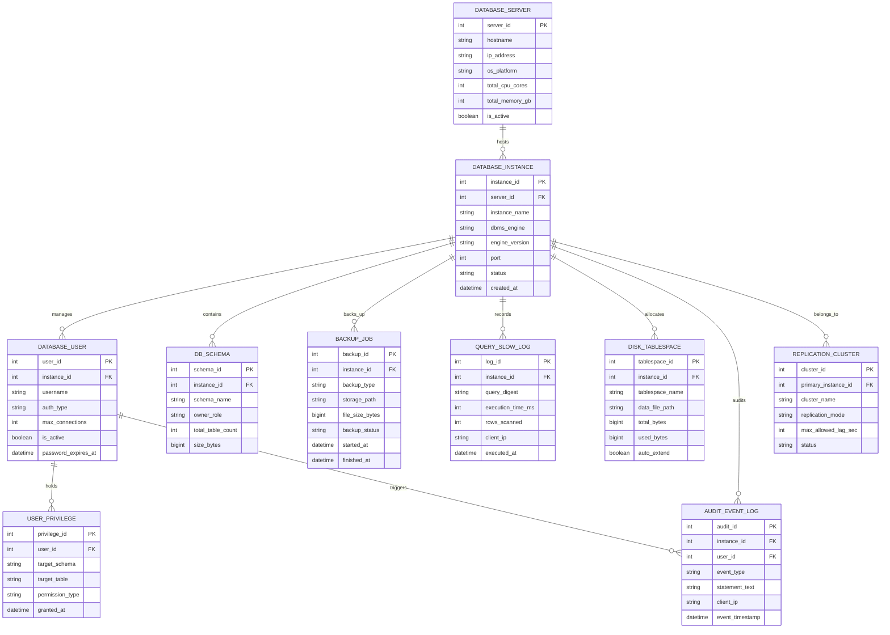

# Conceptual ERD — Database Administration System

## Mermaid Code

## Entity Description Table | Bảng mô tả Entity

| # | Entity Name | Vietnamese Name | Description | Key Attributes | Main Relationships |
|---|-------------|-----------------|-------------|----------------|-------------------|
| 1 | DATABASE_SERVER | Máy chủ Vật lý / Ảo | Lưu trữ thông tin phần cứng máy chủ hosting các thể hiện cơ sở dữ liệu | server_id (PK), hostname, ip_address, total_cpu_cores, total_memory_gb | Hosts DATABASE_INSTANCE |
| 2 | DATABASE_INSTANCE | Thể hiện CSDL (Instance) | Một instance cơ sở dữ liệu (PostgreSQL cluster, MySQL daemon, Oracle SID) | instance_id (PK), server_id (FK), instance_name, dbms_engine, port | Hosted by DATABASE_SERVER, manages USER, contains SCHEMA, backs up BACKUP_JOB |
| 3 | DATABASE_USER | Người dùng CSDL | Quản lý tài khoản người dùng và role được cấp quyền trong database | user_id (PK), instance_id (FK), username, auth_type, max_connections | Belongs to DATABASE_INSTANCE, holds USER_PRIVILEGE, triggers AUDIT_EVENT |
| 4 | USER_PRIVILEGE | Quyền Hạn Người dùng | Chi tiết các quyền hạn SQL (SELECT, INSERT, UPDATE, DELETE) trên schema/bảng | privilege_id (PK), user_id (FK), target_schema, target_table, permission_type | Held by DATABASE_USER |
| 5 | DB_SCHEMA | Schema Cơ sở Dữ liệu | Không gian tên chứa các bảng, view, function và index thuộc về database | schema_id (PK), instance_id (FK), schema_name, owner_role, size_bytes | Contained in DATABASE_INSTANCE |
| 6 | BACKUP_JOB | Lượt Sao lưu CSDL | Bản ghi nhật ký thực thi đợt sao lưu (Full, Differential, WAL archive) | backup_id (PK), instance_id (FK), backup_type, storage_path, backup_status | Backs up DATABASE_INSTANCE |
| 7 | QUERY_SLOW_LOG | Nhật ký Câu lệnh Chậm | Ghi nhận chi tiết các câu lệnh SQL tốn thời gian xử lý vượt ngưỡng quy định | log_id (PK), instance_id (FK), query_digest, execution_time_ms, rows_scanned | Recorded by DATABASE_INSTANCE |
| 8 | REPLICATION_CLUSTER | Cụm Nhân bản HA | Định nghĩa cụm sao chép nhân bản dữ liệu (Primary - Standby Replica cluster) | cluster_id (PK), primary_instance_id (FK), cluster_name, replication_mode | Belongs to DATABASE_INSTANCE |
| 9 | DISK_TABLESPACE | Tablespace Lưu trữ Đĩa | Quản lý dung lượng các tệp tin dữ liệu (.mdf, .ibd, .dbf) trên đĩa cứng | tablespace_id (PK), instance_id (FK), tablespace_name, total_bytes, used_bytes | Allocated by DATABASE_INSTANCE |
| 10 | AUDIT_EVENT_LOG | Nhật ký Kiểm toán CSDL | Ghi nhận các thao tác DDL/DML, truy cập dữ liệu nhạy cảm và sự kiện bảo mật | audit_id (PK), instance_id (FK), user_id (FK), event_type, statement_text | Audited by DATABASE_INSTANCE, triggered by DATABASE_USER |

## Relationship Description | Mô tả Quan hệ

| # | From Entity | Cardinality | To Entity | Relationship Label | Business Explanation |
|---|-------------|-------------|-----------|-------------------|----------------------|
| 1 | DATABASE_SERVER | 1 to Many | DATABASE_INSTANCE | hosts | Mot máy chủ vật lý/ảo có thể hosting nhiều instance CSDL khác nhau. |
| 2 | DATABASE_INSTANCE | 1 to Many | DATABASE_USER | manages | Một instance CSDL quản lý danh sách nhiều tài khoản người dùng/role. |
| 3 | DATABASE_USER | 1 to Many | USER_PRIVILEGE | holds | Một người dùng CSDL sở hữu nhiều quyền hạn trên các bảng/schema. |
| 4 | DATABASE_INSTANCE | 1 to Many | DB_SCHEMA | contains | Một instance CSDL chứa nhiều không gian tên Schema dữ liệu. |
| 5 | DATABASE_INSTANCE | 1 to Many | BACKUP_JOB | backs_up | Một instance CSDL thực hiện nhiều đợt sao lưu dữ liệu theo thời gian. |
| 6 | DATABASE_INSTANCE | 1 to Many | QUERY_SLOW_LOG | records | Một instance CSDL ghi nhận nhiều bản ghi truy vấn SQL chạy chậm. |
| 7 | DATABASE_INSTANCE | 1 to Many | DISK_TABLESPACE | allocates | Một instance CSDL phân bổ dung lượng lưu trữ trên nhiều Tablespace đĩa. |
| 8 | DATABASE_INSTANCE | 1 to Many | AUDIT_EVENT_LOG | audits | Một instance CSDL theo dõi kiểm toán cho các sự kiện truy cập dữ liệu. |
| 9 | DATABASE_USER | 1 to Many | AUDIT_EVENT_LOG | triggers | Một người dùng CSDL khởi tạo các câu lệnh được ghi nhận trong kiểm toán. |
| 10 | DATABASE_INSTANCE | 1 to Many | REPLICATION_CLUSTER | belongs_to | Các instance CSDL tham gia liên kết tạo thành cụm nhân bản dữ liệu HA. |
