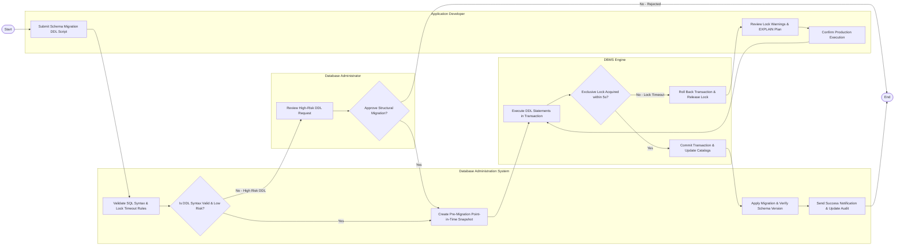

# Swimlane Diagram — Database Administration System

## Mermaid Code

## Flow Description | Mô tả luồng xử lý

| Lane | Actor | Role in Flow |
|------|-------|-------------|
| 1 | Application Developer | Soạn thảo kịch bản DDL thay đổi cấu trúc bảng, kiểm tra cảnh báo khóa bảng và kế hoạch thực thi, xác nhận chạy trên môi trường thực tế. |
| 2 | Database Administration System | Kiểm tra cú pháp SQL, kiểm soát quy tắc Lock Timeout, tạo bản sao lưu snapshot trước khi chạy, và tự động hóa quy trình cập nhật schema. |
| 3 | DBMS Engine (PostgreSQL/MySQL) | Thực thi các câu lệnh DDL trong transaction, kiểm tra khả năng chiếm khóa đĩa (Exclusive Lock), commit hoặc rollback an toàn nếu gặp sự cố. |
| 4 | Database Administrator (DBA) | Đóng vai trò phê duyệt cấp cao đối với các thao tác DDL nguy cơ cao (DROP, TRUNCATE), đảm bảo an toàn tuyệt đối cho dữ liệu production. |
