# Action Tree — Database Administration System

## Mermaid Code

```mermaid
graph TD
    Root["Database Administration System"]

    Root --> M1["Database Provisioning & Cluster Setup"]
    Root --> M2["User & Access Privilege Management"]
    Root --> M3["Performance Monitoring & Query Tuning"]
    Root --> M4["Automated Backup & Disaster Recovery"]
    Root --> M5["Schema Migration & DDL Management"]
    Root --> M6["Database Audit & Compliance"]

    M1 --> A11["Deploy Standalone / Clustered DBMS Instance"]
    M1 --> A12["Configure High Availability Streaming Replication"]
    M1 --> A13["Manage Disk Tablespaces & Auto-Extend"]
    M1 --> A14["Set Connection Pool & Memory Buffers"]

    M2 --> A21["Create Database Users & Roles"]
    M2 --> A22["Grant Granular Object Privileges"]
    M2 --> A23["Configure LDAP / Active Directory SSO"]
    M2 --> A24["Enforce Dynamic Data Masking Rules"]

    M3 --> A31["Monitor Real-time CPU / IOPS / Connections"]
    M3 --> A32["Analyze Slow Query Execution Logs"]
    M3 --> A33["Generate EXPLAIN Execution Plans"]
    M3 --> A34["Provide Automated Index Recommendations"]

    M4 --> A41["Schedule Full & Incremental Backups"]
    M4 --> A42["Configure Continuous WAL / Binlog Archiving"]
    M4 --> A43["Execute Point-in-Time Recovery PITR"]
    M4 --> A44["Verify Backup Restore Integrity"]

    M5 --> A51["Submit DDL Migration Scripts"]
    M5 --> A52["Validate SQL Syntax & Lock Timeout Rules"]
    M5 --> A53["Execute Online Non-blocking Schema Changes"]
    M5 --> A54["Rollback Failed Schema Migrations"]

    M6 --> A61["Log DDL / DML Security Audit Events"]
    M6 --> A62["Detect Privilege Escalation Attempts"]
    M6 --> A63["Generate Capacity Planning Growth Reports"]
    M6 --> A64["Export SOC2 / HIPAA Compliance Logs"]
```

## Module Description | Mô tả Module

| # | Module | Description | Actions |
|---|--------|-------------|---------|
| 1 | Database Provisioning & Cluster Setup | Quản lý việc khởi tạo instance CSDL độc lập hoặc cụm, thiết lập nhân bản HA, cấu hình bộ nhớ đệm và tablespace đĩa. | Deploy Standalone / Clustered DBMS Instance, Configure High Availability Streaming Replication, Manage Disk Tablespaces & Auto-Extend, Set Connection Pool & Memory Buffers |
| 2 | User & Access Privilege Management | Quản lý các tài khoản người dùng CSDL, phân quyền role chi tiết, tích hợp đăng nhập SSO và che giấu dữ liệu nhạy cảm (Data Masking). | Create Database Users & Roles, Grant Granular Object Privileges, Configure LDAP / Active Directory SSO, Enforce Dynamic Data Masking Rules |
| 3 | Performance Monitoring & Query Tuning | Giám sát các chỉ số vận hành đĩa/CPU, phân tích câu lệnh SQL chạy chậm, hiển thị kế hoạch thực thi EXPLAIN và gợi ý tạo index. | Monitor Real-time CPU / IOPS / Connections, Analyze Slow Query Execution Logs, Generate EXPLAIN Execution Plans, Provide Automated Index Recommendations |
| 4 | Automated Backup & Disaster Recovery | Tự động hóa lịch sao lưu CSDL, lưu trữ nhật ký giao dịch liên tục (WAL/Binlog), và thực thi khôi phục Point-in-Time (PITR). | Schedule Full & Incremental Backups, Configure Continuous WAL / Binlog Archiving, Execute Point-in-Time Recovery PITR, Verify Backup Restore Integrity |
| 5 | Schema Migration & DDL Management | Cho phép cập nhật cấu trúc schema CSDL an toàn, kiểm soát thời gian chờ khóa đĩa (Lock Timeout) và hỗ trợ rollback nhanh. | Submit DDL Migration Scripts, Validate SQL Syntax & Lock Timeout Rules, Execute Online Non-blocking Schema Changes, Rollback Failed Schema Migrations |
| 6 | Database Audit & Compliance | Theo dõi nhật ký truy vết mọi thao tác dữ liệu, phát hiện hành vi truy cập trái phép và xuất báo cáo tuân thủ tiêu chuẩn an ninh. | Log DDL / DML Security Audit Events, Detect Privilege Escalation Attempts, Generate Capacity Planning Growth Reports, Export SOC2 / HIPAA Compliance Logs |
