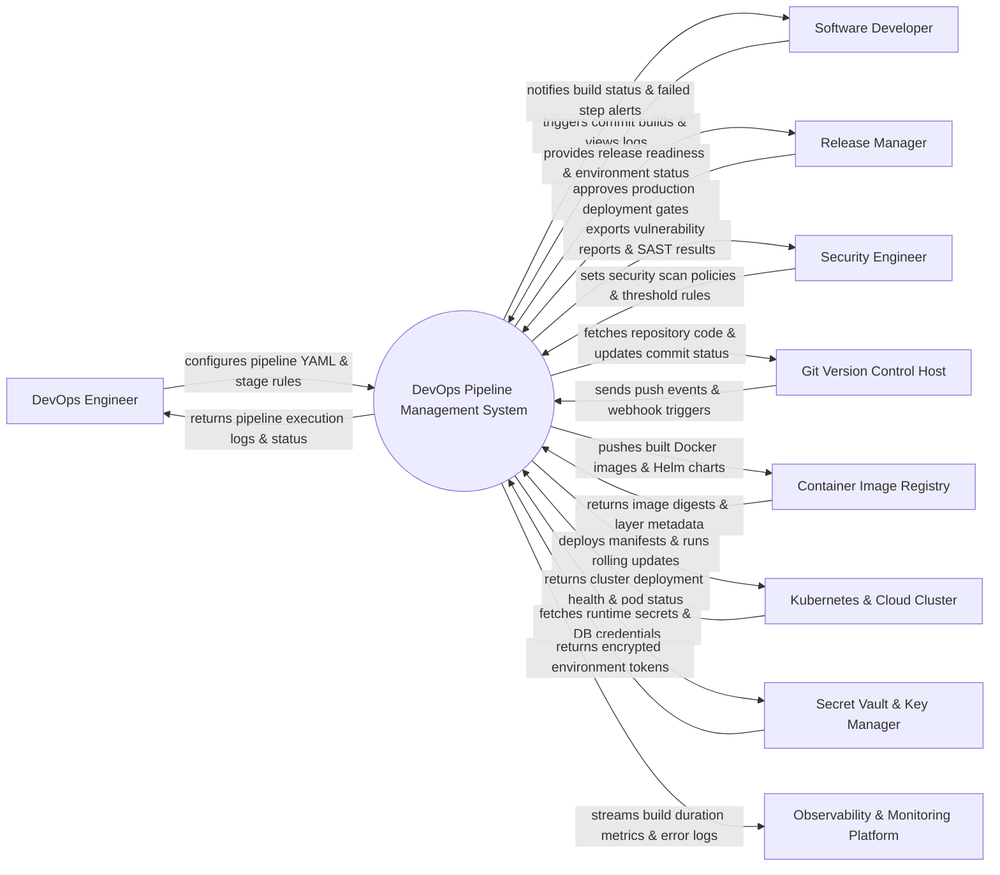

# Context Diagram — DevOps Pipeline Management System

## Mermaid Code

## Actor & Interaction Table | Bảng Actor & Tương tác

| # | Actor | Actor Type | Data Sent TO System | Data Received FROM System | Notes |
|---|-------|------------|---------------------|---------------------------|-------|
| 1 | DevOps Engineer | Primary | Pipeline YAML files, stage definitions, runner configurations | Pipeline execution logs, step execution metrics, runner health | Authors and maintains CI/CD pipeline infrastructure |
| 2 | Software Developer | Primary | Git push triggers, manual pipeline trigger parameters | Real-time build logs, unit test pass rates, compilation error details | Consumes pipeline for building and testing application code |
| 3 | Release Manager | Primary | Production gate sign-offs, deployment rollback commands | Release candidate status, environment deployment history | Governs production deployments and release approvals |
| 4 | Security Engineer | Primary | Security threshold policies, vulnerability compliance rules | SAST/DAST scan reports, dependency vulnerability alerts | Ensures code and container security standards |
| 5 | Git Version Control Host | Supporting | Git Webhook payloads, branch merge events, tag creations | Repository code fetch requests, commit status API updates | Host platforms like GitHub, GitLab, or Bitbucket |
| 6 | Container Image Registry | Supporting | Image layer digests, tag confirmation checksums | Compiled Docker images, Helm charts, OCI artifacts | Registries like AWS ECR, Docker Hub, or Harbor |
| 7 | Kubernetes & Cloud Cluster | Supporting | Pod status, deployment rollout logs, health check probes | Kubernetes YAML manifests, Helm deployment commands | Target runtime infrastructure (EKS, GKE, On-prem K8s) |
| 8 | Secret Vault & Key Manager | Supporting | Decrypted secret values, temporary API tokens | Secret key lookup requests, authentication tokens | Vault engines like HashiCorp Vault, AWS Secrets Manager |
| 9 | Observability & Monitoring Platform | Supporting | Alert triggers, monitoring threshold policies | Build metrics, pipeline failure rate logs, deployment traces | Platforms like Datadog, Prometheus, Grafana |

## System Boundary Description | Mô tả Scope Hệ thống

Hệ thống **DevOps Pipeline Management System** quản lý và tự động hóa toàn bộ luồng tích hợp liên tục (CI) và giao hàng liên tục (CD) cho ứng dụng doanh nghiệp.

- **Phạm vi bên trong hệ thống (In-Scope)**:
  - Định nghĩa, khởi tạo và điều phối các công việc (Jobs) theo các công đoạn (Stages: Build, Test, Security Scan, Package, Deploy).
  - Tự động bắt sự kiện Webhook từ Git, quản lý danh sách runner/agent thực thi công việc.
  - Quản lý tích hợp các biến bí mật (Environment Variables / Secrets) an toàn cho môi trường.
  - Điều khiển phê duyệt cổng phát hành (Approval Gates), thực hiện chiến lược triển khai (Rolling, Blue-Green, Canary) và tự động khôi phục (Rollback).

- **Bên ngoài phạm vi hệ thống (Out-of-Scope)**:
  - Trực tiếp lưu trữ mã nguồn ứng dụng (nhiệm vụ của Git Repository).
  - Trực tiếp lưu trữ lâu dài các container image compiled (do Container Registry đảm nhận).
  - Trực tiếp vận hành phần cứng cụ thể của cụm Kubernetes (do Cloud Cluster Provider quản lý).
