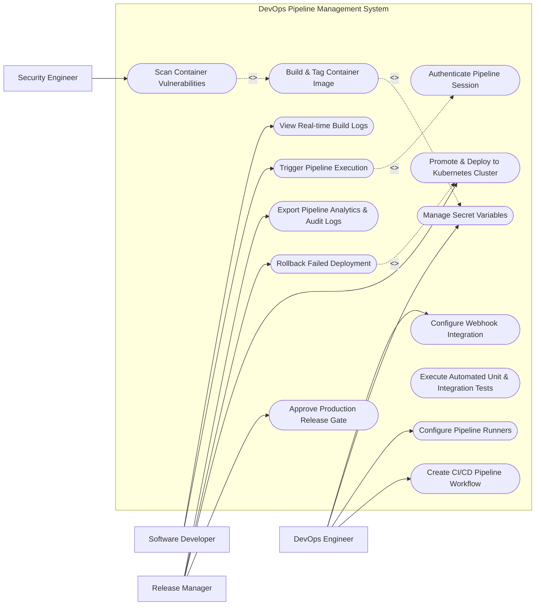

# Use Case Diagram — DevOps Pipeline Management System

## Mermaid Code

## Actor Table | Bảng Actor

| # | Actor | Actor Type | Role Description | Related Use Cases |
|---|-------|------------|------------------|-------------------|
| 1 | DevOps Engineer | Primary | Authors pipeline YAML configurations, manages build runners, configures secret credentials | UC01, UC02, UC03, UC04, UC13 |
| 2 | Software Developer | Primary | Triggers pipeline builds upon code push, inspects live compilation logs, troubleshoots failed steps | UC05, UC09 |
| 3 | Security Engineer | Primary | Sets vulnerability compliance thresholds, reviews container SAST/DAST scan reports | UC06 |
| 4 | Release Manager | Primary | Approves production deployment gates, oversees Kubernetes rollouts, initiates emergency rollbacks | UC10, UC11, UC12, UC14 |

## Use Case Table | Bảng Use Case

| # | UC ID | Use Case Name | Primary Actor | Secondary Actor | Description | Priority |
|---|-------|---------------|---------------|-----------------|-------------|----------|
| 1 | UC01 | Create CI/CD Pipeline Workflow | DevOps Engineer | None | Defines multi-stage pipeline configuration using YAML templates | High |
| 2 | UC02 | Configure Pipeline Runners | DevOps Engineer | None | Manages self-hosted and cloud execution agents and resource limits | High |
| 3 | UC03 | Manage Secret Variables | DevOps Engineer | Secret Vault | Stores and encrypts environment variables, API tokens, and SSH keys | High |
| 4 | UC04 | Authenticate Pipeline Session | System | SSO Provider | Validates developer identity and pipeline trigger permissions | High |
| 5 | UC05 | Trigger Pipeline Execution | Software Developer | Git Host | Triggers pipeline runs via Git Webhooks or manual trigger UI | High |
| 6 | UC06 | Scan Container Vulnerabilities | Security Engineer | Security Scanner | Analyzes Docker images for vulnerabilities (CVEs) and policy violations | High |
| 7 | UC07 | Execute Automated Unit & Integration Tests | System | None | Runs test suites and records code coverage and test pass rates | High |
| 8 | UC08 | Build & Tag Container Image | System | Container Registry | Compiles source code into Docker image and pushes to registry | High |
| 9 | UC09 | View Real-time Build Logs | Software Developer | None | Streams live stdout/stderr console logs from active build runners | Medium |
| 10 | UC10 | Approve Production Release Gate | Release Manager | None | Provides mandatory manual approval for deploying to Production | High |
| 11 | UC11 | Promote & Deploy to Kubernetes Cluster | Release Manager | Cloud Cluster | Applies Kubernetes manifests/Helm charts using Rolling/Canary strategy | High |
| 12 | UC12 | Rollback Failed Deployment | Release Manager | Cloud Cluster | Instantly reverts Kubernetes deployment to previous stable version | High |
| 13 | UC13 | Configure Webhook Integration | DevOps Engineer | Git Host | Sets up Webhook URLs and event listeners for Git branch events | Medium |
| 14 | UC14 | Export Pipeline Analytics & Audit Logs | Release Manager | Audit System | Compiles pipeline duration metrics, pass rates, and deployment audit logs | Low |

## Use Case Specification | Đặc tả Use Case

---

### UC01 — Create CI/CD Pipeline Workflow

| Field | Detail |
|-------|--------|
| **UC ID** | UC01 |
| **Use Case Name** | Create CI/CD Pipeline Workflow |
| **Actor(s)** | Primary: DevOps Engineer |
| **Description** | Allows DevOps engineers to define multi-stage pipelines (Build, Test, Security, Deploy) using YAML code syntax. |
| **Precondition** | 1. DevOps Engineer must have Pipeline Admin permissions.   2. The target repository must be connected to the system. |
| **Main Flow** | 1. DevOps Engineer opens "Pipeline Designer" or commits `.devops-pipeline.yml` to code repo.   2. System parses the YAML file schema (Stages, Jobs, Scripts, Artifacts, Triggers).   3. Engineer defines stages: `build`, `test`, `security_scan`, `deploy_staging`, `deploy_prod`.   4. Engineer sets environment variable bindings and runner tags (e.g., `tags: [docker, linux]`).   5. Engineer clicks "Validate and Save Pipeline".   6. System validates syntax against schema, saves pipeline configuration, and generates unique Pipeline ID. |
| **Alternative Flow** | **AF1** — Template Library Selection: Engineer selects a pre-built pipeline template (e.g., Node.js Microservice / Java Spring Boot).   **AF2** — Visual DAG Builder: Engineer builds pipeline stages using drag-and-drop visual DAG editor. |
| **Exception Flow** | **EX1** — Invalid YAML Syntax: If YAML indentation or syntax is invalid, System highlights error line with message "Syntax error at line 24".   **EX2** — Circular Stage Dependency: If job dependencies form a loop, System flags error "Circular dependency detected in DAG". |
| **Postcondition** | Pipeline workflow configuration is saved and active for subsequent Git commit triggers. |
| **Business Rule** | **BR1**: Production deployment stage must require explicit approval gate declaration in YAML. |

---

### UC05 — Trigger Pipeline Execution

| Field | Detail |
|-------|--------|
| **UC ID** | UC05 |
| **Use Case Name** | Trigger Pipeline Execution |
| **Actor(s)** | Primary: Software Developer   Secondary: Git Version Control Host (GitHub/GitLab) |
| **Description** | Initiates pipeline execution automatically upon Git code push/PR event or manually via Web UI. |
| **Precondition** | 1. Pipeline workflow must be configured and active.   2. Webhook integration must be online. |
| **Main Flow** | 1. Developer pushes code to Git repository branch (e.g., `git push origin feature/auth`).   2. Git host sends HTTP Webhook payload containing commit SHA, branch, and author email.   3. System receives webhook payload, validates secret token, and matches target pipeline.   4. System creates new Pipeline Run instance (e.g., Run #1042) in status "Pending".   5. System queues jobs and allocates available build runner matching requested tags.   6. System updates commit status in Git host to "Pending/In-Progress" and begins job execution. |
| **Alternative Flow** | **AF1** — Manual Trigger: Developer opens Pipeline UI, enters custom parameter values, and clicks "Run Pipeline Now".   **AF2** — Scheduled Cron Trigger: Pipeline triggers automatically at scheduled cron time (e.g., 01:00 AM nightly). |
| **Exception Flow** | **EX1** — No Available Runners: If all build runners are busy, System sets job status to "Queued" with notice "Waiting for available agent".   **EX2** — Branch Excluded: If commit branch is excluded by branch filter rule, System ignores trigger event. |
| **Postcondition** | Pipeline Run instance is created, runner starts executing Stage 1, and live logs begin streaming. |
| **Business Rule** | **BR1**: Concurrent runs per pipeline are limited to a maximum of 5 parallel executions. |

---

### UC06 — Scan Container Vulnerabilities

| Field | Detail |
|-------|--------|
| **UC ID** | UC06 |
| **Use Case Name** | Scan Container Vulnerabilities |
| **Actor(s)** | Primary: Security Engineer   Secondary: Security Scanner Service |
| **Description** | Performs automated static code analysis (SAST) and container image scanning for CVE vulnerabilities during pipeline execution. |
| **Precondition** | 1. Build stage must successfully output a compiled Docker image.   2. Security scan policy thresholds must be pre-configured. |
| **Main Flow** | 1. Pipeline reaches the `security_scan` stage during execution.   2. Runner invokes vulnerability scanner engine (Trivy / Clair / SonarQube) against the container image.   3. Scanner analyzes OS packages, language dependencies, and application binaries for known CVEs.   4. Scanner returns JSON report listing discovered vulnerabilities categorized by severity (Critical, High, Medium, Low).   5. System compares findings against Security Policy threshold (e.g., Max Allowed Critical CVE = 0).   6. If findings satisfy policy, System marks stage as "Passed", attaches security report artifact, and proceeds to next stage. |
| **Alternative Flow** | **AF1** — Auto-Remediation Warning: System highlights recommended updated package versions in vulnerability report summary.   **AF2** — Exception Whitelist: System ignores CVEs listed in approved security exemption whitelist. |
| **Exception Flow** | **EX1** — Critical Vulnerability Gate Fail: If 1 or more Critical CVEs are detected, System fails the security stage immediately and blocks deployment.   **EX2** — Scanner Database Outdated: System logs warning if scanner CVE database is older than 24 hours. |
| **Postcondition** | Security Scan Report is attached to Pipeline Run, and stage status is marked as Passed or Failed. |
| **Business Rule** | **BR1**: Zero Critical CVEs are allowed for images deployed to Production. |

---

### UC07 — Manage Secret Variables

| Field | Detail |
|-------|--------|
| **UC ID** | UC07 |
| **Use Case Name** | Manage Secret Variables |
| **Actor(s)** | Primary: DevOps Engineer   Secondary: Secret Vault |
| **Description** | Encrypts and manages sensitive environment variables (API keys, DB passwords, SSH keys) used by pipeline jobs. |
| **Precondition** | 1. DevOps Engineer must have Secret Admin privileges.   2. Secret Vault engine must be connected. |
| **Main Flow** | 1. DevOps Engineer opens "Pipeline Settings -> Secrets & Variables" panel.   2. Engineer clicks "Add New Secret Variable".   3. Engineer inputs Secret Key Name (e.g., `PROD_DB_PASSWORD`), Secret Value, and Target Environment scope (e.g., `Production`).   4. Engineer checks options: "Mask in Console Logs" and "Protected (Branch Restricted)".   5. Engineer clicks "Save Secret".   6. System encrypts secret value using AES-256 via Secret Vault, stores encrypted reference, and masks value from display. |
| **Alternative Flow** | **AF1** — HashiCorp Vault Integration: System fetches secrets dynamically from external HashiCorp Vault path during runtime.   **AF2** — Key Rotation: Engineer triggers automatic 90-day secret token rotation. |
| **Exception Flow** | **EX1** — Duplicate Secret Key: If Key Name already exists in scope, System alerts "Secret key already exists".   **EX2** — Unmasked Logging Violation: If a pipeline script attempts to print a masked secret, System automatically redacts value to `***`. |
| **Postcondition** | Secret variable is stored securely, encrypted at rest, and available only to authorized pipeline jobs. |
| **Business Rule** | **BR1**: Plaintext values of stored secrets can never be retrieved or viewed via UI after saving. |

---

### UC11 — Promote & Deploy to Kubernetes Cluster

| Field | Detail |
|-------|--------|
| **UC ID** | UC11 |
| **Use Case Name** | Promote & Deploy to Kubernetes Cluster |
| **Actor(s)** | Primary: Release Manager   Secondary: Cloud Cluster (Kubernetes) |
| **Description** | Deploys validated container images to target Kubernetes cluster using Rolling Update, Blue-Green, or Canary deployment strategies. |
| **Precondition** | 1. Previous pipeline stages (Build, Test, Security, Gate Approval) must be Passed.   2. Kubeconfig credentials for target cluster must be active. |
| **Main Flow** | 1. Pipeline reaches `deploy_prod` stage after Release Manager approves manual gate.   2. System retrieves deployment manifest (Kubernetes Deployment YAML / Helm Chart) and container image tag.   3. System connects to target Kubernetes API cluster.   4. System executes deployment command (`kubectl apply` or `helm upgrade --install`).   5. System monitors Kubernetes Rolling Update pod rollout (checking Pod Ready probes and Liveness probes).   6. Once 100% of new pods are Healthy and old pods terminated, System marks deployment stage as "Success" and notifies team. |
| **Alternative Flow** | **AF1** — Canary Rollout: System deploys 10% traffic to new pod version, monitors error rates for 15 minutes, then scales to 100%.   **AF2** — Blue-Green Switch: System deploys new version in Green environment, performs health checks, and flips Router Service to Green. |
| **Exception Flow** | **EX1** — Pod CrashLoopBackOff: If new pods crash during startup, System halts rollout and triggers automatic Rollback (UC12).   **EX2** — Cluster Connection Loss: If API server times out, System pauses deployment and flags "Cluster Unreachable". |
| **Postcondition** | New application version is live on Kubernetes cluster, and deployment record is saved. |
| **Business Rule** | **BR1**: Deployment to Production must perform zero-downtime rolling updates. |
