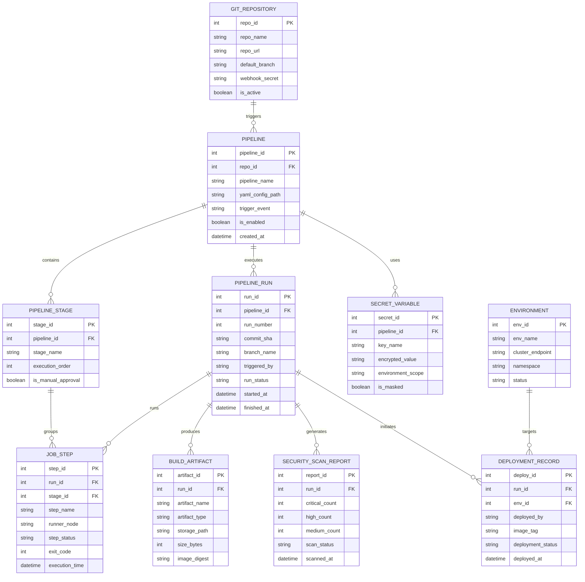

# Conceptual ERD — DevOps Pipeline Management System

## Mermaid Code

## Entity Description Table | Bảng mô tả Entity

| # | Entity Name | Vietnamese Name | Description | Key Attributes | Main Relationships |
|---|-------------|-----------------|-------------|----------------|-------------------|
| 1 | GIT_REPOSITORY | Kho mã nguồn Git | Thông tin lưu trữ và cấu hình kết nối Webhook với kho mã nguồn | repo_id (PK), repo_name, repo_url, default_branch, webhook_secret | Triggers PIPELINE |
| 2 | PIPELINE | Quy trình CI/CD | Định nghĩa cấu hình quy trình gồm file YAML, quy tắc kích hoạt và môi trường | pipeline_id (PK), repo_id (FK), pipeline_name, yaml_config_path | Belongs to GIT_REPOSITORY, contains STAGE, executes RUN, uses SECRET |
| 3 | PIPELINE_STAGE | Công đoạn Pipeline | Định nghĩa các công đoạn trong quy trình (Build, Test, Security, Deploy) | stage_id (PK), pipeline_id (FK), stage_name, execution_order | Belongs to PIPELINE, groups JOB_STEP |
| 4 | PIPELINE_RUN | Lượt Chạy Pipeline | Ghi nhận thông tin chi tiết từng đợt thực thi pipeline (Commit SHA, trạng thái, thời gian) | run_id (PK), pipeline_id (FK), run_number, commit_sha, run_status | Belongs to PIPELINE, runs JOB_STEP, produces ARTIFACT, initiates DEPLOYMENT |
| 5 | JOB_STEP | Bước Thực thi Công việc | Chi tiết từng bước lệnh shell được chạy trên runner node | step_id (PK), run_id (FK), stage_id (FK), step_name, runner_node, step_status | Belongs to PIPELINE_RUN and PIPELINE_STAGE |
| 6 | BUILD_ARTIFACT | Sản phẩm Đóng gói | File binary, container image digest hoặc gói Helm được tạo ra từ đợt build | artifact_id (PK), run_id (FK), artifact_name, artifact_type, image_digest | Produced by PIPELINE_RUN |
| 7 | SECRET_VARIABLE | Biến Mã hóa Bí mật | Biến môi trường, token API hoặc mật khẩu được mã hóa an toàn | secret_id (PK), pipeline_id (FK), key_name, encrypted_value, is_masked | Used by PIPELINE |
| 8 | ENVIRONMENT | Môi trường Triển khai | Thông tin các cụm môi trường mục tiêu (Dev, Staging, Production) | env_id (PK), env_name, cluster_endpoint, namespace | Targets by DEPLOYMENT_RECORD |
| 9 | DEPLOYMENT_RECORD | Nhật ký Triển khai | Ghi nhận lịch sử triển khai container image lên các cụm môi trường | deploy_id (PK), run_id (FK), env_id (FK), image_tag, deployment_status | Initiated by PIPELINE_RUN, targets ENVIRONMENT |
| 10 | SECURITY_SCAN_REPORT | Báo cáo Quét Bảo mật | Kết quả phân tích lỗ hổng mã nguồn và container (CVE status) | report_id (PK), run_id (FK), critical_count, high_count, scan_status | Generated by PIPELINE_RUN |

## Relationship Description | Mô tả Quan hệ

| # | From Entity | Cardinality | To Entity | Relationship Label | Business Explanation |
|---|-------------|-------------|-----------|-------------------|----------------------|
| 1 | GIT_REPOSITORY | 1 to Many | PIPELINE | triggers | Một kho mã nguồn Git có thể sở hữu nhiều quy trình pipeline khác nhau. |
| 2 | PIPELINE | 1 to Many | PIPELINE_STAGE | contains | Một pipeline bao gồm nhiều công đoạn thực thi nối tiếp (Stage). |
| 3 | PIPELINE | 1 to Many | PIPELINE_RUN | executes | Một pipeline thực thi nhiều lượt chạy (Run) tương ứng từng đợt push code. |
| 4 | PIPELINE | 1 to Many | SECRET_VARIABLE | uses | Một pipeline sử dụng nhiều biến bí mật mã hóa cho công việc. |
| 5 | PIPELINE_RUN | 1 to Many | JOB_STEP | runs | Một lượt chạy pipeline thực thi nhiều bước lệnh shell chi tiết. |
| 6 | PIPELINE_STAGE | 1 to Many | JOB_STEP | groups | Một công đoạn gom nhóm các bước lệnh thuộc công đoạn đó. |
| 7 | PIPELINE_RUN | 1 to Many | BUILD_ARTIFACT | produces | Một lượt chạy có thể đóng gói tạo ra nhiều sản phẩm Artifact/Docker Image. |
| 8 | PIPELINE_RUN | 1 to 1 | SECURITY_SCAN_REPORT | generates | Mỗi lượt chạy tạo ra 1 bản báo cáo quét lỗ hổng bảo mật. |
| 9 | PIPELINE_RUN | 1 to Many | DEPLOYMENT_RECORD | initiates | Lượt chạy pipeline kích hoạt đợt triển khai sản phẩm lên các môi trường. |
| 10 | ENVIRONMENT | 1 to Many | DEPLOYMENT_RECORD | targets | Một môi trường (Staging/Production) tiếp nhận nhiều lượt triển khai phiên bản. |
