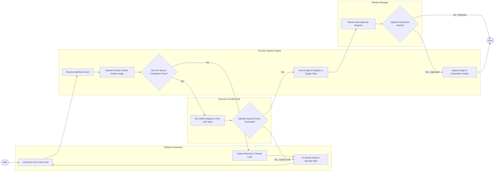

# Swimlane Diagram — DevOps Pipeline Management System

## Mermaid Code

## Flow Description | Mô tả luồng xử lý

| Lane | Actor | Role in Flow |
|------|-------|-------------|
| 1 | Software Developer | Lập trình và đẩy mã nguồn lên Git repository, xem log console thực thi trực tiếp, và sửa lỗi biên dịch hoặc lỗi bảo mật khi pipeline thất bại. |
| 2 | DevOps Pipeline Engine | Bắt sự kiện Webhook tự động, cấp phát runner thực thi biên dịch ứng dụng, tạo container image, đẩy sản phẩm lên Registry và triển khai lên cụm Kubernetes. |
| 3 | Security & Quality Gate | Thực thi quét lỗ hổng bảo mật ứng dụng và container (SAST/CVE scan), so sánh với ngưỡng quy định và chặn triển khai nếu phát hiện lỗ hổng nghiêm trọng. |
| 4 | Release Manager | Xem xét báo cáo tuân thủ quy trình, thực hiện phê duyệt thủ công cổng phát hành (Approval Gate) trước khi hệ thống cập nhật môi trường Production. |
