# Action Tree — DevOps Pipeline Management System

## Mermaid Code

```mermaid
graph TD
    Root["DevOps Pipeline Management System"]

    Root --> M1["Pipeline Definition & Workflow"]
    Root --> M2["Build & Artifact Management"]
    Root --> M3["Secret & Environment Management"]
    Root --> M4["Security & Vulnerability Scanning"]
    Root --> M5["Automated Deployment & Rollback"]
    Root --> M6["Pipeline Analytics & Observability"]

    M1 --> A11["Author Pipeline YAML Syntax"]
    M1 --> A12["Configure Git Webhook Triggers"]
    M1 --> A13["Register Self-Hosted Runners"]
    M1 --> A14["Set Branch Protection Policies"]

    M2 --> A21["Compile Source Code Packages"]
    M2 --> A22["Execute Automated Unit Tests"]
    M2 --> A23["Build Docker Container Image"]
    M2 --> A24["Push Image Digest to Registry"]

    M3 --> A31["Configure Encrypted Secret Variables"]
    M3 --> A32["Bind Vault Dynamic Credentials"]
    M3 --> A33["Mask Secret Values in Console Logs"]
    M3 --> A34["Manage Target Environment Scopes"]

    M4 --> A41["Execute SAST Static Code Analysis"]
    M4 --> A42["Scan Container CVE Vulnerabilities"]
    M4 --> A43["Evaluate Security Threshold Gates"]
    M4 --> A44["Export Vulnerability Compliance Reports"]

    M5 --> A51["Configure Manual Approval Gates"]
    M5 --> A52["Deploy Helm Manifests to K8s"]
    M5 --> A53["Execute Rolling / Canary Strategy"]
    M5 --> A54["Trigger Instant Emergency Rollback"]

    M6 --> A61["View Real-time Console Log Stream"]
    M6 --> A62["Track Pipeline Duration Metrics"]
    M6 --> A63["Analyze Build Success / Failure Rate"]
    M6 --> A64["Export Deployment Audit Logs"]
```

## Module Description | Mô tả Module

| # | Module | Description | Actions |
|---|--------|-------------|---------|
| 1 | Pipeline Definition & Workflow | Quản lý việc định nghĩa quy trình bằng YAML, cấu hình kết nối Webhook Git và quản lý máy chủ thực thi (Runners). | Author Pipeline YAML Syntax, Configure Git Webhook Triggers, Register Self-Hosted Runners, Set Branch Protection Policies |
| 2 | Build & Artifact Management | Thực thi biên dịch mã nguồn, chạy kiểm thử đơn vị, đóng gói Docker container image và đẩy sản phẩm lên Registry. | Compile Source Code Packages, Execute Automated Unit Tests, Build Docker Container Image, Push Image Digest to Registry |
| 3 | Secret & Environment Management | Quản lý an toàn các biến môi trường bí mật, mã hóa credentials qua Vault và phân vùng phạm vi môi trường. | Configure Encrypted Secret Variables, Bind Vault Dynamic Credentials, Mask Secret Values in Console Logs, Manage Target Environment Scopes |
| 4 | Security & Vulnerability Scanning | Thực hiện quét mã nguồn tĩnh (SAST) và quét lỗ hổng container image (CVE), chặn triển khai nếu vi phạm chính sách an ninh. | Execute SAST Static Code Analysis, Scan Container CVE Vulnerabilities, Evaluate Security Threshold Gates, Export Vulnerability Compliance Reports |
| 5 | Automated Deployment & Rollback | Điều khiển triển khai tự động lên cụm Kubernetes theo các chiến lược Rolling/Canary và hỗ trợ khôi phục tức thì khi có sự cố. | Configure Manual Approval Gates, Deploy Helm Manifests to K8s, Execute Rolling / Canary Strategy, Trigger Instant Emergency Rollback |
| 6 | Pipeline Analytics & Observability | Giám sát luồng log trực tiếp, theo dõi chỉ số thời gian chạy pipeline, tỷ lệ thành công và xuất báo cáo kiểm toán triển khai. | View Real-time Console Log Stream, Track Pipeline Duration Metrics, Analyze Build Success / Failure Rate, Export Deployment Audit Logs |
