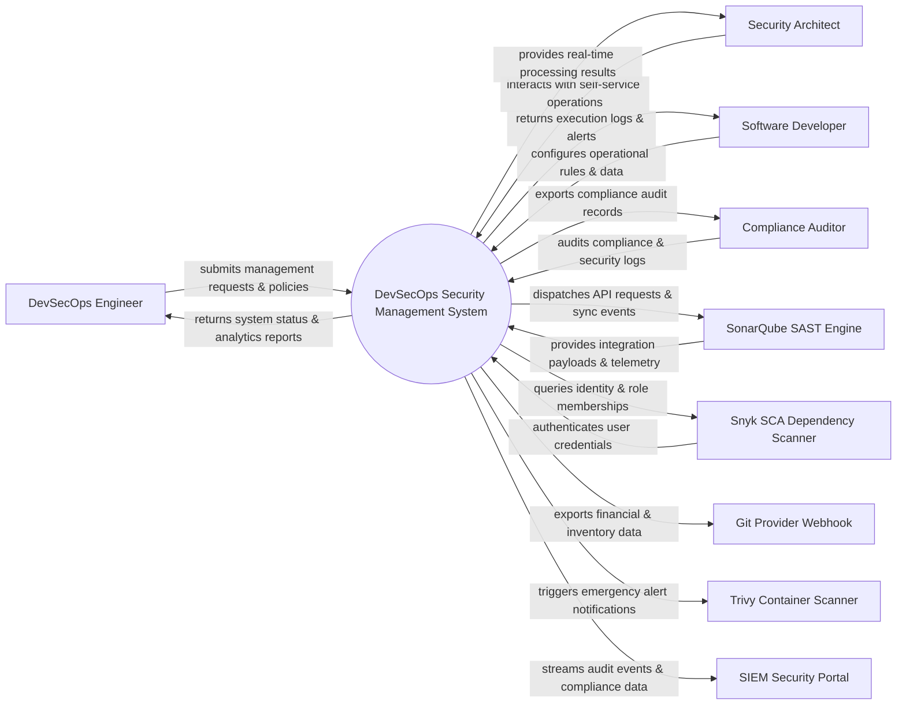

# Context Diagram — DevSecOps Security Management System

## Mermaid Code

## Actor & Interaction Table | Bảng Actor & Tương tác

| # | Actor | Actor Type | Data Sent TO System | Data Received FROM System | Notes |
|---|-------|------------|---------------------|---------------------------|-------|
| 1 | DevSecOps Engineer | Primary | Operational requests, policy configurations, audit queries | Status updates, performance reports, audit results | DevSecOps Engineer role |
| 2 | Security Architect | Primary | Operational requests, policy configurations, audit queries | Status updates, performance reports, audit results | Security Architect role |
| 3 | Software Developer | Primary | Operational requests, policy configurations, audit queries | Status updates, performance reports, audit results | Software Developer role |
| 4 | Compliance Auditor | Primary | Operational requests, policy configurations, audit queries | Status updates, performance reports, audit results | Compliance Auditor role |
| 5 | SonarQube SAST Engine | Supporting | Integration payloads, auth claims, event logs | API sync responses, verification tokens | SonarQube SAST Engine role |
| 6 | Snyk SCA Dependency Scanner | Supporting | Integration payloads, auth claims, event logs | API sync responses, verification tokens | Snyk SCA Dependency Scanner role |
| 7 | Git Provider Webhook | Supporting | Integration payloads, auth claims, event logs | API sync responses, verification tokens | Git Provider Webhook role |
| 8 | Trivy Container Scanner | Supporting | Integration payloads, auth claims, event logs | API sync responses, verification tokens | Trivy Container Scanner role |
| 9 | SIEM Security Portal | Supporting | Integration payloads, auth claims, event logs | API sync responses, verification tokens | SIEM Security Portal role |

## System Boundary Description | Mô tả Scope Hệ thống

Hệ thống **DevSecOps Security Management System** (Hệ thống Quản lý An ninh DevSecOps) được thiết kế nhằm quản lý tập trung và tự động hóa các quy trình vận hành CNTT cốt lõi trong doanh nghiệp.

- **Phạm vi bên trong hệ thống (In-Scope)**:
  - Quản lý dữ liệu nghiệp vụ trung tâm, tự động hóa quy trình theo chính sách doanh nghiệp.
  - Phân quyền người dùng chi tiết, theo dõi lịch sử thao tác và xuất báo cáo tuân thủ (ISO/SOC2).
  - Tích hợp phát hiện sự cố, gửi cảnh báo tức thì và kết nối dữ liệu hai chiều.

- **Bên ngoài phạm vi hệ thống (Out-of-Scope)**:
  - Trực tiếp quản lý hạ tầng phần cứng máy chủ vật lý.
  - Trực tiếp xử lý xác thực mật khẩu người dùng gốc (do Identity Provider đảm nhận).
