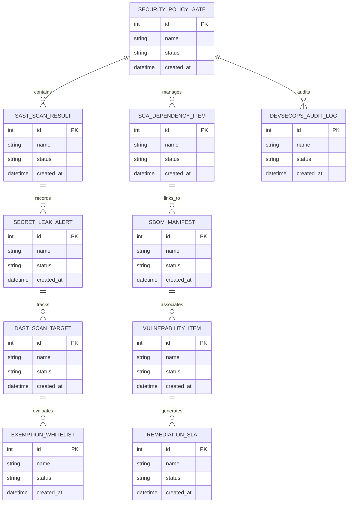

# Conceptual ERD — DevSecOps Security Management System

## Mermaid Code

## Entity Description Table | Bảng mô tả Entity

| # | Entity Name | Vietnamese Name | Description | Key Attributes | Main Relationships |
|---|-------------|-----------------|-------------|----------------|-------------------|
| 1 | SECURITY_POLICY_GATE | Thực thể SECURITY_POLICY_GATE | Quản lý thông tin chi tiết cho security_policy_gate | id (PK), name, status, created_at | Links with related entities |
| 2 | SAST_SCAN_RESULT | Thực thể SAST_SCAN_RESULT | Quản lý thông tin chi tiết cho sast_scan_result | id (PK), name, status, created_at | Links with related entities |
| 3 | SCA_DEPENDENCY_ITEM | Thực thể SCA_DEPENDENCY_ITEM | Quản lý thông tin chi tiết cho sca_dependency_item | id (PK), name, status, created_at | Links with related entities |
| 4 | SECRET_LEAK_ALERT | Thực thể SECRET_LEAK_ALERT | Quản lý thông tin chi tiết cho secret_leak_alert | id (PK), name, status, created_at | Links with related entities |
| 5 | SBOM_MANIFEST | Thực thể SBOM_MANIFEST | Quản lý thông tin chi tiết cho sbom_manifest | id (PK), name, status, created_at | Links with related entities |
| 6 | DAST_SCAN_TARGET | Thực thể DAST_SCAN_TARGET | Quản lý thông tin chi tiết cho dast_scan_target | id (PK), name, status, created_at | Links with related entities |
| 7 | VULNERABILITY_ITEM | Thực thể VULNERABILITY_ITEM | Quản lý thông tin chi tiết cho vulnerability_item | id (PK), name, status, created_at | Links with related entities |
| 8 | EXEMPTION_WHITELIST | Thực thể EXEMPTION_WHITELIST | Quản lý thông tin chi tiết cho exemption_whitelist | id (PK), name, status, created_at | Links with related entities |
| 9 | REMEDIATION_SLA | Thực thể REMEDIATION_SLA | Quản lý thông tin chi tiết cho remediation_sla | id (PK), name, status, created_at | Links with related entities |
| 10 | DEVSECOPS_AUDIT_LOG | Thực thể DEVSECOPS_AUDIT_LOG | Quản lý thông tin chi tiết cho devsecops_audit_log | id (PK), name, status, created_at | Links with related entities |

## Relationship Description | Mô tả Quan hệ

| # | From Entity | Cardinality | To Entity | Relationship Label | Business Explanation |
|---|-------------|-------------|-----------|-------------------|----------------------|
| 1 | SECURITY_POLICY_GATE | 1 to Many | SAST_SCAN_RESULT | relates_to | Quản lý mối quan hệ giữa SECURITY_POLICY_GATE và SAST_SCAN_RESULT |
| 2 | SAST_SCAN_RESULT | 1 to Many | SCA_DEPENDENCY_ITEM | relates_to | Quản lý mối quan hệ giữa SAST_SCAN_RESULT và SCA_DEPENDENCY_ITEM |
| 3 | SCA_DEPENDENCY_ITEM | 1 to Many | SECRET_LEAK_ALERT | relates_to | Quản lý mối quan hệ giữa SCA_DEPENDENCY_ITEM và SECRET_LEAK_ALERT |
| 4 | SECRET_LEAK_ALERT | 1 to Many | SBOM_MANIFEST | relates_to | Quản lý mối quan hệ giữa SECRET_LEAK_ALERT và SBOM_MANIFEST |
| 5 | SBOM_MANIFEST | 1 to Many | DAST_SCAN_TARGET | relates_to | Quản lý mối quan hệ giữa SBOM_MANIFEST và DAST_SCAN_TARGET |
| 6 | DAST_SCAN_TARGET | 1 to Many | VULNERABILITY_ITEM | relates_to | Quản lý mối quan hệ giữa DAST_SCAN_TARGET và VULNERABILITY_ITEM |
| 7 | VULNERABILITY_ITEM | 1 to Many | EXEMPTION_WHITELIST | relates_to | Quản lý mối quan hệ giữa VULNERABILITY_ITEM và EXEMPTION_WHITELIST |
| 8 | EXEMPTION_WHITELIST | 1 to Many | REMEDIATION_SLA | relates_to | Quản lý mối quan hệ giữa EXEMPTION_WHITELIST và REMEDIATION_SLA |
| 9 | REMEDIATION_SLA | 1 to Many | DEVSECOPS_AUDIT_LOG | relates_to | Quản lý mối quan hệ giữa REMEDIATION_SLA và DEVSECOPS_AUDIT_LOG |
