# Action Tree — DevSecOps Security Management System

## Mermaid Code

```mermaid
graph TD
    Root["DevSecOps Security Management System"]

    Root --> M1["SAST Static Code Analysis"]
    Root --> M2["SCA Dependency & Open Source Scanning"]
    Root --> M3["Secret Leakage Detection Engine"]
    Root --> M4["Software Bill of Materials (SBOM) Generator"]
    Root --> M5["DAST Dynamic Application Security Testing"]
    Root --> M6["Vulnerability Remediation & Gate Control"]

    M1 --> A11["Configure SAST Static Code Analysis Policies"]
    M1 --> A12["Execute SAST Static Code Analysis Tasks"]
    M1 --> A13["Monitor SAST Static Code Analysis Telemetry"]
    M1 --> A14["Export SAST Static Code Analysis Audit Logs"]

    M2 --> A21["Configure SCA Dependency & Open Source Scanning Policies"]
    M2 --> A22["Execute SCA Dependency & Open Source Scanning Tasks"]
    M2 --> A23["Monitor SCA Dependency & Open Source Scanning Telemetry"]
    M2 --> A24["Export SCA Dependency & Open Source Scanning Audit Logs"]

    M3 --> A31["Configure Secret Leakage Detection Engine Policies"]
    M3 --> A32["Execute Secret Leakage Detection Engine Tasks"]
    M3 --> A33["Monitor Secret Leakage Detection Engine Telemetry"]
    M3 --> A34["Export Secret Leakage Detection Engine Audit Logs"]

    M4 --> A41["Configure Software Bill of Materials (SBOM) Generator Policies"]
    M4 --> A42["Execute Software Bill of Materials (SBOM) Generator Tasks"]
    M4 --> A43["Monitor Software Bill of Materials (SBOM) Generator Telemetry"]
    M4 --> A44["Export Software Bill of Materials (SBOM) Generator Audit Logs"]

    M5 --> A51["Configure DAST Dynamic Application Security Testing Policies"]
    M5 --> A52["Execute DAST Dynamic Application Security Testing Tasks"]
    M5 --> A53["Monitor DAST Dynamic Application Security Testing Telemetry"]
    M5 --> A54["Export DAST Dynamic Application Security Testing Audit Logs"]

    M6 --> A61["Configure Vulnerability Remediation & Gate Control Policies"]
    M6 --> A62["Execute Vulnerability Remediation & Gate Control Tasks"]
    M6 --> A63["Monitor Vulnerability Remediation & Gate Control Telemetry"]
    M6 --> A64["Export Vulnerability Remediation & Gate Control Audit Logs"]
```

## Module Description | Mô tả Module

| # | Module | Description | Actions |
|---|--------|-------------|---------|
| 1 | SAST Static Code Analysis | Quản lý các chức năng cốt lõi thuộc phân hệ sast static code analysis. | Configure SAST Static Code Analysis Policies, Execute SAST Static Code Analysis Tasks, Monitor SAST Static Code Analysis Telemetry, Export SAST Static Code Analysis Audit Logs |
| 2 | SCA Dependency & Open Source Scanning | Quản lý các chức năng cốt lõi thuộc phân hệ sca dependency & open source scanning. | Configure SCA Dependency & Open Source Scanning Policies, Execute SCA Dependency & Open Source Scanning Tasks, Monitor SCA Dependency & Open Source Scanning Telemetry, Export SCA Dependency & Open Source Scanning Audit Logs |
| 3 | Secret Leakage Detection Engine | Quản lý các chức năng cốt lõi thuộc phân hệ secret leakage detection engine. | Configure Secret Leakage Detection Engine Policies, Execute Secret Leakage Detection Engine Tasks, Monitor Secret Leakage Detection Engine Telemetry, Export Secret Leakage Detection Engine Audit Logs |
| 4 | Software Bill of Materials (SBOM) Generator | Quản lý các chức năng cốt lõi thuộc phân hệ software bill of materials (sbom) generator. | Configure Software Bill of Materials (SBOM) Generator Policies, Execute Software Bill of Materials (SBOM) Generator Tasks, Monitor Software Bill of Materials (SBOM) Generator Telemetry, Export Software Bill of Materials (SBOM) Generator Audit Logs |
| 5 | DAST Dynamic Application Security Testing | Quản lý các chức năng cốt lõi thuộc phân hệ dast dynamic application security testing. | Configure DAST Dynamic Application Security Testing Policies, Execute DAST Dynamic Application Security Testing Tasks, Monitor DAST Dynamic Application Security Testing Telemetry, Export DAST Dynamic Application Security Testing Audit Logs |
| 6 | Vulnerability Remediation & Gate Control | Quản lý các chức năng cốt lõi thuộc phân hệ vulnerability remediation & gate control. | Configure Vulnerability Remediation & Gate Control Policies, Execute Vulnerability Remediation & Gate Control Tasks, Monitor Vulnerability Remediation & Gate Control Telemetry, Export Vulnerability Remediation & Gate Control Audit Logs |
