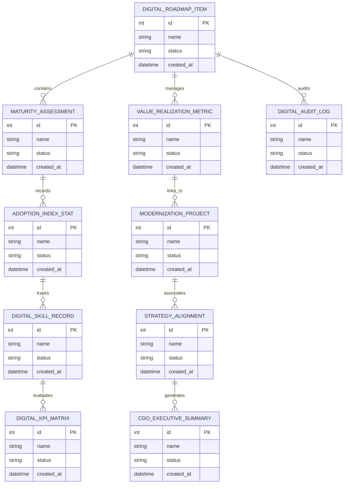

# Conceptual ERD — Digital Transformation Management System

## Mermaid Code

## Entity Description Table | Bảng mô tả Entity

| # | Entity Name | Vietnamese Name | Description | Key Attributes | Main Relationships |
|---|-------------|-----------------|-------------|----------------|-------------------|
| 1 | DIGITAL_ROADMAP_ITEM | Thực thể DIGITAL_ROADMAP_ITEM | Quản lý thông tin chi tiết cho digital_roadmap_item | id (PK), name, status, created_at | Links with related entities |
| 2 | MATURITY_ASSESSMENT | Thực thể MATURITY_ASSESSMENT | Quản lý thông tin chi tiết cho maturity_assessment | id (PK), name, status, created_at | Links with related entities |
| 3 | VALUE_REALIZATION_METRIC | Thực thể VALUE_REALIZATION_METRIC | Quản lý thông tin chi tiết cho value_realization_metric | id (PK), name, status, created_at | Links with related entities |
| 4 | ADOPTION_INDEX_STAT | Thực thể ADOPTION_INDEX_STAT | Quản lý thông tin chi tiết cho adoption_index_stat | id (PK), name, status, created_at | Links with related entities |
| 5 | MODERNIZATION_PROJECT | Thực thể MODERNIZATION_PROJECT | Quản lý thông tin chi tiết cho modernization_project | id (PK), name, status, created_at | Links with related entities |
| 6 | DIGITAL_SKILL_RECORD | Thực thể DIGITAL_SKILL_RECORD | Quản lý thông tin chi tiết cho digital_skill_record | id (PK), name, status, created_at | Links with related entities |
| 7 | STRATEGY_ALIGNMENT | Thực thể STRATEGY_ALIGNMENT | Quản lý thông tin chi tiết cho strategy_alignment | id (PK), name, status, created_at | Links with related entities |
| 8 | DIGITAL_KPI_MATRIX | Thực thể DIGITAL_KPI_MATRIX | Quản lý thông tin chi tiết cho digital_kpi_matrix | id (PK), name, status, created_at | Links with related entities |
| 9 | CDO_EXECUTIVE_SUMMARY | Thực thể CDO_EXECUTIVE_SUMMARY | Quản lý thông tin chi tiết cho cdo_executive_summary | id (PK), name, status, created_at | Links with related entities |
| 10 | DIGITAL_AUDIT_LOG | Thực thể DIGITAL_AUDIT_LOG | Quản lý thông tin chi tiết cho digital_audit_log | id (PK), name, status, created_at | Links with related entities |

## Relationship Description | Mô tả Quan hệ

| # | From Entity | Cardinality | To Entity | Relationship Label | Business Explanation |
|---|-------------|-------------|-----------|-------------------|----------------------|
| 1 | DIGITAL_ROADMAP_ITEM | 1 to Many | MATURITY_ASSESSMENT | relates_to | Quản lý mối quan hệ giữa DIGITAL_ROADMAP_ITEM và MATURITY_ASSESSMENT |
| 2 | MATURITY_ASSESSMENT | 1 to Many | VALUE_REALIZATION_METRIC | relates_to | Quản lý mối quan hệ giữa MATURITY_ASSESSMENT và VALUE_REALIZATION_METRIC |
| 3 | VALUE_REALIZATION_METRIC | 1 to Many | ADOPTION_INDEX_STAT | relates_to | Quản lý mối quan hệ giữa VALUE_REALIZATION_METRIC và ADOPTION_INDEX_STAT |
| 4 | ADOPTION_INDEX_STAT | 1 to Many | MODERNIZATION_PROJECT | relates_to | Quản lý mối quan hệ giữa ADOPTION_INDEX_STAT và MODERNIZATION_PROJECT |
| 5 | MODERNIZATION_PROJECT | 1 to Many | DIGITAL_SKILL_RECORD | relates_to | Quản lý mối quan hệ giữa MODERNIZATION_PROJECT và DIGITAL_SKILL_RECORD |
| 6 | DIGITAL_SKILL_RECORD | 1 to Many | STRATEGY_ALIGNMENT | relates_to | Quản lý mối quan hệ giữa DIGITAL_SKILL_RECORD và STRATEGY_ALIGNMENT |
| 7 | STRATEGY_ALIGNMENT | 1 to Many | DIGITAL_KPI_MATRIX | relates_to | Quản lý mối quan hệ giữa STRATEGY_ALIGNMENT và DIGITAL_KPI_MATRIX |
| 8 | DIGITAL_KPI_MATRIX | 1 to Many | CDO_EXECUTIVE_SUMMARY | relates_to | Quản lý mối quan hệ giữa DIGITAL_KPI_MATRIX và CDO_EXECUTIVE_SUMMARY |
| 9 | CDO_EXECUTIVE_SUMMARY | 1 to Many | DIGITAL_AUDIT_LOG | relates_to | Quản lý mối quan hệ giữa CDO_EXECUTIVE_SUMMARY và DIGITAL_AUDIT_LOG |
