# Action Tree — Digital Transformation Management System

## Mermaid Code

```mermaid
graph TD
    Root["Digital Transformation Management System"]

    Root --> M1["Digital Roadmap & Initiative Planning"]
    Root --> M2["Digital Maturity & Readiness Assessment"]
    Root --> M3["Digital Adoption & Change Management"]
    Root --> M4["Legacy System Modernization Tracking"]
    Root --> M5["Value Realization & ROI Measurement"]
    Root --> M6["CDO Executive Governance Dashboard"]

    M1 --> A11["Configure Digital Roadmap & Initiative Planning Policies"]
    M1 --> A12["Execute Digital Roadmap & Initiative Planning Tasks"]
    M1 --> A13["Monitor Digital Roadmap & Initiative Planning Telemetry"]
    M1 --> A14["Export Digital Roadmap & Initiative Planning Audit Logs"]

    M2 --> A21["Configure Digital Maturity & Readiness Assessment Policies"]
    M2 --> A22["Execute Digital Maturity & Readiness Assessment Tasks"]
    M2 --> A23["Monitor Digital Maturity & Readiness Assessment Telemetry"]
    M2 --> A24["Export Digital Maturity & Readiness Assessment Audit Logs"]

    M3 --> A31["Configure Digital Adoption & Change Management Policies"]
    M3 --> A32["Execute Digital Adoption & Change Management Tasks"]
    M3 --> A33["Monitor Digital Adoption & Change Management Telemetry"]
    M3 --> A34["Export Digital Adoption & Change Management Audit Logs"]

    M4 --> A41["Configure Legacy System Modernization Tracking Policies"]
    M4 --> A42["Execute Legacy System Modernization Tracking Tasks"]
    M4 --> A43["Monitor Legacy System Modernization Tracking Telemetry"]
    M4 --> A44["Export Legacy System Modernization Tracking Audit Logs"]

    M5 --> A51["Configure Value Realization & ROI Measurement Policies"]
    M5 --> A52["Execute Value Realization & ROI Measurement Tasks"]
    M5 --> A53["Monitor Value Realization & ROI Measurement Telemetry"]
    M5 --> A54["Export Value Realization & ROI Measurement Audit Logs"]

    M6 --> A61["Configure CDO Executive Governance Dashboard Policies"]
    M6 --> A62["Execute CDO Executive Governance Dashboard Tasks"]
    M6 --> A63["Monitor CDO Executive Governance Dashboard Telemetry"]
    M6 --> A64["Export CDO Executive Governance Dashboard Audit Logs"]
```

## Module Description | Mô tả Module

| # | Module | Description | Actions |
|---|--------|-------------|---------|
| 1 | Digital Roadmap & Initiative Planning | Quản lý các chức năng cốt lõi thuộc phân hệ digital roadmap & initiative planning. | Configure Digital Roadmap & Initiative Planning Policies, Execute Digital Roadmap & Initiative Planning Tasks, Monitor Digital Roadmap & Initiative Planning Telemetry, Export Digital Roadmap & Initiative Planning Audit Logs |
| 2 | Digital Maturity & Readiness Assessment | Quản lý các chức năng cốt lõi thuộc phân hệ digital maturity & readiness assessment. | Configure Digital Maturity & Readiness Assessment Policies, Execute Digital Maturity & Readiness Assessment Tasks, Monitor Digital Maturity & Readiness Assessment Telemetry, Export Digital Maturity & Readiness Assessment Audit Logs |
| 3 | Digital Adoption & Change Management | Quản lý các chức năng cốt lõi thuộc phân hệ digital adoption & change management. | Configure Digital Adoption & Change Management Policies, Execute Digital Adoption & Change Management Tasks, Monitor Digital Adoption & Change Management Telemetry, Export Digital Adoption & Change Management Audit Logs |
| 4 | Legacy System Modernization Tracking | Quản lý các chức năng cốt lõi thuộc phân hệ legacy system modernization tracking. | Configure Legacy System Modernization Tracking Policies, Execute Legacy System Modernization Tracking Tasks, Monitor Legacy System Modernization Tracking Telemetry, Export Legacy System Modernization Tracking Audit Logs |
| 5 | Value Realization & ROI Measurement | Quản lý các chức năng cốt lõi thuộc phân hệ value realization & roi measurement. | Configure Value Realization & ROI Measurement Policies, Execute Value Realization & ROI Measurement Tasks, Monitor Value Realization & ROI Measurement Telemetry, Export Value Realization & ROI Measurement Audit Logs |
| 6 | CDO Executive Governance Dashboard | Quản lý các chức năng cốt lõi thuộc phân hệ cdo executive governance dashboard. | Configure CDO Executive Governance Dashboard Policies, Execute CDO Executive Governance Dashboard Tasks, Monitor CDO Executive Governance Dashboard Telemetry, Export CDO Executive Governance Dashboard Audit Logs |
