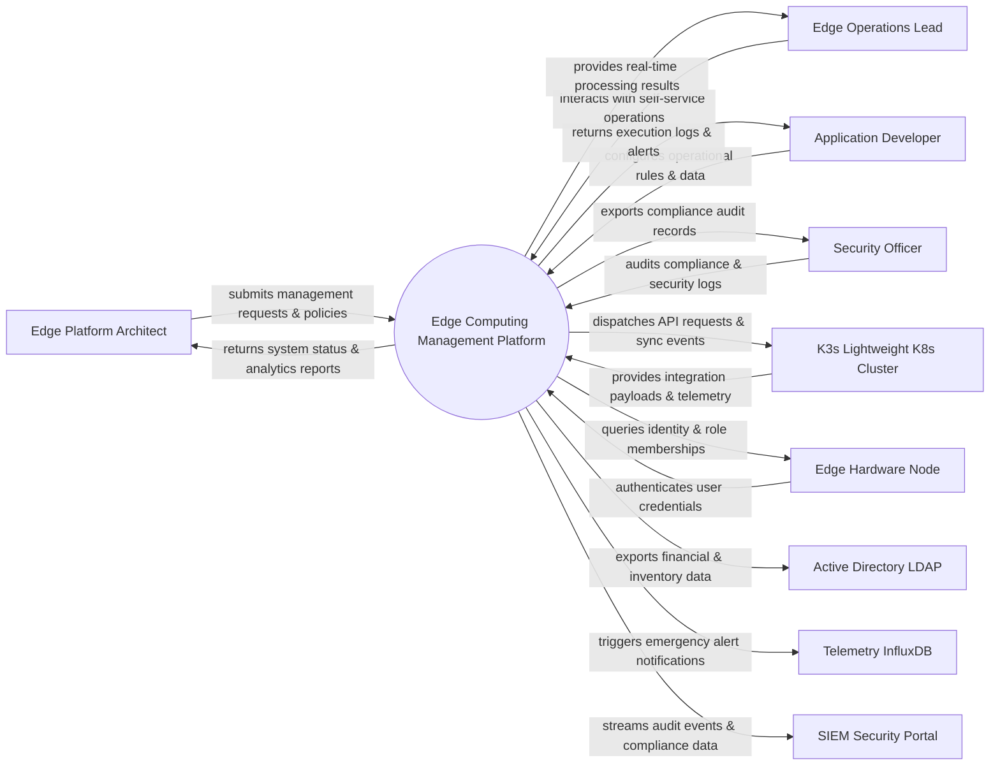

# Context Diagram — Edge Computing Management Platform

## Mermaid Code

## Actor & Interaction Table | Bảng Actor & Tương tác

| # | Actor | Actor Type | Data Sent TO System | Data Received FROM System | Notes |
|---|-------|------------|---------------------|---------------------------|-------|
| 1 | Edge Platform Architect | Primary | Operational requests, policy configurations, audit queries | Status updates, performance reports, audit results | Edge Platform Architect role |
| 2 | Edge Operations Lead | Primary | Operational requests, policy configurations, audit queries | Status updates, performance reports, audit results | Edge Operations Lead role |
| 3 | Application Developer | Primary | Operational requests, policy configurations, audit queries | Status updates, performance reports, audit results | Application Developer role |
| 4 | Security Officer | Primary | Operational requests, policy configurations, audit queries | Status updates, performance reports, audit results | Security Officer role |
| 5 | K3s Lightweight K8s Cluster | Supporting | Integration payloads, auth claims, event logs | API sync responses, verification tokens | K3s Lightweight K8s Cluster role |
| 6 | Edge Hardware Node | Supporting | Integration payloads, auth claims, event logs | API sync responses, verification tokens | Edge Hardware Node role |
| 7 | Active Directory LDAP | Supporting | Integration payloads, auth claims, event logs | API sync responses, verification tokens | Active Directory LDAP role |
| 8 | Telemetry InfluxDB | Supporting | Integration payloads, auth claims, event logs | API sync responses, verification tokens | Telemetry InfluxDB role |
| 9 | SIEM Security Portal | Supporting | Integration payloads, auth claims, event logs | API sync responses, verification tokens | SIEM Security Portal role |

## System Boundary Description | Mô tả Scope Hệ thống

Hệ thống **Edge Computing Management Platform** (Nền tảng Quản lý Điện toán Biên (Edge Computing)) được thiết kế nhằm quản lý tập trung và tự động hóa các quy trình vận hành CNTT cốt lõi trong doanh nghiệp.

- **Phạm vi bên trong hệ thống (In-Scope)**:
  - Quản lý dữ liệu nghiệp vụ trung tâm, tự động hóa quy trình theo chính sách doanh nghiệp.
  - Phân quyền người dùng chi tiết, theo dõi lịch sử thao tác và xuất báo cáo tuân thủ (ISO/SOC2).
  - Tích hợp phát hiện sự cố, gửi cảnh báo tức thì và kết nối dữ liệu hai chiều.

- **Bên ngoài phạm vi hệ thống (Out-of-Scope)**:
  - Trực tiếp quản lý hạ tầng phần cứng máy chủ vật lý.
  - Trực tiếp xử lý xác thực mật khẩu người dùng gốc (do Identity Provider đảm nhận).
