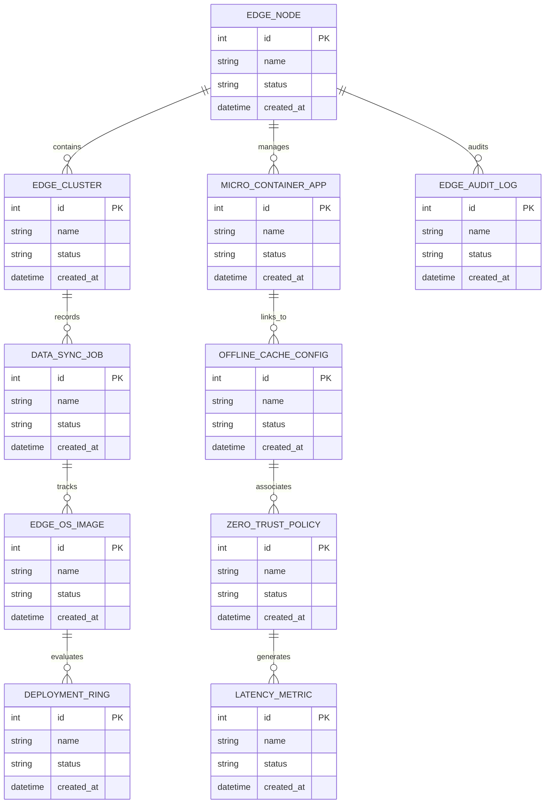

# Conceptual ERD — Edge Computing Management Platform

## Mermaid Code

## Entity Description Table | Bảng mô tả Entity

| # | Entity Name | Vietnamese Name | Description | Key Attributes | Main Relationships |
|---|-------------|-----------------|-------------|----------------|-------------------|
| 1 | EDGE_NODE | Thực thể EDGE_NODE | Quản lý thông tin chi tiết cho edge_node | id (PK), name, status, created_at | Links with related entities |
| 2 | EDGE_CLUSTER | Thực thể EDGE_CLUSTER | Quản lý thông tin chi tiết cho edge_cluster | id (PK), name, status, created_at | Links with related entities |
| 3 | MICRO_CONTAINER_APP | Thực thể MICRO_CONTAINER_APP | Quản lý thông tin chi tiết cho micro_container_app | id (PK), name, status, created_at | Links with related entities |
| 4 | DATA_SYNC_JOB | Thực thể DATA_SYNC_JOB | Quản lý thông tin chi tiết cho data_sync_job | id (PK), name, status, created_at | Links with related entities |
| 5 | OFFLINE_CACHE_CONFIG | Thực thể OFFLINE_CACHE_CONFIG | Quản lý thông tin chi tiết cho offline_cache_config | id (PK), name, status, created_at | Links with related entities |
| 6 | EDGE_OS_IMAGE | Thực thể EDGE_OS_IMAGE | Quản lý thông tin chi tiết cho edge_os_image | id (PK), name, status, created_at | Links with related entities |
| 7 | ZERO_TRUST_POLICY | Thực thể ZERO_TRUST_POLICY | Quản lý thông tin chi tiết cho zero_trust_policy | id (PK), name, status, created_at | Links with related entities |
| 8 | DEPLOYMENT_RING | Thực thể DEPLOYMENT_RING | Quản lý thông tin chi tiết cho deployment_ring | id (PK), name, status, created_at | Links with related entities |
| 9 | LATENCY_METRIC | Thực thể LATENCY_METRIC | Quản lý thông tin chi tiết cho latency_metric | id (PK), name, status, created_at | Links with related entities |
| 10 | EDGE_AUDIT_LOG | Thực thể EDGE_AUDIT_LOG | Quản lý thông tin chi tiết cho edge_audit_log | id (PK), name, status, created_at | Links with related entities |

## Relationship Description | Mô tả Quan hệ

| # | From Entity | Cardinality | To Entity | Relationship Label | Business Explanation |
|---|-------------|-------------|-----------|-------------------|----------------------|
| 1 | EDGE_NODE | 1 to Many | EDGE_CLUSTER | relates_to | Quản lý mối quan hệ giữa EDGE_NODE và EDGE_CLUSTER |
| 2 | EDGE_CLUSTER | 1 to Many | MICRO_CONTAINER_APP | relates_to | Quản lý mối quan hệ giữa EDGE_CLUSTER và MICRO_CONTAINER_APP |
| 3 | MICRO_CONTAINER_APP | 1 to Many | DATA_SYNC_JOB | relates_to | Quản lý mối quan hệ giữa MICRO_CONTAINER_APP và DATA_SYNC_JOB |
| 4 | DATA_SYNC_JOB | 1 to Many | OFFLINE_CACHE_CONFIG | relates_to | Quản lý mối quan hệ giữa DATA_SYNC_JOB và OFFLINE_CACHE_CONFIG |
| 5 | OFFLINE_CACHE_CONFIG | 1 to Many | EDGE_OS_IMAGE | relates_to | Quản lý mối quan hệ giữa OFFLINE_CACHE_CONFIG và EDGE_OS_IMAGE |
| 6 | EDGE_OS_IMAGE | 1 to Many | ZERO_TRUST_POLICY | relates_to | Quản lý mối quan hệ giữa EDGE_OS_IMAGE và ZERO_TRUST_POLICY |
| 7 | ZERO_TRUST_POLICY | 1 to Many | DEPLOYMENT_RING | relates_to | Quản lý mối quan hệ giữa ZERO_TRUST_POLICY và DEPLOYMENT_RING |
| 8 | DEPLOYMENT_RING | 1 to Many | LATENCY_METRIC | relates_to | Quản lý mối quan hệ giữa DEPLOYMENT_RING và LATENCY_METRIC |
| 9 | LATENCY_METRIC | 1 to Many | EDGE_AUDIT_LOG | relates_to | Quản lý mối quan hệ giữa LATENCY_METRIC và EDGE_AUDIT_LOG |
