# Action Tree — Edge Computing Management Platform

## Mermaid Code

```mermaid
graph TD
    Root["Edge Computing Management Platform"]

    Root --> M1["Edge Node Provisioning & Lifecycle"]
    Root --> M2["Micro-Container Application Deployment"]
    Root --> M3["Central Cloud Data Synchronization"]
    Root --> M4["Offline Standalone & Resiliency Mode"]
    Root --> M5["Zero-Trust Edge Security Governance"]
    Root --> M6["Edge Performance & Latency Analytics"]

    M1 --> A11["Configure Edge Node Provisioning & Lifecycle Policies"]
    M1 --> A12["Execute Edge Node Provisioning & Lifecycle Tasks"]
    M1 --> A13["Monitor Edge Node Provisioning & Lifecycle Telemetry"]
    M1 --> A14["Export Edge Node Provisioning & Lifecycle Audit Logs"]

    M2 --> A21["Configure Micro-Container Application Deployment Policies"]
    M2 --> A22["Execute Micro-Container Application Deployment Tasks"]
    M2 --> A23["Monitor Micro-Container Application Deployment Telemetry"]
    M2 --> A24["Export Micro-Container Application Deployment Audit Logs"]

    M3 --> A31["Configure Central Cloud Data Synchronization Policies"]
    M3 --> A32["Execute Central Cloud Data Synchronization Tasks"]
    M3 --> A33["Monitor Central Cloud Data Synchronization Telemetry"]
    M3 --> A34["Export Central Cloud Data Synchronization Audit Logs"]

    M4 --> A41["Configure Offline Standalone & Resiliency Mode Policies"]
    M4 --> A42["Execute Offline Standalone & Resiliency Mode Tasks"]
    M4 --> A43["Monitor Offline Standalone & Resiliency Mode Telemetry"]
    M4 --> A44["Export Offline Standalone & Resiliency Mode Audit Logs"]

    M5 --> A51["Configure Zero-Trust Edge Security Governance Policies"]
    M5 --> A52["Execute Zero-Trust Edge Security Governance Tasks"]
    M5 --> A53["Monitor Zero-Trust Edge Security Governance Telemetry"]
    M5 --> A54["Export Zero-Trust Edge Security Governance Audit Logs"]

    M6 --> A61["Configure Edge Performance & Latency Analytics Policies"]
    M6 --> A62["Execute Edge Performance & Latency Analytics Tasks"]
    M6 --> A63["Monitor Edge Performance & Latency Analytics Telemetry"]
    M6 --> A64["Export Edge Performance & Latency Analytics Audit Logs"]
```

## Module Description | Mô tả Module

| # | Module | Description | Actions |
|---|--------|-------------|---------|
| 1 | Edge Node Provisioning & Lifecycle | Quản lý các chức năng cốt lõi thuộc phân hệ edge node provisioning & lifecycle. | Configure Edge Node Provisioning & Lifecycle Policies, Execute Edge Node Provisioning & Lifecycle Tasks, Monitor Edge Node Provisioning & Lifecycle Telemetry, Export Edge Node Provisioning & Lifecycle Audit Logs |
| 2 | Micro-Container Application Deployment | Quản lý các chức năng cốt lõi thuộc phân hệ micro-container application deployment. | Configure Micro-Container Application Deployment Policies, Execute Micro-Container Application Deployment Tasks, Monitor Micro-Container Application Deployment Telemetry, Export Micro-Container Application Deployment Audit Logs |
| 3 | Central Cloud Data Synchronization | Quản lý các chức năng cốt lõi thuộc phân hệ central cloud data synchronization. | Configure Central Cloud Data Synchronization Policies, Execute Central Cloud Data Synchronization Tasks, Monitor Central Cloud Data Synchronization Telemetry, Export Central Cloud Data Synchronization Audit Logs |
| 4 | Offline Standalone & Resiliency Mode | Quản lý các chức năng cốt lõi thuộc phân hệ offline standalone & resiliency mode. | Configure Offline Standalone & Resiliency Mode Policies, Execute Offline Standalone & Resiliency Mode Tasks, Monitor Offline Standalone & Resiliency Mode Telemetry, Export Offline Standalone & Resiliency Mode Audit Logs |
| 5 | Zero-Trust Edge Security Governance | Quản lý các chức năng cốt lõi thuộc phân hệ zero-trust edge security governance. | Configure Zero-Trust Edge Security Governance Policies, Execute Zero-Trust Edge Security Governance Tasks, Monitor Zero-Trust Edge Security Governance Telemetry, Export Zero-Trust Edge Security Governance Audit Logs |
| 6 | Edge Performance & Latency Analytics | Quản lý các chức năng cốt lõi thuộc phân hệ edge performance & latency analytics. | Configure Edge Performance & Latency Analytics Policies, Execute Edge Performance & Latency Analytics Tasks, Monitor Edge Performance & Latency Analytics Telemetry, Export Edge Performance & Latency Analytics Audit Logs |
