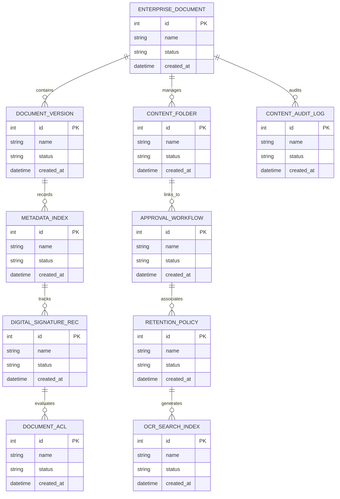

# Conceptual ERD — Enterprise Content Management System

## Mermaid Code

## Entity Description Table | Bảng mô tả Entity

| # | Entity Name | Vietnamese Name | Description | Key Attributes | Main Relationships |
|---|-------------|-----------------|-------------|----------------|-------------------|
| 1 | ENTERPRISE_DOCUMENT | Thực thể ENTERPRISE_DOCUMENT | Quản lý thông tin chi tiết cho enterprise_document | id (PK), name, status, created_at | Links with related entities |
| 2 | DOCUMENT_VERSION | Thực thể DOCUMENT_VERSION | Quản lý thông tin chi tiết cho document_version | id (PK), name, status, created_at | Links with related entities |
| 3 | CONTENT_FOLDER | Thực thể CONTENT_FOLDER | Quản lý thông tin chi tiết cho content_folder | id (PK), name, status, created_at | Links with related entities |
| 4 | METADATA_INDEX | Thực thể METADATA_INDEX | Quản lý thông tin chi tiết cho metadata_index | id (PK), name, status, created_at | Links with related entities |
| 5 | APPROVAL_WORKFLOW | Thực thể APPROVAL_WORKFLOW | Quản lý thông tin chi tiết cho approval_workflow | id (PK), name, status, created_at | Links with related entities |
| 6 | DIGITAL_SIGNATURE_REC | Thực thể DIGITAL_SIGNATURE_REC | Quản lý thông tin chi tiết cho digital_signature_rec | id (PK), name, status, created_at | Links with related entities |
| 7 | RETENTION_POLICY | Thực thể RETENTION_POLICY | Quản lý thông tin chi tiết cho retention_policy | id (PK), name, status, created_at | Links with related entities |
| 8 | DOCUMENT_ACL | Thực thể DOCUMENT_ACL | Quản lý thông tin chi tiết cho document_acl | id (PK), name, status, created_at | Links with related entities |
| 9 | OCR_SEARCH_INDEX | Thực thể OCR_SEARCH_INDEX | Quản lý thông tin chi tiết cho ocr_search_index | id (PK), name, status, created_at | Links with related entities |
| 10 | CONTENT_AUDIT_LOG | Thực thể CONTENT_AUDIT_LOG | Quản lý thông tin chi tiết cho content_audit_log | id (PK), name, status, created_at | Links with related entities |

## Relationship Description | Mô tả Quan hệ

| # | From Entity | Cardinality | To Entity | Relationship Label | Business Explanation |
|---|-------------|-------------|-----------|-------------------|----------------------|
| 1 | ENTERPRISE_DOCUMENT | 1 to Many | DOCUMENT_VERSION | relates_to | Quản lý mối quan hệ giữa ENTERPRISE_DOCUMENT và DOCUMENT_VERSION |
| 2 | DOCUMENT_VERSION | 1 to Many | CONTENT_FOLDER | relates_to | Quản lý mối quan hệ giữa DOCUMENT_VERSION và CONTENT_FOLDER |
| 3 | CONTENT_FOLDER | 1 to Many | METADATA_INDEX | relates_to | Quản lý mối quan hệ giữa CONTENT_FOLDER và METADATA_INDEX |
| 4 | METADATA_INDEX | 1 to Many | APPROVAL_WORKFLOW | relates_to | Quản lý mối quan hệ giữa METADATA_INDEX và APPROVAL_WORKFLOW |
| 5 | APPROVAL_WORKFLOW | 1 to Many | DIGITAL_SIGNATURE_REC | relates_to | Quản lý mối quan hệ giữa APPROVAL_WORKFLOW và DIGITAL_SIGNATURE_REC |
| 6 | DIGITAL_SIGNATURE_REC | 1 to Many | RETENTION_POLICY | relates_to | Quản lý mối quan hệ giữa DIGITAL_SIGNATURE_REC và RETENTION_POLICY |
| 7 | RETENTION_POLICY | 1 to Many | DOCUMENT_ACL | relates_to | Quản lý mối quan hệ giữa RETENTION_POLICY và DOCUMENT_ACL |
| 8 | DOCUMENT_ACL | 1 to Many | OCR_SEARCH_INDEX | relates_to | Quản lý mối quan hệ giữa DOCUMENT_ACL và OCR_SEARCH_INDEX |
| 9 | OCR_SEARCH_INDEX | 1 to Many | CONTENT_AUDIT_LOG | relates_to | Quản lý mối quan hệ giữa OCR_SEARCH_INDEX và CONTENT_AUDIT_LOG |
