# Action Tree — Enterprise Content Management System

## Mermaid Code

```mermaid
graph TD
    Root["Enterprise Content Management System"]

    Root --> M1["Document Capture & Metadata Indexing"]
    Root --> M2["Version Control & Check-in Check-out"]
    Root --> M3["Full-Text Search & OCR Engine"]
    Root --> M4["Digital Signature & Approval Workflow"]
    Root --> M5["Document Security & Access Controls"]
    Root --> M6["Retention Policy & Compliance Archiving"]

    M1 --> A11["Configure Document Capture & Metadata Indexing Policies"]
    M1 --> A12["Execute Document Capture & Metadata Indexing Tasks"]
    M1 --> A13["Monitor Document Capture & Metadata Indexing Telemetry"]
    M1 --> A14["Export Document Capture & Metadata Indexing Audit Logs"]

    M2 --> A21["Configure Version Control & Check-in Check-out Policies"]
    M2 --> A22["Execute Version Control & Check-in Check-out Tasks"]
    M2 --> A23["Monitor Version Control & Check-in Check-out Telemetry"]
    M2 --> A24["Export Version Control & Check-in Check-out Audit Logs"]

    M3 --> A31["Configure Full-Text Search & OCR Engine Policies"]
    M3 --> A32["Execute Full-Text Search & OCR Engine Tasks"]
    M3 --> A33["Monitor Full-Text Search & OCR Engine Telemetry"]
    M3 --> A34["Export Full-Text Search & OCR Engine Audit Logs"]

    M4 --> A41["Configure Digital Signature & Approval Workflow Policies"]
    M4 --> A42["Execute Digital Signature & Approval Workflow Tasks"]
    M4 --> A43["Monitor Digital Signature & Approval Workflow Telemetry"]
    M4 --> A44["Export Digital Signature & Approval Workflow Audit Logs"]

    M5 --> A51["Configure Document Security & Access Controls Policies"]
    M5 --> A52["Execute Document Security & Access Controls Tasks"]
    M5 --> A53["Monitor Document Security & Access Controls Telemetry"]
    M5 --> A54["Export Document Security & Access Controls Audit Logs"]

    M6 --> A61["Configure Retention Policy & Compliance Archiving Policies"]
    M6 --> A62["Execute Retention Policy & Compliance Archiving Tasks"]
    M6 --> A63["Monitor Retention Policy & Compliance Archiving Telemetry"]
    M6 --> A64["Export Retention Policy & Compliance Archiving Audit Logs"]
```

## Module Description | Mô tả Module

| # | Module | Description | Actions |
|---|--------|-------------|---------|
| 1 | Document Capture & Metadata Indexing | Quản lý các chức năng cốt lõi thuộc phân hệ document capture & metadata indexing. | Configure Document Capture & Metadata Indexing Policies, Execute Document Capture & Metadata Indexing Tasks, Monitor Document Capture & Metadata Indexing Telemetry, Export Document Capture & Metadata Indexing Audit Logs |
| 2 | Version Control & Check-in Check-out | Quản lý các chức năng cốt lõi thuộc phân hệ version control & check-in check-out. | Configure Version Control & Check-in Check-out Policies, Execute Version Control & Check-in Check-out Tasks, Monitor Version Control & Check-in Check-out Telemetry, Export Version Control & Check-in Check-out Audit Logs |
| 3 | Full-Text Search & OCR Engine | Quản lý các chức năng cốt lõi thuộc phân hệ full-text search & ocr engine. | Configure Full-Text Search & OCR Engine Policies, Execute Full-Text Search & OCR Engine Tasks, Monitor Full-Text Search & OCR Engine Telemetry, Export Full-Text Search & OCR Engine Audit Logs |
| 4 | Digital Signature & Approval Workflow | Quản lý các chức năng cốt lõi thuộc phân hệ digital signature & approval workflow. | Configure Digital Signature & Approval Workflow Policies, Execute Digital Signature & Approval Workflow Tasks, Monitor Digital Signature & Approval Workflow Telemetry, Export Digital Signature & Approval Workflow Audit Logs |
| 5 | Document Security & Access Controls | Quản lý các chức năng cốt lõi thuộc phân hệ document security & access controls. | Configure Document Security & Access Controls Policies, Execute Document Security & Access Controls Tasks, Monitor Document Security & Access Controls Telemetry, Export Document Security & Access Controls Audit Logs |
| 6 | Retention Policy & Compliance Archiving | Quản lý các chức năng cốt lõi thuộc phân hệ retention policy & compliance archiving. | Configure Retention Policy & Compliance Archiving Policies, Execute Retention Policy & Compliance Archiving Tasks, Monitor Retention Policy & Compliance Archiving Telemetry, Export Retention Policy & Compliance Archiving Audit Logs |
