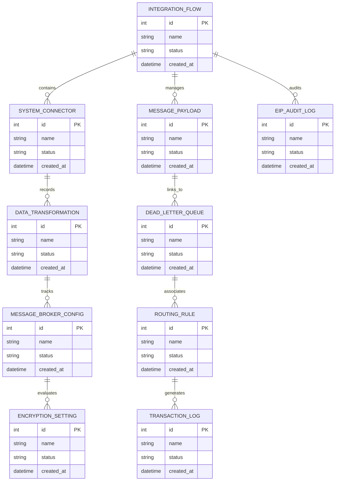

# Conceptual ERD — Enterprise Integration Platform (EIP)

## Mermaid Code

## Entity Description Table | Bảng mô tả Entity

| # | Entity Name | Vietnamese Name | Description | Key Attributes | Main Relationships |
|---|-------------|-----------------|-------------|----------------|-------------------|
| 1 | INTEGRATION_FLOW | Thực thể INTEGRATION_FLOW | Quản lý thông tin chi tiết cho integration_flow | id (PK), name, status, created_at | Links with related entities |
| 2 | SYSTEM_CONNECTOR | Thực thể SYSTEM_CONNECTOR | Quản lý thông tin chi tiết cho system_connector | id (PK), name, status, created_at | Links with related entities |
| 3 | MESSAGE_PAYLOAD | Thực thể MESSAGE_PAYLOAD | Quản lý thông tin chi tiết cho message_payload | id (PK), name, status, created_at | Links with related entities |
| 4 | DATA_TRANSFORMATION | Thực thể DATA_TRANSFORMATION | Quản lý thông tin chi tiết cho data_transformation | id (PK), name, status, created_at | Links with related entities |
| 5 | DEAD_LETTER_QUEUE | Thực thể DEAD_LETTER_QUEUE | Quản lý thông tin chi tiết cho dead_letter_queue | id (PK), name, status, created_at | Links with related entities |
| 6 | MESSAGE_BROKER_CONFIG | Thực thể MESSAGE_BROKER_CONFIG | Quản lý thông tin chi tiết cho message_broker_config | id (PK), name, status, created_at | Links with related entities |
| 7 | ROUTING_RULE | Thực thể ROUTING_RULE | Quản lý thông tin chi tiết cho routing_rule | id (PK), name, status, created_at | Links with related entities |
| 8 | ENCRYPTION_SETTING | Thực thể ENCRYPTION_SETTING | Quản lý thông tin chi tiết cho encryption_setting | id (PK), name, status, created_at | Links with related entities |
| 9 | TRANSACTION_LOG | Thực thể TRANSACTION_LOG | Quản lý thông tin chi tiết cho transaction_log | id (PK), name, status, created_at | Links with related entities |
| 10 | EIP_AUDIT_LOG | Thực thể EIP_AUDIT_LOG | Quản lý thông tin chi tiết cho eip_audit_log | id (PK), name, status, created_at | Links with related entities |

## Relationship Description | Mô tả Quan hệ

| # | From Entity | Cardinality | To Entity | Relationship Label | Business Explanation |
|---|-------------|-------------|-----------|-------------------|----------------------|
| 1 | INTEGRATION_FLOW | 1 to Many | SYSTEM_CONNECTOR | relates_to | Quản lý mối quan hệ giữa INTEGRATION_FLOW và SYSTEM_CONNECTOR |
| 2 | SYSTEM_CONNECTOR | 1 to Many | MESSAGE_PAYLOAD | relates_to | Quản lý mối quan hệ giữa SYSTEM_CONNECTOR và MESSAGE_PAYLOAD |
| 3 | MESSAGE_PAYLOAD | 1 to Many | DATA_TRANSFORMATION | relates_to | Quản lý mối quan hệ giữa MESSAGE_PAYLOAD và DATA_TRANSFORMATION |
| 4 | DATA_TRANSFORMATION | 1 to Many | DEAD_LETTER_QUEUE | relates_to | Quản lý mối quan hệ giữa DATA_TRANSFORMATION và DEAD_LETTER_QUEUE |
| 5 | DEAD_LETTER_QUEUE | 1 to Many | MESSAGE_BROKER_CONFIG | relates_to | Quản lý mối quan hệ giữa DEAD_LETTER_QUEUE và MESSAGE_BROKER_CONFIG |
| 6 | MESSAGE_BROKER_CONFIG | 1 to Many | ROUTING_RULE | relates_to | Quản lý mối quan hệ giữa MESSAGE_BROKER_CONFIG và ROUTING_RULE |
| 7 | ROUTING_RULE | 1 to Many | ENCRYPTION_SETTING | relates_to | Quản lý mối quan hệ giữa ROUTING_RULE và ENCRYPTION_SETTING |
| 8 | ENCRYPTION_SETTING | 1 to Many | TRANSACTION_LOG | relates_to | Quản lý mối quan hệ giữa ENCRYPTION_SETTING và TRANSACTION_LOG |
| 9 | TRANSACTION_LOG | 1 to Many | EIP_AUDIT_LOG | relates_to | Quản lý mối quan hệ giữa TRANSACTION_LOG và EIP_AUDIT_LOG |
