# Action Tree — Enterprise Integration Platform (EIP)

## Mermaid Code

```mermaid
graph TD
    Root["Enterprise Integration Platform (EIP)"]

    Root --> M1["Integration Flow & Pipeline Designer"]
    Root --> M2["System Connectors & Protocol Adapters"]
    Root --> M3["Payload Transformation & Mapping Engine"]
    Root --> M4["Message Broker & Dead Letter Queue"]
    Root --> M5["Content Routing & Security Control"]
    Root --> M6["EIP Performance & Audit Monitoring"]

    M1 --> A11["Configure Integration Flow & Pipeline Designer Policies"]
    M1 --> A12["Execute Integration Flow & Pipeline Designer Tasks"]
    M1 --> A13["Monitor Integration Flow & Pipeline Designer Telemetry"]
    M1 --> A14["Export Integration Flow & Pipeline Designer Audit Logs"]

    M2 --> A21["Configure System Connectors & Protocol Adapters Policies"]
    M2 --> A22["Execute System Connectors & Protocol Adapters Tasks"]
    M2 --> A23["Monitor System Connectors & Protocol Adapters Telemetry"]
    M2 --> A24["Export System Connectors & Protocol Adapters Audit Logs"]

    M3 --> A31["Configure Payload Transformation & Mapping Engine Policies"]
    M3 --> A32["Execute Payload Transformation & Mapping Engine Tasks"]
    M3 --> A33["Monitor Payload Transformation & Mapping Engine Telemetry"]
    M3 --> A34["Export Payload Transformation & Mapping Engine Audit Logs"]

    M4 --> A41["Configure Message Broker & Dead Letter Queue Policies"]
    M4 --> A42["Execute Message Broker & Dead Letter Queue Tasks"]
    M4 --> A43["Monitor Message Broker & Dead Letter Queue Telemetry"]
    M4 --> A44["Export Message Broker & Dead Letter Queue Audit Logs"]

    M5 --> A51["Configure Content Routing & Security Control Policies"]
    M5 --> A52["Execute Content Routing & Security Control Tasks"]
    M5 --> A53["Monitor Content Routing & Security Control Telemetry"]
    M5 --> A54["Export Content Routing & Security Control Audit Logs"]

    M6 --> A61["Configure EIP Performance & Audit Monitoring Policies"]
    M6 --> A62["Execute EIP Performance & Audit Monitoring Tasks"]
    M6 --> A63["Monitor EIP Performance & Audit Monitoring Telemetry"]
    M6 --> A64["Export EIP Performance & Audit Monitoring Audit Logs"]
```

## Module Description | Mô tả Module

| # | Module | Description | Actions |
|---|--------|-------------|---------|
| 1 | Integration Flow & Pipeline Designer | Quản lý các chức năng cốt lõi thuộc phân hệ integration flow & pipeline designer. | Configure Integration Flow & Pipeline Designer Policies, Execute Integration Flow & Pipeline Designer Tasks, Monitor Integration Flow & Pipeline Designer Telemetry, Export Integration Flow & Pipeline Designer Audit Logs |
| 2 | System Connectors & Protocol Adapters | Quản lý các chức năng cốt lõi thuộc phân hệ system connectors & protocol adapters. | Configure System Connectors & Protocol Adapters Policies, Execute System Connectors & Protocol Adapters Tasks, Monitor System Connectors & Protocol Adapters Telemetry, Export System Connectors & Protocol Adapters Audit Logs |
| 3 | Payload Transformation & Mapping Engine | Quản lý các chức năng cốt lõi thuộc phân hệ payload transformation & mapping engine. | Configure Payload Transformation & Mapping Engine Policies, Execute Payload Transformation & Mapping Engine Tasks, Monitor Payload Transformation & Mapping Engine Telemetry, Export Payload Transformation & Mapping Engine Audit Logs |
| 4 | Message Broker & Dead Letter Queue | Quản lý các chức năng cốt lõi thuộc phân hệ message broker & dead letter queue. | Configure Message Broker & Dead Letter Queue Policies, Execute Message Broker & Dead Letter Queue Tasks, Monitor Message Broker & Dead Letter Queue Telemetry, Export Message Broker & Dead Letter Queue Audit Logs |
| 5 | Content Routing & Security Control | Quản lý các chức năng cốt lõi thuộc phân hệ content routing & security control. | Configure Content Routing & Security Control Policies, Execute Content Routing & Security Control Tasks, Monitor Content Routing & Security Control Telemetry, Export Content Routing & Security Control Audit Logs |
| 6 | EIP Performance & Audit Monitoring | Quản lý các chức năng cốt lõi thuộc phân hệ eip performance & audit monitoring. | Configure EIP Performance & Audit Monitoring Policies, Execute EIP Performance & Audit Monitoring Tasks, Monitor EIP Performance & Audit Monitoring Telemetry, Export EIP Performance & Audit Monitoring Audit Logs |
