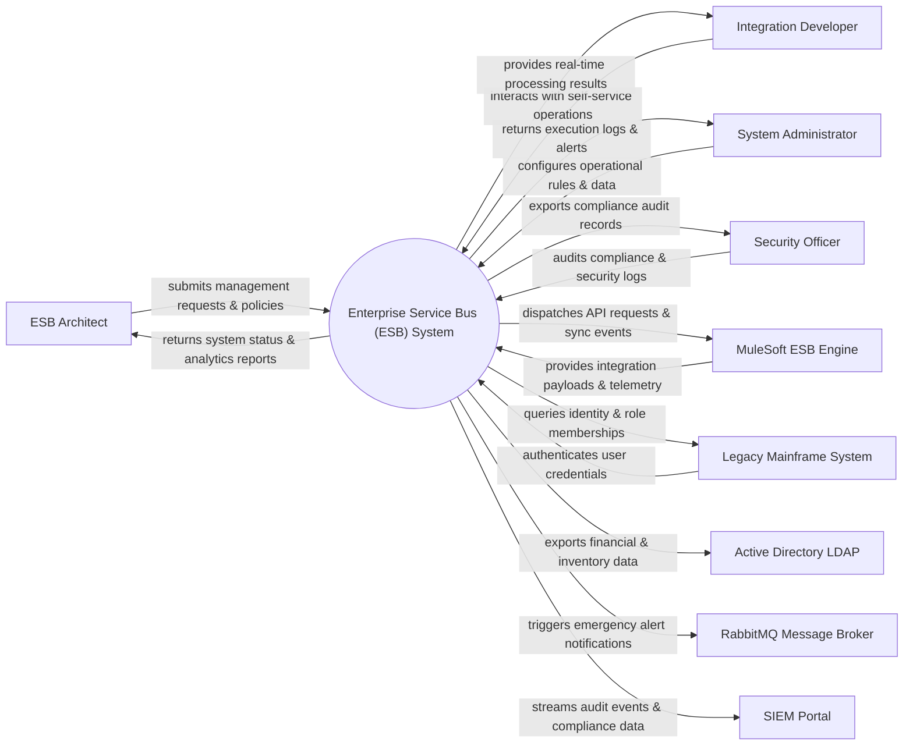

# Context Diagram — Enterprise Service Bus (ESB) System

## Mermaid Code

## Actor & Interaction Table | Bảng Actor & Tương tác

| # | Actor | Actor Type | Data Sent TO System | Data Received FROM System | Notes |
|---|-------|------------|---------------------|---------------------------|-------|
| 1 | ESB Architect | Primary | Operational requests, policy configurations, audit queries | Status updates, performance reports, audit results | ESB Architect role |
| 2 | Integration Developer | Primary | Operational requests, policy configurations, audit queries | Status updates, performance reports, audit results | Integration Developer role |
| 3 | System Administrator | Primary | Operational requests, policy configurations, audit queries | Status updates, performance reports, audit results | System Administrator role |
| 4 | Security Officer | Primary | Operational requests, policy configurations, audit queries | Status updates, performance reports, audit results | Security Officer role |
| 5 | MuleSoft ESB Engine | Supporting | Integration payloads, auth claims, event logs | API sync responses, verification tokens | MuleSoft ESB Engine role |
| 6 | Legacy Mainframe System | Supporting | Integration payloads, auth claims, event logs | API sync responses, verification tokens | Legacy Mainframe System role |
| 7 | Active Directory LDAP | Supporting | Integration payloads, auth claims, event logs | API sync responses, verification tokens | Active Directory LDAP role |
| 8 | RabbitMQ Message Broker | Supporting | Integration payloads, auth claims, event logs | API sync responses, verification tokens | RabbitMQ Message Broker role |
| 9 | SIEM Portal | Supporting | Integration payloads, auth claims, event logs | API sync responses, verification tokens | SIEM Portal role |

## System Boundary Description | Mô tả Scope Hệ thống

Hệ thống **Enterprise Service Bus (ESB) System** (Hệ thống Trục Dịch vụ Doanh nghiệp (ESB)) được thiết kế nhằm quản lý tập trung và tự động hóa các quy trình vận hành CNTT cốt lõi trong doanh nghiệp.

- **Phạm vi bên trong hệ thống (In-Scope)**:
  - Quản lý dữ liệu nghiệp vụ trung tâm, tự động hóa quy trình theo chính sách doanh nghiệp.
  - Phân quyền người dùng chi tiết, theo dõi lịch sử thao tác và xuất báo cáo tuân thủ (ISO/SOC2).
  - Tích hợp phát hiện sự cố, gửi cảnh báo tức thì và kết nối dữ liệu hai chiều.

- **Bên ngoài phạm vi hệ thống (Out-of-Scope)**:
  - Trực tiếp quản lý hạ tầng phần cứng máy chủ vật lý.
  - Trực tiếp xử lý xác thực mật khẩu người dùng gốc (do Identity Provider đảm nhận).
