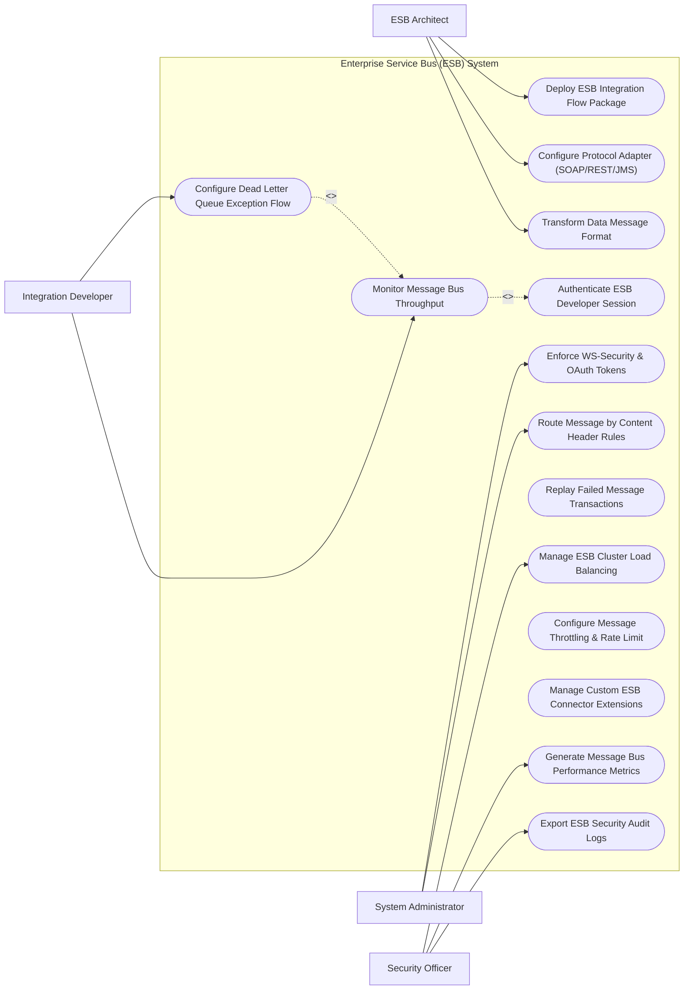

# Use Case Diagram — Enterprise Service Bus (ESB) System

## Mermaid Code

## Actor Table | Bảng Actor

| # | Actor | Actor Type | Role Description | Related Use Cases |
|---|-------|------------|------------------|-------------------|
| 1 | ESB Architect | Primary | Main actor responsible for system operations and oversight | UC01, UC02, UC05, UC10 |
| 2 | Integration Developer | Primary | Main actor responsible for system operations and oversight | UC01, UC02, UC05, UC10 |
| 3 | System Administrator | Primary | Main actor responsible for system operations and oversight | UC01, UC02, UC05, UC10 |
| 4 | Security Officer | Primary | Main actor responsible for system operations and oversight | UC01, UC02, UC05, UC10 |

## Use Case Table | Bảng Use Case

| # | UC ID | Use Case Name | Primary Actor | Secondary Actor | Description | Priority |
|---|-------|---------------|---------------|-----------------|-------------|----------|
| 1 | UC01 | Deploy ESB Integration Flow Package | ESB Architect | Supporting System | Handles deploy esb integration flow package operations within system boundary | High |
| 2 | UC02 | Configure Protocol Adapter (SOAP/REST/JMS) | Integration Developer | Supporting System | Handles configure protocol adapter (soap/rest/jms) operations within system boundary | High |
| 3 | UC03 | Transform Data Message Format | System Administrator | Supporting System | Handles transform data message format operations within system boundary | High |
| 4 | UC04 | Authenticate ESB Developer Session | Security Officer | Supporting System | Handles authenticate esb developer session operations within system boundary | High |
| 5 | UC05 | Monitor Message Bus Throughput | ESB Architect | Supporting System | Handles monitor message bus throughput operations within system boundary | High |
| 6 | UC06 | Configure Dead Letter Queue Exception Flow | Integration Developer | Supporting System | Handles configure dead letter queue exception flow operations within system boundary | High |
| 7 | UC07 | Enforce WS-Security & OAuth Tokens | System Administrator | Supporting System | Handles enforce ws-security & oauth tokens operations within system boundary | High |
| 8 | UC08 | Route Message by Content Header Rules | Security Officer | Supporting System | Handles route message by content header rules operations within system boundary | High |
| 9 | UC09 | Replay Failed Message Transactions | ESB Architect | Supporting System | Handles replay failed message transactions operations within system boundary | Medium |
| 10 | UC10 | Manage ESB Cluster Load Balancing | Integration Developer | Supporting System | Handles manage esb cluster load balancing operations within system boundary | Medium |
| 11 | UC11 | Configure Message Throttling & Rate Limit | System Administrator | Supporting System | Handles configure message throttling & rate limit operations within system boundary | Medium |
| 12 | UC12 | Manage Custom ESB Connector Extensions | Security Officer | Supporting System | Handles manage custom esb connector extensions operations within system boundary | Low |
| 13 | UC13 | Generate Message Bus Performance Metrics | ESB Architect | Supporting System | Handles generate message bus performance metrics operations within system boundary | Medium |
| 14 | UC14 | Export ESB Security Audit Logs | Integration Developer | Supporting System | Handles export esb security audit logs operations within system boundary | Low |

## Use Case Specification | Đặc tả Use Case

---

### UC01 — Deploy ESB Integration Flow Package

| Field | Detail |
|-------|--------|
| **UC ID** | UC01 |
| **Use Case Name** | Deploy ESB Integration Flow Package |
| **Actor(s)** | Primary: ESB Architect |
| **Description** | Allows primary actors to configure and execute deploy esb integration flow package within the system. |
| **Precondition** | 1. Actor must be authenticated.   2. System must be in operational status. |
| **Main Flow** | 1. Actor accesses system module.   2. System displays input form.   3. Actor inputs required details.   4. System validates parameters.   5. Actor submits request.   6. System saves record and updates status. |
| **Alternative Flow** | **AF1** — Bulk Operation: System processes input items in batch mode.   **AF2** — Template Loading: System auto-populates fields using preset template. |
| **Exception Flow** | **EX1** — Validation Error: System highlights missing mandatory fields.   **EX2** — System Timeout: System logs transaction and prompts retry. |
| **Postcondition** | Record is saved and audit trail entry is generated. |
| **Business Rule** | **BR1**: Operation requires valid administrative privileges. |

---

### UC05 — Monitor Message Bus Throughput

| Field | Detail |
|-------|--------|
| **UC ID** | UC05 |
| **Use Case Name** | Monitor Message Bus Throughput |
| **Actor(s)** | Primary: Integration Developer |
| **Description** | Executes monitor message bus throughput with real-time feedback and validation. |
| **Precondition** | 1. User must have operational role.   2. Target items must exist. |
| **Main Flow** | 1. User initiates operation.   2. System retrieves target data.   3. User verifies details.   4. User confirms execution.   5. System processes transaction.   6. System returns success confirmation. |
| **Alternative Flow** | **AF1** — Automated Trigger: System executes operation automatically based on policy. |
| **Exception Flow** | **EX1** — Resource Locked: System alerts user if item is locked by another session. |
| **Postcondition** | Execution status is updated to completed. |
| **Business Rule** | **BR1**: All state changes must record timestamp and operator ID. |

---

### UC06 — Configure Dead Letter Queue Exception Flow

| Field | Detail |
|-------|--------|
| **UC ID** | UC06 |
| **Use Case Name** | Configure Dead Letter Queue Exception Flow |
| **Actor(s)** | Primary: System Administrator |
| **Description** | Performs configure dead letter queue exception flow to ensure operational compliance and quality. |
| **Precondition** | 1. System policies must be active. |
| **Main Flow** | 1. User opens audit/monitoring view.   2. System performs automated scan.   3. System presents findings.   4. User applies corrective action.   5. System updates compliance status.   6. System dispatches notification. |
| **Alternative Flow** | **AF1** — Auto-Remediation: System auto-corrects non-compliant items. |
| **Exception Flow** | **EX1** — Access Denied: System blocks unauthorized role access. |
| **Postcondition** | Compliance logs are updated. |
| **Business Rule** | **BR1**: Non-compliant items must generate high-priority alerts. |

---

### UC07 — Enforce WS-Security & OAuth Tokens

| Field | Detail |
|-------|--------|
| **UC ID** | UC07 |
| **Use Case Name** | Enforce WS-Security & OAuth Tokens |
| **Actor(s)** | Primary: System Administrator |
| **Description** | Manages enforce ws-security & oauth tokens to maintain system efficiency. |
| **Precondition** | 1. Threshold rules must be defined. |
| **Main Flow** | 1. System detects threshold event.   2. System alerts user.   3. User reviews event parameters.   4. User confirms action.   5. System executes update.   6. System logs outcome. |
| **Alternative Flow** | **AF1** — Scheduled Task: System executes task at off-peak hours. |
| **Exception Flow** | **EX1** — Integration Fail: System retries external API connection. |
| **Postcondition** | Metric trends are updated. |
| **Business Rule** | **BR1**: Critical metrics require immediate notification. |

---

### UC10 — Manage ESB Cluster Load Balancing

| Field | Detail |
|-------|--------|
| **UC ID** | UC10 |
| **Use Case Name** | Manage ESB Cluster Load Balancing |
| **Actor(s)** | Primary: Security Officer |
| **Description** | Conducts manage esb cluster load balancing for governance and security audits. |
| **Precondition** | 1. Audit rules must be pre-configured. |
| **Main Flow** | 1. Auditor opens governance portal.   2. System compiles audit report.   3. Auditor reviews compliance score.   4. Auditor exports documentation.   5. System logs audit event.   6. System updates compliance status. |
| **Alternative Flow** | **AF1** — Automated Export: System dispatches weekly audit summary email. |
| **Exception Flow** | **EX1** — Data Gap Warning: System flags unverified data points. |
| **Postcondition** | Audit compliance record is finalized. |
| **Business Rule** | **BR1**: Audit records are immutable after publication. |
