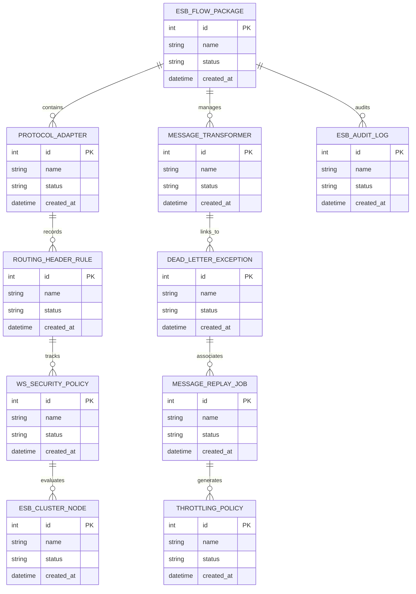

# Conceptual ERD — Enterprise Service Bus (ESB) System

## Mermaid Code

## Entity Description Table | Bảng mô tả Entity

| # | Entity Name | Vietnamese Name | Description | Key Attributes | Main Relationships |
|---|-------------|-----------------|-------------|----------------|-------------------|
| 1 | ESB_FLOW_PACKAGE | Thực thể ESB_FLOW_PACKAGE | Quản lý thông tin chi tiết cho esb_flow_package | id (PK), name, status, created_at | Links with related entities |
| 2 | PROTOCOL_ADAPTER | Thực thể PROTOCOL_ADAPTER | Quản lý thông tin chi tiết cho protocol_adapter | id (PK), name, status, created_at | Links with related entities |
| 3 | MESSAGE_TRANSFORMER | Thực thể MESSAGE_TRANSFORMER | Quản lý thông tin chi tiết cho message_transformer | id (PK), name, status, created_at | Links with related entities |
| 4 | ROUTING_HEADER_RULE | Thực thể ROUTING_HEADER_RULE | Quản lý thông tin chi tiết cho routing_header_rule | id (PK), name, status, created_at | Links with related entities |
| 5 | DEAD_LETTER_EXCEPTION | Thực thể DEAD_LETTER_EXCEPTION | Quản lý thông tin chi tiết cho dead_letter_exception | id (PK), name, status, created_at | Links with related entities |
| 6 | WS_SECURITY_POLICY | Thực thể WS_SECURITY_POLICY | Quản lý thông tin chi tiết cho ws_security_policy | id (PK), name, status, created_at | Links with related entities |
| 7 | MESSAGE_REPLAY_JOB | Thực thể MESSAGE_REPLAY_JOB | Quản lý thông tin chi tiết cho message_replay_job | id (PK), name, status, created_at | Links with related entities |
| 8 | ESB_CLUSTER_NODE | Thực thể ESB_CLUSTER_NODE | Quản lý thông tin chi tiết cho esb_cluster_node | id (PK), name, status, created_at | Links with related entities |
| 9 | THROTTLING_POLICY | Thực thể THROTTLING_POLICY | Quản lý thông tin chi tiết cho throttling_policy | id (PK), name, status, created_at | Links with related entities |
| 10 | ESB_AUDIT_LOG | Thực thể ESB_AUDIT_LOG | Quản lý thông tin chi tiết cho esb_audit_log | id (PK), name, status, created_at | Links with related entities |

## Relationship Description | Mô tả Quan hệ

| # | From Entity | Cardinality | To Entity | Relationship Label | Business Explanation |
|---|-------------|-------------|-----------|-------------------|----------------------|
| 1 | ESB_FLOW_PACKAGE | 1 to Many | PROTOCOL_ADAPTER | relates_to | Quản lý mối quan hệ giữa ESB_FLOW_PACKAGE và PROTOCOL_ADAPTER |
| 2 | PROTOCOL_ADAPTER | 1 to Many | MESSAGE_TRANSFORMER | relates_to | Quản lý mối quan hệ giữa PROTOCOL_ADAPTER và MESSAGE_TRANSFORMER |
| 3 | MESSAGE_TRANSFORMER | 1 to Many | ROUTING_HEADER_RULE | relates_to | Quản lý mối quan hệ giữa MESSAGE_TRANSFORMER và ROUTING_HEADER_RULE |
| 4 | ROUTING_HEADER_RULE | 1 to Many | DEAD_LETTER_EXCEPTION | relates_to | Quản lý mối quan hệ giữa ROUTING_HEADER_RULE và DEAD_LETTER_EXCEPTION |
| 5 | DEAD_LETTER_EXCEPTION | 1 to Many | WS_SECURITY_POLICY | relates_to | Quản lý mối quan hệ giữa DEAD_LETTER_EXCEPTION và WS_SECURITY_POLICY |
| 6 | WS_SECURITY_POLICY | 1 to Many | MESSAGE_REPLAY_JOB | relates_to | Quản lý mối quan hệ giữa WS_SECURITY_POLICY và MESSAGE_REPLAY_JOB |
| 7 | MESSAGE_REPLAY_JOB | 1 to Many | ESB_CLUSTER_NODE | relates_to | Quản lý mối quan hệ giữa MESSAGE_REPLAY_JOB và ESB_CLUSTER_NODE |
| 8 | ESB_CLUSTER_NODE | 1 to Many | THROTTLING_POLICY | relates_to | Quản lý mối quan hệ giữa ESB_CLUSTER_NODE và THROTTLING_POLICY |
| 9 | THROTTLING_POLICY | 1 to Many | ESB_AUDIT_LOG | relates_to | Quản lý mối quan hệ giữa THROTTLING_POLICY và ESB_AUDIT_LOG |
