# Action Tree — Enterprise Service Bus (ESB) System

## Mermaid Code

```mermaid
graph TD
    Root["Enterprise Service Bus (ESB) System"]

    Root --> M1["ESB Flow & Message Routing Engine"]
    Root --> M2["Protocol Adapters (SOAP REST JMS)"]
    Root --> M3["Data Transformation & Payload Mapping"]
    Root --> M4["Dead Letter Queue & Transaction Replay"]
    Root --> M5["WS-Security & Message Encryption"]
    Root --> M6["ESB Cluster & Message Bus Monitoring"]

    M1 --> A11["Configure ESB Flow & Message Routing Engine Policies"]
    M1 --> A12["Execute ESB Flow & Message Routing Engine Tasks"]
    M1 --> A13["Monitor ESB Flow & Message Routing Engine Telemetry"]
    M1 --> A14["Export ESB Flow & Message Routing Engine Audit Logs"]

    M2 --> A21["Configure Protocol Adapters (SOAP REST JMS) Policies"]
    M2 --> A22["Execute Protocol Adapters (SOAP REST JMS) Tasks"]
    M2 --> A23["Monitor Protocol Adapters (SOAP REST JMS) Telemetry"]
    M2 --> A24["Export Protocol Adapters (SOAP REST JMS) Audit Logs"]

    M3 --> A31["Configure Data Transformation & Payload Mapping Policies"]
    M3 --> A32["Execute Data Transformation & Payload Mapping Tasks"]
    M3 --> A33["Monitor Data Transformation & Payload Mapping Telemetry"]
    M3 --> A34["Export Data Transformation & Payload Mapping Audit Logs"]

    M4 --> A41["Configure Dead Letter Queue & Transaction Replay Policies"]
    M4 --> A42["Execute Dead Letter Queue & Transaction Replay Tasks"]
    M4 --> A43["Monitor Dead Letter Queue & Transaction Replay Telemetry"]
    M4 --> A44["Export Dead Letter Queue & Transaction Replay Audit Logs"]

    M5 --> A51["Configure WS-Security & Message Encryption Policies"]
    M5 --> A52["Execute WS-Security & Message Encryption Tasks"]
    M5 --> A53["Monitor WS-Security & Message Encryption Telemetry"]
    M5 --> A54["Export WS-Security & Message Encryption Audit Logs"]

    M6 --> A61["Configure ESB Cluster & Message Bus Monitoring Policies"]
    M6 --> A62["Execute ESB Cluster & Message Bus Monitoring Tasks"]
    M6 --> A63["Monitor ESB Cluster & Message Bus Monitoring Telemetry"]
    M6 --> A64["Export ESB Cluster & Message Bus Monitoring Audit Logs"]
```

## Module Description | Mô tả Module

| # | Module | Description | Actions |
|---|--------|-------------|---------|
| 1 | ESB Flow & Message Routing Engine | Quản lý các chức năng cốt lõi thuộc phân hệ esb flow & message routing engine. | Configure ESB Flow & Message Routing Engine Policies, Execute ESB Flow & Message Routing Engine Tasks, Monitor ESB Flow & Message Routing Engine Telemetry, Export ESB Flow & Message Routing Engine Audit Logs |
| 2 | Protocol Adapters (SOAP REST JMS) | Quản lý các chức năng cốt lõi thuộc phân hệ protocol adapters (soap rest jms). | Configure Protocol Adapters (SOAP REST JMS) Policies, Execute Protocol Adapters (SOAP REST JMS) Tasks, Monitor Protocol Adapters (SOAP REST JMS) Telemetry, Export Protocol Adapters (SOAP REST JMS) Audit Logs |
| 3 | Data Transformation & Payload Mapping | Quản lý các chức năng cốt lõi thuộc phân hệ data transformation & payload mapping. | Configure Data Transformation & Payload Mapping Policies, Execute Data Transformation & Payload Mapping Tasks, Monitor Data Transformation & Payload Mapping Telemetry, Export Data Transformation & Payload Mapping Audit Logs |
| 4 | Dead Letter Queue & Transaction Replay | Quản lý các chức năng cốt lõi thuộc phân hệ dead letter queue & transaction replay. | Configure Dead Letter Queue & Transaction Replay Policies, Execute Dead Letter Queue & Transaction Replay Tasks, Monitor Dead Letter Queue & Transaction Replay Telemetry, Export Dead Letter Queue & Transaction Replay Audit Logs |
| 5 | WS-Security & Message Encryption | Quản lý các chức năng cốt lõi thuộc phân hệ ws-security & message encryption. | Configure WS-Security & Message Encryption Policies, Execute WS-Security & Message Encryption Tasks, Monitor WS-Security & Message Encryption Telemetry, Export WS-Security & Message Encryption Audit Logs |
| 6 | ESB Cluster & Message Bus Monitoring | Quản lý các chức năng cốt lõi thuộc phân hệ esb cluster & message bus monitoring. | Configure ESB Cluster & Message Bus Monitoring Policies, Execute ESB Cluster & Message Bus Monitoring Tasks, Monitor ESB Cluster & Message Bus Monitoring Telemetry, Export ESB Cluster & Message Bus Monitoring Audit Logs |
