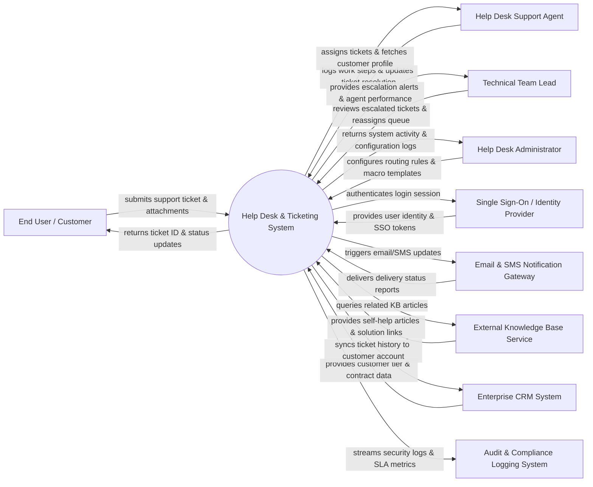

# Context Diagram — Help Desk & Ticketing System

## Mermaid Code

## Actor & Interaction Table | Bảng Actor & Tương tác

| # | Actor | Actor Type | Data Sent TO System | Data Received FROM System | Notes |
|---|-------|------------|---------------------|---------------------------|-------|
| 1 | End User / Customer | Primary | Submits support requests, screenshots, replies to agent questions, rates satisfaction | Ticket tracking ID, progress notifications, agent responses, resolution confirmation | External clients or internal staff requesting technical assistance |
| 2 | Help Desk Support Agent | Primary | Enters troubleshooting notes, applies resolution macros, changes ticket status | Assigned ticket queue, user contact details, customer history, recommended KB links | Tier 1 support agents handling day-to-day inquiries |
| 3 | Technical Team Lead | Primary | Reassigns complex tickets, adjusts SLA priority, approves escalations | Escalation alerts, queue bottleneck reports, agent workload metrics | Tier 2/3 supervisors managing support queue throughput |
| 4 | Help Desk Administrator | Primary | Defines auto-assignment rules, manages canned responses, configures user roles | System health metrics, error logs, user access audit trails | System admin configuring workflow automation |
| 5 | Single Sign-On / Identity Provider | Supporting | User authentication claims, SAML/OAuth tokens, security roles | Login verification requests, token validation checks | Enterprise identity provider (Azure AD / Okta) |
| 6 | Email & SMS Notification Gateway | Supporting | Delivery delivery receipts, bounce back status alerts | Email notifications, SMS message payloads, push alerts | External communication service provider |
| 7 | External Knowledge Base Service | Supporting | Search results, article HTML content, self-help FAQs | Article query terms, category filters, usage hit counts | External documentation portal or Zendesk KB API |
| 8 | Enterprise CRM System | Supporting | Customer VIP tier, contract SLAs, active account status | Ticket summary logs, customer interaction history | CRM platform like Salesforce or HubSpot |
| 9 | Audit & Compliance Logging System | Supporting | Compliance policy rules, audit mandates | System transaction logs, SLA breach records, security events | SIEM or enterprise compliance logging engine |

## System Boundary Description | Mô tả Scope Hệ thống

Hệ thống **Help Desk & Ticketing System** đóng vai trò là điểm tiếp nhận và xử lý tập trung (Single Point of Contact - SPOC) cho toàn bộ các yêu cầu hỗ trợ kỹ thuật và thắc mắc của người dùng.

- **Phạm vi bên trong hệ thống (In-Scope)**:
  - Tiếp nhận ticket qua cổng Web Portal, tự động tạo ticket từ Email/Form.
  - Phân loại, gán nhãn (Tagging), tự động điều phối (Auto-routing) ticket đến đúng kỹ thuật viên.
  - Quản lý quá trình trao đổi (Canned Responses/Macros), đính kèm tệp tin và nhật ký xử lý công việc (Work logs).
  - Quản lý quy trình leo thang (Escalations), đo lường thời hạn cam kết SLA và đánh giá mức độ hài lòng khách hàng (CSAT).

- **Bên ngoài phạm vi hệ thống (Out-of-Scope)**:
  - Trực tiếp quản lý thông tin khách hàng gốc (thuộc CRM).
  - Xác thực mật khẩu người dùng trực tiếp (sử dụng SSO / Azure AD).
  - Trực tiếp khắc phục sự cố trên hạ tầng phần cứng của người dùng.
