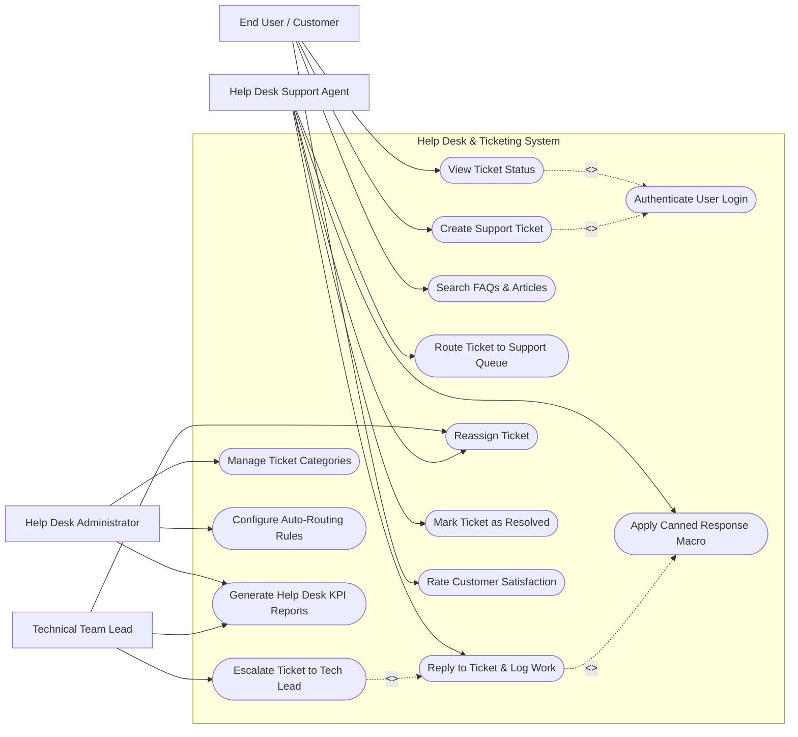

# Use Case Diagram — Help Desk & Ticketing System

## Mermaid Code

## Actor Table | Bảng Actor

| # | Actor | Actor Type | Role Description | Related Use Cases |
|---|-------|------------|------------------|-------------------|
| 1 | End User / Customer | Primary | Submits issues, checks ticket status, searches solution guides, evaluates agent service | UC01, UC02, UC03, UC04, UC11 |
| 2 | Help Desk Support Agent | Primary | Interacts with users, logs diagnostic steps, applies macro templates, resolves tickets | UC05, UC06, UC07, UC08, UC10 |
| 3 | Technical Team Lead | Primary | Handles escalated tickets, monitors queue metrics, balances workload across support tiers | UC08, UC09, UC14 |
| 4 | Help Desk Administrator | Primary | Configures categories, automation rules, ticket fields, and monitors overall KPI reports | UC12, UC13, UC14 |

## Use Case Table | Bảng Use Case

| # | UC ID | Use Case Name | Primary Actor | Secondary Actor | Description | Priority |
|---|-------|---------------|---------------|-----------------|-------------|----------|
| 1 | UC01 | Create Support Ticket | End User / Customer | SSO / Identity Provider | Allows users to submit a new technical support inquiry with attachments | High |
| 2 | UC02 | View Ticket Status | End User / Customer | None | Displays current progress, responses, and assigned agent details | High |
| 3 | UC03 | Search FAQs & Articles | End User / Customer | Knowledge Base API | Provides self-service articles to resolve common issues without creating a ticket | Medium |
| 4 | UC04 | Authenticate User Login | System | Single Sign-On | Validates user identity and session credentials | High |
| 5 | UC05 | Route Ticket to Support Queue | Help Desk Support Agent | System | Assigns pending incoming tickets to agents based on skills or queue load | High |
| 6 | UC06 | Reply to Ticket & Log Work | Help Desk Support Agent | End User | Allows agents to post public replies or internal work notes | High |
| 7 | UC07 | Apply Canned Response Macro | Help Desk Support Agent | None | Inserts pre-written response templates to speed up repetitive replies | Medium |
| 8 | UC08 | Reassign Ticket | Help Desk Support Agent | Technical Team Lead | Transfers ticket to another agent or support department | Medium |
| 9 | UC09 | Escalate Ticket to Tech Lead | Help Desk Support Agent | Technical Team Lead | Escalates critical or unresolved tickets exceeding SLA boundaries | High |
| 10 | UC10 | Mark Ticket as Resolved | Help Desk Support Agent | End User | Changes ticket status to resolved and prompts user confirmation | High |
| 11 | UC11 | Rate Customer Satisfaction | End User / Customer | CRM System | Captures 1-5 star ratings and comments on support quality | Medium |
| 12 | UC12 | Manage Ticket Categories | Help Desk Administrator | None | Defines ticket categories, sub-categories, and custom field forms | Medium |
| 13 | UC13 | Configure Auto-Routing Rules | Help Desk Administrator | None | Configures keyword-based auto-assignment and SLA trigger rules | Medium |
| 14 | UC14 | Generate Help Desk KPI Reports | Technical Team Lead | Audit System | Compiles ticket resolution times, CSAT averages, and agent productivity | High |

## Use Case Specification | Đặc tả Use Case

---

### UC01 — Create Support Ticket

| Field | Detail |
|-------|--------|
| **UC ID** | UC01 |
| **Use Case Name** | Create Support Ticket |
| **Actor(s)** | Primary: End User / Customer   Secondary: Single Sign-On / Email Gateway |
| **Description** | Allows an end user or customer to submit a new support ticket describing a software/hardware problem or service request. |
| **Precondition** | 1. The user must be authenticated via SSO or logged into the portal.   2. The Help Desk system must be online and active. |
| **Main Flow** | 1. User clicks "Submit New Ticket" on the portal home page.   2. System presents ticket submission form with fields: Subject, Category, Urgency, Detailed Description, and File Attachments.   3. User enters subject and detailed description of the problem.   4. System automatically searches KB and displays top 3 related articles in a side panel.   5. User attaches relevant screenshots (if any) and clicks "Submit Ticket".   6. System validates inputs, generates a unique ticket tracking number (e.g., HD-89201), assigns initial priority, stores record, and sends a confirmation email to the user. |
| **Alternative Flow** | **AF1** — Email-to-Ticket Conversion: User sends an email to support@company.com; System parses email header/body, creates a ticket automatically, and replies with ticket ID.   **AF2** — KB Self-Resolution: User reads suggested KB article, clicks "This solved my issue", and exits without submitting ticket. |
| **Exception Flow** | **EX1** — Mandatory Field Missing: If subject or description is empty, System highlights field in red and displays "Required field missing".   **EX2** — File Format Unsupported: If user uploads an executable (.exe/.bat), System blocks upload with error "Unsupported file type for security". |
| **Postcondition** | Ticket record is created with status "New", placed in unassigned queue, and confirmation notification is sent. |
| **Business Rule** | **BR1**: High-urgency tickets must require a phone contact number.   **BR2**: Attachments are limited to a maximum of 5 files per ticket. |

---

### UC05 — Route Ticket to Support Queue

| Field | Detail |
|-------|--------|
| **UC ID** | UC05 |
| **Use Case Name** | Route Ticket to Support Queue |
| **Actor(s)** | Primary: Help Desk Support Agent   Secondary: System Engine |
| **Description** | Assigns unassigned incoming tickets from the main queue to specific support agents based on workload or specialization. |
| **Precondition** | 1. Agent must be logged in with active support status.   2. Pending tickets exist in the unassigned queue. |
| **Main Flow** | 1. Support Agent opens the "Unassigned Queue" view.   2. System lists pending tickets ranked by creation time and priority.   3. Support Agent selects a ticket to inspect summary.   4. Support Agent clicks "Take Ownership" or selects a team member from "Assign To" dropdown.   5. Support Agent confirms assignment.   6. System updates ticket status to "In Progress", sets Assigned Agent ID, and starts the SLA response timer. |
| **Alternative Flow** | **AF1** — Automated Smart Routing: System automatically assigns ticket to the available agent with the matching skill tag and fewest open tickets.   **AF2** — Re-routing to Tier 2: Agent routes ticket directly to Tier 2 Network Queue due to technical complexity. |
| **Exception Flow** | **EX1** — Ticket Already Claimed: If another agent claimed the ticket simultaneously, System alerts "Ticket HD-89201 was claimed by Agent B" and refreshes list.   **EX2** — Agent Max Capacity Reached: If selected agent has reached max limit of 15 open tickets, System alerts "Agent capacity limit exceeded". |
| **Postcondition** | Ticket status changes to "In Progress", assigned agent receives push notification, and assignment log is recorded. |
| **Business Rule** | **BR1**: Tier 1 agents cannot have more than 15 active "In Progress" tickets at any single time. |

---

### UC06 — Reply to Ticket & Log Work

| Field | Detail |
|-------|--------|
| **UC ID** | UC06 |
| **Use Case Name** | Reply to Ticket & Log Work |
| **Actor(s)** | Primary: Help Desk Support Agent   Secondary: End User / Customer |
| **Description** | Allows assigned support agents to communicate with customers, provide troubleshooting instructions, or log internal diagnostic work. |
| **Precondition** | 1. Ticket must be in "In Progress" or "Pending Customer Response" status.   2. Agent must have permission to access the ticket. |
| **Main Flow** | 1. Agent opens ticket details from "My Assigned Tickets" list.   2. System displays conversation history, customer contact details, and activity timeline.   3. Agent selects message mode: "Public Reply" (visible to customer) or "Internal Note" (visible to staff only).   4. Agent types response or selects troubleshooting steps.   5. Agent inputs time spent on ticket (e.g., 25 mins) in work log field.   6. Agent clicks "Submit Reply", System updates conversation thread, updates last activity timestamp, and sends email notification to user (if Public Reply). |
| **Alternative Flow** | **AF1** — Request User Confirmation: Agent replies with solution and updates status to "Pending Customer Confirmation".   **AF2** — Attach Internal Diagnostic File: Agent attaches log files as an internal note for team lead review. |
| **Exception Flow** | **EX1** — Empty Reply Text: If agent clicks submit without text, System alerts "Reply message cannot be blank".   **EX2** — Invalid Work Log Format: If time spent is entered as negative or non-numeric, System highlights the field. |
| **Postcondition** | Conversation thread is updated, work log hours are accumulated in database, and notification email is queued. |
| **Business Rule** | **BR1**: Internal notes must be color-coded yellow and restricted from end-user portal view. |

---

### UC10 — Mark Ticket as Resolved

| Field | Detail |
|-------|--------|
| **UC ID** | UC10 |
| **Use Case Name** | Mark Ticket as Resolved |
| **Actor(s)** | Primary: Help Desk Support Agent   Secondary: End User / Customer |
| **Description** | Concludes troubleshooting by recording resolution summary and marking ticket as resolved, initiating user verification. |
| **Precondition** | 1. Ticket status must be "In Progress".   2. Agent must provide mandatory resolution summary and root cause category. |
| **Main Flow** | 1. Support Agent clicks "Resolve Ticket" button on ticket toolbar.   2. System displays Resolution Form requiring: Resolution Category (e.g., Software Patch, User Guidance, Hardware Swap) and Resolution Summary text.   3. Agent enters resolution details and clicks "Confirm Resolution".   4. System updates ticket status to "Resolved", stops SLA timers, and records resolution timestamp.   5. System sends a "Ticket Resolved" email notification to the customer containing a solution summary and a link to reopen or rate the service.   6. System starts a 48-hour auto-close timer. |
| **Alternative Flow** | **AF1** — Customer Accepts Resolution: Customer clicks "Confirm & Close Ticket", instantly updating status to "Closed".   **AF2** — Auto-Closure on Inactivity: If customer does not respond within 48 hours, System background process updates status to "Closed". |
| **Exception Flow** | **EX1** — Customer Reopens Ticket: Customer replies "Issue still persists", System changes status back to "In Progress" and notifies agent.   **EX2** — Missing Resolution Code: If resolution category is unselected, System prevents submission. |
| **Postcondition** | Ticket status changes to "Resolved", SLA metrics are finalized, and customer satisfaction survey is triggered. |
| **Business Rule** | **BR1**: A ticket in "Closed" status cannot be reopened; users must submit a new ticket. |

---

### UC11 — Rate Customer Satisfaction (CSAT)

| Field | Detail |
|-------|--------|
| **UC ID** | UC11 |
| **Use Case Name** | Rate Customer Satisfaction |
| **Actor(s)** | Primary: End User / Customer   Secondary: Enterprise CRM System |
| **Description** | Captures customer feedback and rating score (1 to 5 stars) after a support ticket has been resolved. |
| **Precondition** | 1. Ticket status must be "Resolved" or "Closed".   2. Customer must not have previously submitted feedback for this ticket. |
| **Main Flow** | 1. Customer receives resolution notification email or opens portal prompt.   2. Customer clicks CSAT survey link or rate stars widget.   3. System opens CSAT rating form with 1-5 Star Scale and optional comments text box.   4. Customer selects star rating (e.g., 5 Stars - Excellent) and enters optional feedback text.   5. Customer clicks "Submit Feedback".   6. System stores rating record, links it to ticket and support agent, updates agent's average CSAT score, and displays "Thank You" message. |
| **Alternative Flow** | **AF1** — Low Rating Alert: If customer submits 1 or 2 stars, System automatically creates an escalation alert ticket for the Support Team Lead to follow up.   **AF2** — CRM Sync: System syncs positive CSAT score to customer profile in enterprise CRM. |
| **Exception Flow** | **EX1** — Duplicate Submission: If customer tries to rate an already rated ticket, System displays "Feedback already submitted for this ticket".   **EX2** — Expired Survey Link: If survey link is accessed after 14 days, System displays "Survey link has expired". |
| **Postcondition** | Rating and feedback comments are saved, agent CSAT score is updated, and team lead is notified if rating is low. |
| **Business Rule** | **BR1**: CSAT survey links expire 14 days after ticket closure.   **BR2**: Ratings of 1 or 2 stars require mandatory comment text. |
