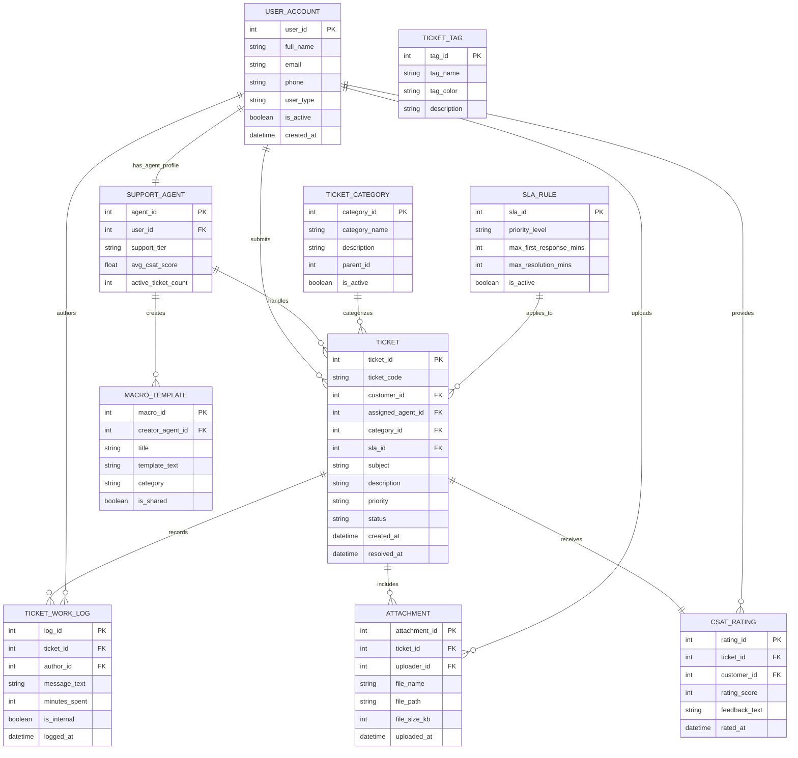

# Conceptual ERD — Help Desk & Ticketing System

## Mermaid Code

## Entity Description Table | Bảng mô tả Entity

| # | Entity Name | Vietnamese Name | Description | Key Attributes | Main Relationships |
|---|-------------|-----------------|-------------|----------------|-------------------|
| 1 | USER_ACCOUNT | Tài khoản Người dùng | Quản lý thông tin tài khoản người dùng cuối và nhân viên trong hệ thống | user_id (PK), full_name, email, phone, user_type | Submits TICKET, authors TICKET_WORK_LOG, provides CSAT_RATING |
| 2 | SUPPORT_AGENT | Hồ sơ Nhân viên Hỗ trợ | Thông tin chuyên môn, cấp độ hỗ trợ và chỉ số hiệu năng của kỹ thuật viên | agent_id (PK), user_id (FK), support_tier, avg_csat_score | Belongs to USER_ACCOUNT, handles TICKET, creates MACRO_TEMPLATE |
| 3 | TICKET_CATEGORY | Danh mục Phân loại | Cấu trúc danh mục dịch vụ/lỗi kỹ thuật dùng để phân loại sự cố | category_id (PK), category_name, description | Categorizes TICKET |
| 4 | SLA_RULE | Quy tắc Cam kết Dịch vụ | Thời hạn cam kết phản hồi lần đầu và thời gian xử lý theo mức ưu tiên | sla_id (PK), priority_level, max_first_response_mins, max_resolution_mins | Applies to TICKET |
| 5 | TICKET | Phiếu Yêu cầu Hỗ trợ | Thực thể trung tâm chứa thông tin yêu cầu hỗ trợ kỹ thuật của người dùng | ticket_id (PK), ticket_code, customer_id (FK), assigned_agent_id (FK), status | Submits by USER_ACCOUNT, handled by SUPPORT_AGENT, records WORK_LOG |
| 6 | TICKET_WORK_LOG | Nhật ký & Phản hồi | Lưu trữ các phản hồi công khai cho khách hàng hoặc ghi chú nội bộ của kỹ thuật viên | log_id (PK), ticket_id (FK), author_id (FK), message_text, is_internal | Belongs to TICKET and USER_ACCOUNT |
| 7 | ATTACHMENT | Tệp tin Đính kèm | Lưu trữ hình ảnh chụp màn hình, tệp log sự cố được tải lên trong ticket | attachment_id (PK), ticket_id (FK), uploader_id (FK), file_name, file_path | Includes in TICKET, uploaded by USER_ACCOUNT |
| 8 | MACRO_TEMPLATE | Mẫu Phản hồi Nhanh | Chuỗi câu trả lời mẫu cho các câu hỏi thường gặp để kỹ thuật viên phản hồi nhanh | macro_id (PK), creator_agent_id (FK), title, template_text | Created by SUPPORT_AGENT |
| 9 | TICKET_TAG | Thẻ Nhãn Phân loại | Thẻ nhãn tùy chỉnh dùng để đánh dấu trạng thái đặc biệt hoặc từ khóa cho ticket | tag_id (PK), tag_name, tag_color | Tagging for TICKET |
| 10 | CSAT_RATING | Đánh giá Hài lòng | Điểm số và nhận xét từ khách hàng sau khi ticket hoàn thành xử lý | rating_id (PK), ticket_id (FK), customer_id (FK), rating_score, feedback_text | Receives for TICKET, provided by USER_ACCOUNT |

## Relationship Description | Mô tả Quan hệ

| # | From Entity | Cardinality | To Entity | Relationship Label | Business Explanation |
|---|-------------|-------------|-----------|-------------------|----------------------|
| 1 | USER_ACCOUNT | 1 to Many | TICKET | submits | Một người dùng cuối có thể gửi nhiều ticket yêu cầu hỗ trợ. |
| 2 | USER_ACCOUNT | 1 to 1 | SUPPORT_AGENT | has_agent_profile | Một tài khoản người dùng có thể gắn liền với 1 hồ sơ nhân viên hỗ trợ. |
| 3 | SUPPORT_AGENT | 1 to Many | TICKET | handles | Một nhân viên hỗ trợ có thể chịu trách nhiệm xử lý nhiều ticket. |
| 4 | TICKET_CATEGORY | 1 to Many | TICKET | categorizes | Một danh mục được dùng để phân loại cho nhiều ticket khác nhau. |
| 5 | SLA_RULE | 1 to Many | TICKET | applies_to | Quy tắc SLA áp dụng hạn định thời gian cho tất cả ticket cùng mức ưu tiên. |
| 6 | TICKET | 1 to Many | TICKET_WORK_LOG | records | Một ticket lưu trữ nhiều lượt phản hồi công khai và ghi chú nội bộ. |
| 7 | USER_ACCOUNT | 1 to Many | TICKET_WORK_LOG | authors | Một người dùng/kỹ thuật viên viết nhiều đoạn nhật ký xử lý. |
| 8 | TICKET | 1 to Many | ATTACHMENT | includes | Một ticket có thể đính kèm nhiều tệp tin minh họa lỗi. |
| 9 | SUPPORT_AGENT | 1 to Many | MACRO_TEMPLATE | creates | Kỹ thuật viên có thể tạo nhiều mẫu phản hồi nhanh (Macro) cho riêng mình hoặc chia sẻ. |
| 10 | TICKET | 1 to 1 | CSAT_RATING | receives | Mỗi ticket hoàn thành được đánh giá bởi 1 bản khảo sát mức độ hài lòng (CSAT). |
