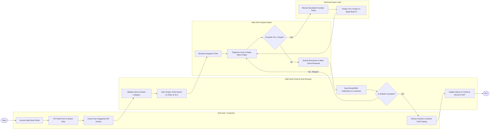

# Swimlane Diagram — Help Desk & Ticketing System

## Mermaid Code

## Flow Description | Mô tả luồng xử lý

| Lane | Actor | Role in Flow |
|------|-------|-------------|
| 1 | End User / Customer | Khởi tạo yêu cầu hỗ trợ qua cổng Web Portal, đính kèm tệp tin mô tả lỗi, tra cứu bài viết gợi ý tự động, xem phản hồi và gửi đánh giá chất lượng (CSAT) sau khi kết thúc. |
| 2 | Help Desk Portal & Auto-Routing | Kiểm tra tính hợp lệ của dữ liệu nhập, xác định danh mục, tự động điều phối ticket đến đúng kỹ thuật viên theo quy tắc SLA, và quản lý các thông báo tự động. |
| 3 | Help Desk Support Agent | Tiếp nhận ticket được điều phối, chẩn đoán nguyên nhân sự cố, áp dụng mẫu câu trả lời nhanh (Macro) hoặc nhập các bước khắc phục, đánh giá nhu cầu leo thang công việc. |
| 4 | Technical Team Lead | Đóng vai trò điểm leo thang cấp cao (Tier 2/3), tiếp nhận các ticket phức tạp ngoài phạm vi xử lý của Tier 1, phân công chuyên gia hoặc phối hợp sửa lỗi hạ tầng. |
