# Action Tree — Help Desk & Ticketing System

## Mermaid Code

```mermaid
graph TD
    Root["Help Desk & Ticketing System"]

    Root --> M1["Ticket Intake & Auto-Routing"]
    Root --> M2["Support Agent Workspace"]
    Root --> M3["Self-Service & KB Portal"]
    Root --> M4["Automation & SLA Engine"]
    Root --> M5["CSAT & Feedback Management"]
    Root --> M6["Help Desk Reporting & Analytics"]

    M1 --> A11["Submit Web Portal Form Ticket"]
    M1 --> A12["Convert Incoming Email to Ticket"]
    M1 --> A13["Validate Input Attachments"]
    M1 --> A14["Assign Priority & Initial Status"]

    M2 --> A21["Claim Ticket from Queue"]
    M2 --> A22["Add Public Reply to Customer"]
    M2 --> A23["Add Internal Diagnostic Note"]
    M2 --> A24["Apply Canned Macro Template"]
    M2 --> A25["Reassign to Another Agent"]
    M2 --> A26["Mark Ticket as Resolved"]

    M3 --> A31["Search Knowledge Base Articles"]
    M3 --> A32["View Self-Help Troubleshooting Steps"]
    M3 --> A33["Track Active Ticket Progress"]

    M4 --> A41["Configure Category Hierarchy"]
    M4 --> A42["Set Up Skill-Based Auto Routing"]
    M4 --> A43["Define Response & Resolution SLAs"]
    M4 --> A44["Configure Overdue Escalation Triggers"]

    M5 --> A51["Dispatch CSAT Rating Email"]
    M5 --> A52["Submit Star Rating & Review Text"]
    M5 --> A53["Trigger Low-Rating Alert Escalate"]

    M6 --> A61["Generate Agent Resolution Time Report"]
    M6 --> A62["View Average CSAT Score Dashboard"]
    M6 --> A63["Analyze SLA Breach Metrics"]
    M6 --> A64["Export Support Ticket Audit Logs"]
```

## Module Description | Mô tả Module

| # | Module | Description | Actions |
|---|--------|-------------|---------|
| 1 | Ticket Intake & Auto-Routing | Tiếp nhận yêu cầu từ nhiều kênh (Web, Email), kiểm tra dữ liệu và phân loại ban đầu. | Submit Web Portal Form Ticket, Convert Incoming Email to Ticket, Validate Input Attachments, Assign Priority & Initial Status |
| 2 | Support Agent Workspace | Không gian làm việc cho kỹ thuật viên tiếp nhận, trao đổi, sử dụng mẫu câu phản hồi nhanh và xử lý ticket. | Claim Ticket from Queue, Add Public Reply to Customer, Add Internal Diagnostic Note, Apply Canned Macro Template, Reassign to Another Agent, Mark Ticket as Resolved |
| 3 | Self-Service & KB Portal | Cổng tự phục vụ cho khách hàng tra cứu câu hỏi thường gặp (FAQ), bài viết giải pháp và theo dõi tiến độ ticket. | Search Knowledge Base Articles, View Self-Help Troubleshooting Steps, Track Active Ticket Progress |
| 4 | Automation & SLA Engine | Động cơ cấu hình quy trình tự động hóa điều phối ticket, thiết lập danh mục và cam kết hạn định thời gian (SLA). | Configure Category Hierarchy, Set Up Skill-Based Auto Routing, Define Response & Resolution SLAs, Configure Overdue Escalation Triggers |
| 5 | CSAT & Feedback Management | Quản lý việc gửi khảo sát, thu thập phản hồi đánh giá chất lượng phục vụ và cảnh báo đánh giá thấp. | Dispatch CSAT Rating Email, Submit Star Rating & Review Text, Trigger Low-Rating Alert Escalate |
| 6 | Help Desk Reporting & Analytics | Cung cấp hệ thống báo cáo phân tích năng suất kỹ thuật viên, mức độ hài lòng khách hàng và chỉ số vi phạm SLA. | Generate Agent Resolution Time Report, View Average CSAT Score Dashboard, Analyze SLA Breach Metrics, Export Support Ticket Audit Logs |
